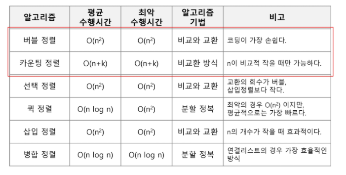

# Algorithm | Array 배열

### APS Algorithm Problem Solving

- 알고리즘이란?
  - 유한한 단계를 통해 문제를 해결하기 위한 절차 혹은 방법.
  - 주로 컴퓨터 용어로 쓰이며, 컴퓨터가 어떤 일을 수행하기 위한 단계적 방법을 의미
  - **문제 해결을 위한 절차**
- 알고리즘 표현 방법
  - 수도 코드(Pseudo Code)
  - 순서도
- APS 과정은 보다 좋은 알고리즘을 이해하고 활용하는 것
- 좋은 알고리즘이란?
  - 정확성 : 얼마나 정확하게 동작하는가
  - 작업량 : 얼마나 적은 연산으로 원하는 결과를 얻어내는가
  - 메모리 사용량 : 얼마나 적은 메모리를 사용하는가
  - 단순성 : 얼마나 단순한가
  - 최적성 : 더 이상 개선할 여지없이 최적화되었는가

</br></br>

#### 시간 복잡도 (Time Complexity)

- 시간 복잡도란?
  - 실제 걸리는 시간을 측정
  - 실행되는 명령문의 개수를 계산
  - 연산되는 횟수를 계산
- 빅-오(O) 표기법 (Big-Oh Notation)
  - 시간 복잡도 함수 중에서 가장 큰 영향력을 주는 n에 대한 항 만을 표시
  - 계수(Coefficient) 는 생략하여 표시

</br></br>

### Array 배열

- 배열이란?
  - 일정한 자료형의 변수들을 하나의 이름으로 열거하여 사용하는 자료구조

- 필요성
  - 프로그램 내에서 여러 개의 변수가 필요할 때, 일일이 다른 변수명을 사용해서 자료에 접근하는 것은 매우 비효율적
  - 배열을 사용하면 하나의 선언을 통해 둘 이상의 변수 선언이 가능
  - 단순히 다수의 변수 선언을 의미하는 것이 아닌, 다수의 변수로는 하기 힘든 작업을 배열을 활용해서 쉽게 할 수 있다

</br></br>

### 정렬

- 2개 이상의 자료를 특정 기준에 의해 작은 값부터 큰 값(오름차순: ascending) 또는 반대 순서대로(내림차순: descending) 재배열하는 것

- 키

  - 자료를 정렬하는 기준이 되는 특정 값

- 정렬 방식의 종류

  - 버블 정렬 (Bubble Sort)
  - 카운팅 정렬 (Counting Sort)
  - 선택 정렬 (Selection Sort)
  - 퀵 정렬 (Quick Sort)
  - 삽입 정렬 (Insertion Sort)
  - 병합 정렬 (Merge Sort)

  

</br></br>

### 버블 정렬 (Bublle Sort)

- 인접한 두 개의 원소를 비교하며 자리를 계속 교환하는 방식
- 정렬 과정
  - 첫 번째 원소부터 인접한 원소끼리 자리를 교환하면서 맨 마지막 자리까지 이동
  - 한 단계가 끝나면 가장 큰 원소가 마지막 자리로 정렬된다
  - 교환하며 자리를 이동하는 모습이 물 위에 올라오는 거품 모양과 같다고 해서 버블 정렬이라고 한다
- 시간 복잡도
  - `O(n²)`
- 예시 코드

```python
def BubbleSrot(a):
	for i in range(len(a)-1, 0, -1):
		for j in range(0, i):
			if a[j] > a[j+1]:
				a[j], a[j+1] = a[j+1], a[j]
```

</br></br>

### 카운팅 정렬 (Counting Sort)

- 항목들의 순서를 결정하기 위해 집합에 각 항목이 몇 개씩 있는지 세는 작업을 하여, 선형 시간에 정렬하는 효율적인 알고리즘
- 제한 사항
  - 정수 or 정수로 표현 가능한 자료에 대해서만 적용 가능
    - 각 항목의 발생 횟수를 기록하기 위해서 정수 항목으로 인덱스 되는 카운트들의 배열을 사용하기 때문
  - 카운트를 위한 충분한 공간을 할당하려면 집합 내의 가장 큰 정수를 알아야 한다.
- 시간 복잡도
  - `O(n + k)` : n은 리스트 길이, k는 정수의 최대값
- 예시 코드

```python
def Counting_Sort(A, B, k):
# A [] 입력 배열 (1 to k)
# B [] 정렬된 배열
# C [] 카운트 배열
	
    C = [0] * (k + 1)
    
	for i in range(0, len(B)):
        C[A[i]] += 1
    
    for i in range(1, len(C)):
        C[i] += C[i-1]
    
    for i in range(len(B)-1, -1, -1):
        B[C[A[i]]-1] = A[i]
        C[A[i]] -= 1
```

</br></br>

### Baby-gin Game

- 설명
  - 0~9 사이의 숫자 카드에서 임의의 카드 6장을 뽑았을 때
  - 3장의 카드가 연속적인 번호를 갖는 경우를 run
  - 3장의 카드가 동일한 번호를 갖는 경우를 triplet 이라고 함
  - 6장의 카드가 run 과 triplet 로만 구성된 경우를 baby-gin 으로 부른다
- 예시
  - 667767은 두 개의 triplet 이므로 baby-gin → 666, 777
  - 054060은 한 개의 run 과 한 개의 triplet 이므로 baby-gin → 456, 000
  - 101123은 한 개의 triplet 이 존재하지만, 023이 run 이 아니므로 baby-gin 이 아니다
    - 123을 run 으로 사용해도 011이 run 이나 triplet 이 아님

#### 완전 검색 (Exaustive Search)

- 문제의 해법으로 생각할 수 잇는 모든 경우의 수를 나열해보고 확인하는 기법
- Brute-force 혹은 generate-and-test 기법이라고도 함
- 모든 경우의 수를 테스트하고, 최종 해법을 도출한다
- 경우의 수가 상대적으로 작을때 유용함
- 모든 경우의 수를 생성하고 테스트하기 때문에 수행 속도는 느리다. But, 해답을 찾아내지 못할 확률이 작다
- 주어진 문제를 풀 때, 완전 검색으로 접근해서 해답을 도출한 후, 성능 개선을 위해 다른 알고리즘을 사용하고 해답을 확인하는 것이 바람직함.

</br></br>

#### 순열 (Permutation)

- 서로 다른 것 중 몇개를 뽑아서 한 줄로 나열하는 것

- 서로 다른 n개 중 r개를 택하는 순열

  - `nPr`

- `nPr = n * (n-1) * (n-2) * ... * (n-r+1)`

- `nPn = n!` Factorial 이라고 부른다

  - `n! = n * (n-1) * (n-2) * (n-3) * ... * 2 * 1`

- 예시

  - ```python
    # {1, 2, 3} 을 포함하는 모든 순열을 생성하는 함수
    # 동일한 숫자가 포함되지 않았을 때, 각 자리 수 별로 loop를 이용해 다음과 같이 구현 가능
    for i1 in range(1, 4):
    	for i2 in range(1, 4):
    		if i2 != i1:
    			for i3 in range(1, 4):
    				if i3 != i1 and i3 != i2:
    					print(i1, i2, i3)
    ```

</br></br>

#### 탐욕 (Greedy) 알고리즘

- 최적해를 구하는데 사용되는 근시안적인 방법

- 여러 경우 중 하나를 결정해야 할 때마다 그 순간에 최적이라고 생각되는 것을 선택해나가는 방식으로 진행해서 최종적인 해답에 도달

- 각 선택 시점에서 이루어지는 결정은 지역적으로는 최적이지만,

- 그 선택들을 수집해서 최종적인 해답을 만들었다고 해서, 그것이 최적이라는 보장은 없다.

- 일반적으로 머릿속에 떠오르는 생각을 검증 없이 바로 구현하면 Greedy 접근!!!

- 동작 과정

  1. 해 선택 : 현재 상테에서 부분 문제의 최적 해를 구한 뒤, 이를 부분해 집합(Solution Set)에 추가
  2. 실행 가능성 검사 : 새로운 부분해 집합이 실행 가능한지 확인한다. 문제의 제약 조건을 위반하지 않는지 검사
  3. 해 검사 : 새로운 부분해 집합이 문제의 해가 되는지를 확인. 전체 문제의 해가 완성되지 않았다면 1번 해 선택부터 다시 시작한다.

- 예시

  - 거스름돈 줄이기

    - 어떻게 하면 손님에게 거스름돈으로 주는 지폐와 동전의 갯수를 최소한으로 줄일 수 있을까?

      

##### Baby-gin Game 구현 예시

```python
num = 456789 # Baby Gin 확인할 6자리 수
c = [0] * 10 # 6자리 수로부터 각 자리 수를 추출하여 갯수를 누적할 리스트

for i in range(6):
    c[num % 10] += 1
    num //= 10
    
i = 0
tri = run = 0
while i < 10:
    # triplet 조사 후 데이터 삭제
    if c[i] >= 3:
        c[i] -= 3
        tri += 1
        continue
    # run 조사후 데이터 삭제    
    if c[i] >= 1 and c[i+1] >= 1 and c[i+2] >= 1:
        c[i] -= 1
        c[i+1] -= 1
        c[i+2] -= 1
        run += 1
        continue
    i += 1

if run + tri == 2:
    print("Baby Gin")
else:
    print("Lose")
```

