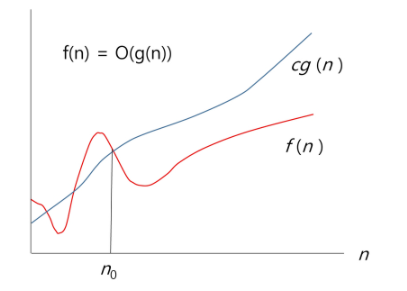

# Algorithm | Complexity 복잡도

### 복잡도 분석

- 알고리즘이란?
  - 유한한 단계를 통해 문제를 해결하기 위한 절차 혹은 방법.
  - 주로 컴퓨터 용어로 쓰이며, 컴퓨터가 어떤 일을 수행하기 위한 단계적 방법을 의미
  - **문제 해결을 위한 절차**
- 알고리즘의 효율
  - 공간적 효율성 
    - 연산량 대비 얼마나 적은 메모리 공간을 요하는 가
  - 시간적 효율성
    - 연산량 대비 얼마나 적은 시간을 요하는 가
  - 효율성을 뒤집어 표현하면 복잡도(Complexity)가 됨. 복잡도가 높을수록 효율성은 저하

 

#### 시간 복잡도 (Time Complexity)

- 시간 복잡도 분석
  - 하드웨어 환경에 따라 처리시간이 달라짐
    - 부동소수 처리 프로세서 존재유무, 나눗셈 가속기능 유무
    - 입출력 장비의 성능, 공유여부
  - 소프트웨어 환경에 따라 처리시간이 달라짐
    - 프로그램 언어의 종류
    - OS, 컴파일러의 종류

 

#### 복잡도의 점근적 표기

- 시간(or 공간) 복잡도는 입력 크기에 대한 함수로 표기하는데, 이 함수는 주로 여러개의 항을 가지는 다항식임
- 이를 단순한 함수로 표현하기 위해 점근적 표기(Asymptotic Notation)를 사용
- 입력 크기 `n` 이 무한대로 커질 때의 복잡도를 간단히 표현하기 위해 사용하는 표기법
- 종류
  - `O`(Big-Oh) 표기
  - `Ω`(Big-Omega) 표기
  - `Θ`(Big-Theta) 표기

 

##### `O`(Big-Oh) 표기

- O-표기는 복잡도의 **점근적 상한**을 나타냄
- `f(n) = 2n²-7n+4` 라면, `f(n)`의 O-표기는 `O(n²)` 이다
- `f(n)`의 단순화된 표현은 n².
- 단순화된 함수 n²에 임의의 상수 c를 곱한 `cn²`이 n이 증가함에 따라 `f(n)`의 상한이 됨

- n이 증가함에 따라 O(g(n))이 점근적 상한이라는 것. 즉, g(n)이 모든 n에 대해서 항상 f(n)보다 크다는 것을 보여줌

 

##### `Ω`(Big-Omega) 표기

- 복잡도의 **점근적 하한**을 의미
- `f(n) = 2n²-7n+4` 라면, `f(n)`의 Ω-표기는 `Ω(n²)` 이다
- n이 증가함에 따라 2n²-7n+4이 cn²보다 작을 수 없다는 의미
- **최소한 이만한 시간이 걸린다** 는 의미

- g(n)이 모든 n에 대해서 항상 f(n)보다 작다.

 

##### `Θ`(Big-Theta) 표기

- O-표기와 Ω-표기가 같은 경우에 사용
- `f(n) = 2n²+8n+3 = O(n²) = Ω(n²)` 이므로, `f(n) = Θ(n²)` 임
- **n이 증가함에 따라 n²과 동일한 증가율을 가진다**는 의미

##### 자주 사용하는 O-표기

- `O(1)` - 상수 시간 (Constant Time)
- `O(logn)` - 로그(대수) 시간 (Logarithmic Time)
- `O(n)` - 선형 시간 (Linear Time)
- `O(nlogn)` - 로그 선형 시간 (Log-linear Time)
- `O(n²)` - 제곱 시간 (Quadratic Time)
- `O(n³)` - 세제곱 시간 (Cubic Time)
- `O(2ⁿ)` - 지수 시간 (Exponential Time)

 

#### 효율적인 알고리즘이 필요한 이유

- 10억개의 숫자를 정렬하는데, PC에서 `O(n²)` 알고리즘은 300년. `O(nlogn)` 알고리즘은 5분이 걸린다
- 효율적인 알고리즘은 슈퍼컴퓨터보다 더 큰 가치가 있음
- 값 비싼 H/W 기술 개발보다 효율적인 알고리즘 개발이 훨씬 경제적임
