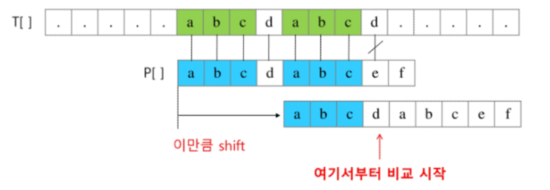

# Algorithm | String

### 목차

> - 문자열
> - 패턴 매칭

</br></br>

### 문자열 String

- 문자의 표현
  - 컴퓨터에서 문자를 표현할 때
    - 메모리는 숫자만을 저장할 수 있음
    - 각 문자에 대해서 대응하는 숫자를 정해 놓고 이것을 메모리에 저장하는 방법이 사용됨
  - 영어는 대소문자를 합쳐서 52이므로 6비트 (`2**6` 가지)로 모두 표현할 수 있다.
    - 이를 **코드 체계**라고 함
  - 네트워크가 발전하기 전에는 지역별로 각각 코드체계를 정해놓고 사용했다.
    - 정보를 저마다 달리 해석하는 문제가 발생
    - 1967년, 미국에서 **ASCII** (American Standard Code for Information Interchange) 라는 문자 인코딩 표준이 제정됨
    - ASCII 는 7비트 인코딩으로 128문자를 표현. 33개의 출력 불가능한 제어문자들과 공백을 비롯한 95개의 출력 가능한 문자로 이루어져 있음
  - 인터넷이 전세계로 발전하면서 ASCII 를 만들었을 때와 같은 문제가 국가간 정보를 주고 받을 때 발생
    - 다국어 처리를 위해 표준을 마련했고, 이를 **유니코드** 라고 함
  - big-endian, little-endian

- 문자열의 분류
  - 문자열 (string)
    - fixed length
    - variable length
      - length controlled - `java` 언어에서의 문자열
      - delimited - `c` 언어에서의 문자열

</br></br>

### 패턴 매칭

- 패턴 매칭에 사용되는 알고리즘
  - 고지식한 패턴 검색 알고리즘
  - 카프-라빈 알고리즘
  - KMP 알고리즘
  - 보이어-무어 알고리즘

</br></br>

- **고지식한 알고리즘 (Brute Force)**

  - 본문 문자열을 처음부터 끝까지 차례로 순회하면서 패턴 내의 문자들을 일일이 비교

  ```python
  # 고지식한 패턴 검색 알고리즘
  
  p = "is" # 찾을 패턴
  t = "This is a book~!" # 전체 텍스트
  M = len(p) # 찾을 패턴의 길이
  N = len(t) # 전체 텍스트의 길이
  
  def bruteForce(p, t):
  	i = 0 # t의 인덱스
  	j = 0 # p의 인덱스
  	while j < M and i < N:
  		if t[i] != p[j]:
  			i = i - j # 비교를 시작한 위치
  			j = -1 # 초기화
  		i = i + 1
  		j = j + 1
  	if j == M:
  		return i - M # 검색 성공
  	else:
  		return -1 # 검색 실패
  ```

  - 시간 복잡도
    - 최악의 경우 텍스트 모든 위치에서 패턴을 비교해야 하므로 `O(MN)` 이 됨

</br></br>

- **KMP 알고리즘**

  - 불일치가 발생한 텍스트 스트링의 앞 부분에 어떤 문자가 있는지 미리 알고 있음

  - 불일치가 발생한 앞 부분에 대해 다시 비교하지 않고 매칭을 수행

  - 패턴을 전처리하여 배열 `next[M]` 을 구해서 잘못된 시작을 최소화한다

    - next[M] : 불일치가 발생했을 경우 이동할 다음 위치

  - 시간 복잡도

    - `O(M+N)`

  - 아이디어 설명

    - 텍스트에서 'abcdabc' 까지 매치가 되고, e 에서 실패했다면
    - 패턴 맨 앞 abc와 실패 직전의 abc가 동일함을 이용
    - 실패한 텍스트 문자와 P[4]를 비교

    

</br></br>

- **보이어-무어 알고리즘**
  - 오른쪽에서 왼쪽으로 비교
  - 대부분 상용 소프트웨어에서 채택하고 있는 알고리즘
  - 패턴에 오른쪽 끝에 있는 문자가 불일치 하고, 이 문자가 패턴 내에 존재하지 않는 경우, 이동거리는 패턴의 길이 만큼이 된다.
  - 오른쪽 끝에 있는 문자가 불일치하고, 이 문자가 패턴 내에 존재할 경우
    - 패턴에서 일치하는 문자를 찾아서 칸 수를 계산하고 점프

</br></br>

- **문자열 매칭 알고리즘 비교**
  - 찾고자하는 문자열 패턴의 길이 m, 총 문자열 길이 n
  - 고지식한 패턴 검색 알고리즘 : `O(mn)`
  - 카프-라빈 알고리즘 : `Θ(n)`
  - KMP 알고리즘 : `Θ(N)`
  - 보이어-무어 알고리즘
    - 최선의 경우 `Ω(n)`
    - 텍스트 문자를 다 보지 않아도 된다
    - 패턴의 오른쪽부터 비교
    - 최악의 경우 `Θ(mn)`
    - 입력에 따라 다르지만 일반적으로 `Θ(n)` 보다 시간이 덜 든다