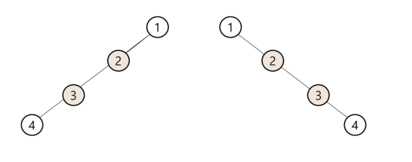

# Algorithm | Tree

### 목차

> - 트리
> - 이진 트리
> - 이진탐색 트리
> - 힙

</br></br>

### 1. 트리

#### 트리의 개념

- 비선형 구조
- 원소들 간 1:N 관계를 가지는 자료구조
- 원소들 간 계층관계를 가지는 계층형 자료구조
- 상위원소 → 하위원소로 내려가면서 확장되는 나무 모양의 구조

- 한 개 이상의 노드로 이루어진 유합 집합.
  - 노드 중 최상위 노드를 루트(`root`) 라고 한다.
  - 나머지 노드들은 분리 집합 T1,...,TN으로 분리될 수 있다.
    - 루트의 부 트리(`subtree`) 라고 한다.

#### 용어 정리

- 노드(`node`) - 트리의 원소
- 간선(`edge`) - 노드를 연결하는 선. 부모-자식 노드를 연결
- 루트 노드(`root node`) - 트리의 시작 노드
- 형제 노드(sibling node) - 같은 부모의 자식 노드들
- 조상 노드 - 간선을 따라 루트 노드까지 이르는 경로에 있는 모든 노드
- 서브 트리(subtree) - 부모 노드와 연결된 간선을 끊었을 때 생성되는 트리
- 자손 노드 - 서브 트리에 있는 하위 레벨의 노드들
- 차수(`degree`)
  - 노드의 차수 : 노드에 연결된 자식 노드의 수
  - 트리의 차수 : 트리에 있는 노드의 차수 중 가장 큰 값
  - 단말 노드(리프 노드) : 차수가 0인 노드. 자식 노드가 없는 노드
- 높이
  - 노드의 높이 : 루트에서 노드에 이르는 간선의 수. 노드의 레벨
  - 트리의 높이 : 트리에 있는 노드의 높이 중 가장 큰 값. 최대 레벨

<br>

### 2. 이진 트리

- 모든 노드들이 2개의 서브트리를 갖는 특별한 형태의 트리
- 각 노드가 자식 노드를 최대 2개까지만 가질 수 있는 트리
  - 왼쪽 자식 노드(left child node)
  - 오른쪽 자식 노드(right child node)
- 특징
  - 레벨 `n` 에서 노드의 최대 개수는 `2ⁿ` 개
    - 높이가 a인 이진 트리가 가질 수 있는 노드의 최소 개수는 `a+1`개, 최대 개수는 `2ª+¹-1` 개

- 종류

  - 포화 이진 트리(Full Binary Tree)

    - 모든 레벨에 노드가 포화상태로 차있는 이진 트리
    - 루트를 1번으로 해서정해진 위치에 대해 모든 노드 번호를 가진다.

    

  - 완전 이진 트리(Complete Binary Tree)

    - 포화 이진 트리의 노드 번호 1번부터 n번까지 빈 자리가 없는 이진 트리

    

  - 편향 이진 트리(Skewed Binary Tree)

    - 높이 h에 대한 최소 개수의 노드를 가지면서 한쪽 방향의 자식 노드만을 가진 이진 트리
    - 왼쪽 편향 이진 트리 / 오른쪽 편향 이진 트리

    

#### 순회 (traversal)

- 트리의 각 노드를 중복되지 않게 전부 방문(visit)하는 것을 말함.
- 트리는 비선형 구조이기 때문에 선형구조와 같이 선후 연결 관계를 알 수 없음

- 3가지 순회 방법

  - 전위 순회(preorder traversal) : VLR

    - 부모노드 방문 후, 자식노드를 좌-우 순서로 방문

    ```python
    def preorder_traverse(T):
        if T:
            visit(T)
            preorder_traverse(T.left)
            preorder_traverse(T.right)
    ```

  - 중위 순회(inorder traversal) : LVR

    - 왼쪽 자식노드, 부모노드, 오른쪽 자식노드 순으로 방문

    ```python
    def inorder_traverse(T):
        if T:
            inorder_traverse(T.left)
            visit(T)
            inorder_traverse(T.right)
    ```

  - 후위 순회(postorder traversal) : LRV

    - 자식노드를 좌-우 순서로 방문 후, 부모노드를 방문

    ```python
    def postorder_traverse(T):
        if T:
            postorder_traverse(T.left)
            postorder_traverse(T.right)
            visit(T)
    ```

#### 이진트리 표현

- 배열
  - 노드 번호의 성질
    - 노드 번호가 `i` 인 노드의 부모노드 번호 = `i/2`
    - 노드 번호가 `i` 인 노드의 왼쪽 자식 노드 번호 = `2*i`
    - 노드 번호가 `i` 인 노드의 오른쪽 자식 노드 번호 = `2*i+1`
    - 레벨 `n` 의 노드 시작 번호 = `2ⁿ`
  - 단점
    - 편향 이진 트리의 경우, 사용하지 않는 배열 원소에 대한 메모리 공간 낭비 발생
    - 트리 중간에 새로운 노드를 삽입 or 기존 노드를 삭제할 경우 배열의 크기 변경이 어려워서 비효율적임

- 연결리스트

  - 배열을 이용한 이진 트리 표현의 단점을 보완하기 위해 연결리스트를 이용할 수 있음

  - 이진 트리의 모든 노드는 최대 2개의 자식 노드를 가짐.

    - 일정한 구조의 단순 연결 리스트 노드를 사용하여 구현

    

#### 수식 트리

- 수식을 표현하는 이진 트리
- 수식 이진 트리(Expression Binary Tree) 라고 부르기도 함.
- 연산자 : 루트 노드이거나 가지 노드
- 피연산자 : 잎 노드


<br>

### 3. 이진 탐색 트리

- 탐색작업을 효율적으로 하기 위한 자료 구조
- 모든 원소는 서로 다른 유일한 키를 가진다.
- `왼쪽 서브트리 key < 루트 노드 key < 오른쪽 서브트리 key`
- 왼쪽 서브트리, 오른쪽 서브트리도 이진 탐색 트리다.
- 중위순회하면, 오름차순으로 정렬된 값을 얻을 수 있음.

#### 연산

- 탐색연산
  - 루트에서 시작
  - 탐색할 키 값 `x` 를 루트 노드의 키 값과 비교
    - 키 값 `x` = 루트노드 키 값 → 원하는 원소를 찾았으므로 탐색연산 성공
    - 키 값 `x` < 루트노드 키 값 → 루트노드의 왼쪽 서브트리에 대해서 탐색연산 수행
    - 키 값 `x` > 루트노드 키 값 → 루트노드의 오른쪽 서브트리에 대해서 탐색연산 수행
- 삽입연산
  - 탐색연산을 먼저 수행
    - 삽입할 원소와 같은 원소가 트리에 있으면 삽입할 수 없으므로, 같은 원소가 트리에 있는지 탐색하여 확인
  - 탐색에서 탐색 실패가 결정되는 위치가 삽입 위치가 된다.

- 탐색(searching) / 삽입(insertion) / 삭제(deletion) 시간은 트리의 높이만큼 걸린다.
  - `O(h)` : h는 이진탐색트리(BST)의 깊이(height)
  - 이진 트리가 균형적으로 생셩되어 있는 경우
    - `O(logn)`
  - 최악의 경우
    - 한쪽으로 치우친 경사 이진트리의 경우 `O(n)`
    - 순차탐색과 시간복잡도가 같음.

<br>

### 4. 힙

- 완전 이진 트리에 있는 노드 중, 키값이 가장 큰 노드나 키값이 가장 작은 노드를 찾기 위해 만든 자료구조
- 최대 힙(max heap)
  - 키값이 가장 큰 노드를 찾기 위한 완전 이진 트리
  - `부모노드의 키 값 > 자식노드의 키 값`
  - 루트 노드 :  키값이 가장 큰 노드
- 최소 힙(min heap)
  - 키값이 가장 작은 노드를 찾기 위한 완전 이진 트리
  - `부모노드의 키 값 < 자식노드의 키 값`
  - 루트 노드 : 키갑싱 가장 작은 노드

- 힙에서는 **루트 노드의 원소만을 삭제할 수** 있음

