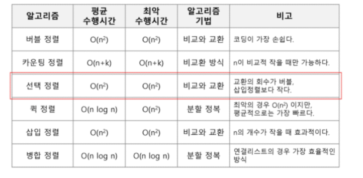

# Algorithm | Array 2

### 목차

- 2차원 배열
- 부분집합 생성
- 바이너리 서치 (Binary Search)
- 셀렉션 알고리즘 (Selection Algorithm)
- 선택 정렬 (Selection Sort)

</br></br>

### 2차원 배열

- 2차원 배열이란?

  - 1차원 List 를 묶어놓은 List

  - 2차원 이상의 다차원 List는 차원에 따라서 `index` 를 선언

  - 2차원 List의 선언

    - 세로 길이 (행의 개수), 가로 길이 (열의 개수)를 필요로 함

  - Python 에서는 데이터 초기화를 통해 변수 선언 및 초기화 가능

    

- 2차원 리스트 만들기 예시 코드

```python
# N은 행, M은 열의 개수
N, M = map(int, input().split())
arr = [list(map(int, input().split())) for _ in range(N)]

# M개의 0으로 채워진 N행의 2차원 배열
arr2 = [[0] * M for _ in range(N)]
'''
arr2 = [[0] * M] * N 사용불가.
얕은 복사이기 때문.
arr2[0] 이 가리키는 [0, 0, 0]과 arr2[1] 이 가리키는 [0, 0, 0] 이 동일한 Object이다.
'''
```

- 배열 순회

  - `nXm` 배열의 모든 원소를 빠짐없이 조사하는 방법
  - 행 우선 순회

  ```python
  # i x j 로 이루어진 배열 Array
  # i 행의 좌표. j 열의 좌표
  for i in range(len(Array)):
      for j in range(len(Array[i])):
          Array[i][j]
  ```

  - 열 우선 순회

  ```python
  # i x j 로 이루어진 배열 Array
  # i 행의 좌표. j 열의 좌표
  for j in range(len(Array[0])):
      for i in range(len(Array)):
          Array[i][j]
  ```

  - 지그재그 순회

  ```python
  # i x j 로 이루어진 배열 Array
  # i 행의 좌표. j 열의 좌표
  for i in range(len(Array)):
      for j in range(len(Array[0])):
          # 짝수일 때는 오른쪽으로 증가하면서, 홀수일 때는 왼쪽으로 감소하면서 순회
          Array[i][j + (m-1-2*j) * (i % 2)]
  ```

  - 델타를 이용한 2차 배열 탐색

  ```python
  # 2차원 배열의 한 좌표에서 4방향의 인접 배열 요소를 탐색하는 방법
  # N x M 으로 이루어진 배열 arr
  
  # 첫번째 방법
  di[] ← [0, 1, 0, -1] # 우하좌상
  dj[] ← [1, 0, -1, 0] # 오른쪽부터 시계방향으로...
  
  for i in range(N):
      for j in range(M):
          for k in range(4):
              ni = i + di[k]
              nj = j + dj[k]
              if 0 <= ni < N and 0 <= nj < M:
              	arr[ni][nj]
                  
  # 두번째 방법
  for i in range(N):
      for j in range(M):
          for dr, dc in [[0, 1], [1, 0], [0, -1], [-1, 0]]:
              ni = i + dr
              nj = j + dc
              if 0 <= ni < N and 0 <= nj < M:
                  arr[ni][nj]
  ```

  - 전치 행렬

  ```python
  # i : 행의 좌표, len(arr)
  # j : 열의 좌표, len(arr[0])
  arr = [[1, 2, 3], [4, 5, 6], [7, 8, 9]] # 3 x 3 행렬
  
  for i in range(3):
      for j in range(3):
          if i < j:
              arr[i][j], arr[j][i] = arr[j][i], arr[i][j]
  ```

</br></br>

### 부분집합

- 부분집합 합 (Subset Sum) 문제

  - 유한 개의 정수로 이루어진 집합이 있을 때, 이 집합의 **부분집합 중에서 그 집합의 원소를 모두 더한 값이 0이 되는 경우가 있는지** 알아내는 문제
  - ex) `[-7, -3, -2, 5, 8]` 이라는 집합이 있을 때, `[-3, -2, 5]` 는 이 집합의 부분 집합이면서 합이 0 이므로 이 경우 답은 `참`이 됨.
  - `완전 검색` 기법으로 부분집합 합 문제를 풀기 위해서는 집합의 모든 부분집합을 생성한 후 각 부분집합의 합을 계산해야 함.

- 부분집합 생성하기

  - 부분집합의 수
    - 집합의 원소가 `n` 개일 때, 공집합을 포함한 부분집합의 수는 `2ⁿ`개 이다.
    - 각 **원소를 부분집합에 포함시키거나 - 포함시키지 않는 2가지 경우**를 모든 원소에 적용한 경우의 수
    - ex. `{1, 2, 3, 4}` 의 부분집합의 수
      - 2 x 2 x 2 x 2 = 16 가지
  - 각 원소가 부분집합에 포함되었는지 loop 를 이용하여 확인하고 부분집합을 생성하는 방법

  ```python
  bit = [0, 0, 0, 0]
  # 0번째 원소
  for i in range(2):
      bit[0] = i
      # 1번째 원소
      for j in range(2):
          bit[1] = j
          # 2번째 원소
          for k in range(2):
              bit[2] = k
              # 3번째 원소
              for l in range(2):
                  bit[3] = l
                  # 생성된 부분집합의 bit list 출력
                  print(bit, end=' ')
                  # 부분집합을 출력
                  for p in range(4):
                      if bit[p]:
                          print(arr[p], end=' ')
                  print()
  ```

#### 비트 연산자

- 비트 연산자
  - `&` : 비트 단위로 AND 연산을 한다.
  - `|` : 비트 단위로 OR 연산을 한다.
  - `<<` : 피연산자의 비트 열을 왼쪽으로 이동시킨다.
  - `>>` : 피연산자의 비트 열을 오른쪽으로 이동시킨다.
- `<<` 연산자
  - `1 << n` : 2ⁿ 즉, 원소가 n개일 경우의 모든 부분집합의 수를 의미
- `&` 연산자
  - `i & (1<<j)` : i 의 j 번째 비트가 1인지 아닌지를 리턴
  - `1 << j` : j 번 비트가 0인지 1인지를 의미하기도 함

- 간결하게 부분집합을 생성하는 방법

```python
arr = [3, 6, 7, 1, 5, 4]

# n : 원소의 개수
n = len(arr)

# 1<<n : 부분 집합의 개수
for i in range(1<<n):
    # 원소의 수만큼 비트를 비교
    for j in range(n):
        # i의 j번째 비트가 1이면 j번째 원소를 출력
        if i & (1<<j):
            print(arr[j], end=", ")
    print()
print()
```

</br></br>

### 검색 (Search)

- 검색이란?
  - 저장되어 있는 자료 중에서 원하는 항목을 찾는 작업
  - 목적하는 탐색 키를 가진 항목을 찾는 것
    - 탐색 키 (Search Key) : 자료를 구별하여 인식할 수 있는 키
  - 검색의 종류
    - 순차 검색 (sequential search)
    - 이진 검색 (binary search)
    - 해쉬 (hash)

#### 순차 검색 (Sequential Search)

- 순차 검색이란?

  - 일렬로 되어 있는 자료를 순서대로 검색하는 방법

    - 가장 간단하고 직관적인 검색 방법
    - 배열, 연결 리스트 등 순차구조로 구현된 자료구조에서 원하는 항목을 찾을 때 유용
    - 알고리즘이 단순하여 구현이 쉽지만, 검색 대상의 수가 많은 경우에 수행시간이 급격히 증가하여 비효율적임

  - 2가지 경우

    - **정렬되어 있지 않은 경우**

      - 검색 과정
        - 첫 번째 원소부터 순서대로 검색 대상과 키 값이 같은 원소가 있는지 비교하며 찾음
        - 키 값이 동일한 원소를 찾으면 그 원소의 인덱스를 반환
        - 자료 구조 마지막에 이를 때까지 검색 대상을 찾지 못하면 검색 실패
      - 찾고자 하는 원소 순서에 따라 비교 횟수가 결정됨
        - 첫 번째 원소를 찾을 때는 1번 비교, 두 번째 원소를 찾을 때는 2번 비교
        - 정렬되지 않은 자료에서 순차 검색의 평균 비교 회수
          - `(1/n)*(1+2+3+...+n) = (n+1)/2`
        - 시간 복잡도 : `O(n)`
      - 구현 예시

      ```python
      def sequentialSearch(a, n, key):
          # index 값 초기화
          i = 0
          
          # index 검사 먼저하고 키와 같은지 검사
          while i < n and a[i] != key:
              i = i+1
              
          # 찾은 경우 인덱스 i 를 반환
          if i < n:
              return i
          # 검색에 실패한 경우 -1 반환
          else:
              return -1
      ```

    - **정렬되어 있는 경우**

      - 검색 과정
        - 자료가 오름차순으로 정렬된 상태에서 검색을 실시한다고 가정
        - 순차적으로 검색하면서 키 값을 비교하고, 원소의 키 값이 검색 대상의 키 값보다 크면 찾는 원소가 없다는 의미이므로 더 이상 검색하지 않고 검색을 종료
      - 찾고자 하는 원소의 순서에 따라 비교 횟수가 결정됨
        - 정렬되어 있으므로, 검색 실패를 반환하는 경우 평균 비교 횟수가 반으로 줄어든다
        - 시간 복잡도 : `O(n)`
      - 구현 예시

      ```python
      def sequentialSearch2(a, n, key):
      	# index 값 초기화
          i = 0
          
      	# index 검사를 먼저하고 비교 대상이 key 값보다 작으면 계속 반복
          while i < n and a[i] < key:
              i += 1
          
          # index가 n보다 작고 key값과 같을 경우 검색을 종료하고 i를 반환
          if i < n and a[i] = key:
              return i
          # 검색에 실패한 경우 -1을 반환
          else:
              return -1
      ```

</br></br>

#### 이진 검색 (Binary Search)

- 이진 검색이란?

  - 자료의 가운데에 있는 항목의 키 값과 비교하여 다음 검색 위치를 결정하고 검색을 계속 진행하는 방법
    - 목적 키를 찾을 때까지 이진 검색을 순환적으로 반복 수행
    - 검색 범위를 반으로 줄여가면서 보다 빠르게 검색을 수행
  - 이진 검색을 하기 위해서는 **자료가 정렬된 상태여야 함**
  - 검색 과정
    - 자료의 중앙에 있는 원소를 고른다
    - 중앙 원소의 값과 찾고자 하는 목표 값을 비교
      - 목표 값이 중앙 원소의 값보다 작으면, 자료의 왼쪽 반에 대해서 새로운 검색을 수행.
      - 중앙 원소 값보다 크다면, 자료의 오른쪽 반에 대해서 새로운 검색을 수행
    - 찾고자 하는 값을 찾을 때까지 위 과정을 반복
  - 구현
    - 검색 범위의 시작점과 종료점을 이용해서 검색을 반복 수행
    - 자료의 삽입 or 삭제가 발생했을 때 배열의 상태를 항상 정렬 상태로 유지하는 추가 작업이 필요함

  ```python
  # a는 정렬된 배열. key는 목표 값
  def binarySearch(a, key):
      # 시작점과 종료점 초기화
      start = 0
      end = len(a) - 1
      
      # 검색 구간이 구분되는 동안 while문을 반복
      while start <= end:
          # 중앙 지점 = (시작점 + 종료점) // 2
          middle = (start + end) // 2
          # 중앙 값이 목표 값과 같으면 검색 성공
          if a[middle] == key:
              return True
          # 중앙 값이 목표 값보다 크면, 왼쪽 반을 탐색해야 함
          elif a[middle] > key:
              # 종료점을 중앙 지점 - 1로 변경
              end = middle - 1
          # 중앙 값이 목표 값보다 작으면, 오른쪽 반을 탐색해야 함
          else:
              # 시작점을 중앙 지점 + 1로 변경
              start = middle + 1
      # 검색 실패           
      return False
  ```

  ```python
  # 재귀함수로 구현
  def binarySearch2(a, low, high, key):
      if low > high:
          return False
      else:
          middle = (low + high) // 2
          if key == a[middle]:
              return True
          elif key < a[middle]:
              return binarySearch2(a, low, middle-1, key)
          elif a[middle] < key:
              return binarySearch2(a, middle+1, high, key)
  ```

</br></br>

### 인덱스

- Index 라는 용어는 Database에서 유래했으며, 테이블에 대한 동작 속도를 높여주는 자료구조를 일컬음
- 데이터베이스 분야가 아닌 곳에서는 Look up table 등의 용어를 사용하기도 함
- 인덱스를 저장하는데 필요한 디스크 공간 < 테이블을 저장하는데 필요한 디스크 공간
  - 인덱스는 키-필드만 갖고 있고, 테이블의 다른 세부 항목들은 갖고 있지 않기 때문
- 배열을 사용한 인덱스
  - 대량의 데이터를 매번 정렬하면 프로그램 반응이 느려질 수 밖에 없다
  - 대량 데이터의 성능 저하 문제를 해결하기 위해 배열 인덱스를 사용할 수 있음

### 선택 정렬

- 포켓볼 순서대로 정렬하기
  - 흩어진 당구공을 정리하기 위해서는?
  - 당구대 위에 있는 공 중 가장 작은 숫자의 공부터 골라서 차례대로 정리 → 선택 정렬
- 선택 정렬이란?
  - 주어진 자료들 중 가장 작은 값의 원소부터 차례대로 선택하여 위치를 교환하는 방식
- 정렬 과정
  - 주어진 리스트 중에서 최소값을 찾는다.
  - 그 값을 리스트의 맨 앞의 위치한 값과 교환한다.
  - 맨 처음 위치를 제외한 나머지 리스트를 대상으로 위 과정을 반복한다.
- 시간 복잡도 = `O(n²)`
- 알고리즘

```python
def SelectionSort(a[], n):
    for i from 0 to n-1
    	a[i],...,a[n-1] 원소 중 최소값 a[k] 찾음
        a[i]와 a[k] 교환
```

- 선택 정렬

```python
def selectionSort(a):
    # 작업 구간의 시작
    for i in range(0, len(a)-1):
		# 맨 앞이 제일 작다고 가정
        min = i
        # i 다음 인덱스부터 반복
        for j in range(i+1, len(a)):
            # j 인덱스의 값이 현재 최소값보다 작으면
            if a[min] > a[j]:
                # 최소값의 인덱스를 j로 변경
                min = j
		#                 
        a[i], a[min] = a[min], a[i]
```

### 셀렉션 알고리즘 (Selection Algorithm)

- 셀렉션 알고리즘이란?
  - 저장되어 있는 자료로부터 k번째로 크거나 작은 원소를 찾는 방법
  - 최소값, 최대값 또는 중간값을 찾는 알고리즘을 의미하기도 함
- 선택 과정
  - 정렬 알고리즘을 이용하여 자료 정렬
  - 원하는 순서에 있는 원소 가져오기
- k번째로 작은 원소를 찾는 알고리즘
  - 1번부터 k번째까지 작은 원소들을 찾아 배열의 앞쪽으로 이동시키고, 배열의 k번째를 반환
  - k가 비교적 작을 때 유용하며 `O(kn)` 의 수행시간을 필요로 함

```python
def select(list, k):
    for i in range(0, k):
        minIndex = i
        for j in range(i+1, len(list)):
            if list[minIndex] > list[j]:
                minIndex = j
        list[i], list[minIndex] = list[minIndex], list[i]
    return list[k-1]
```



