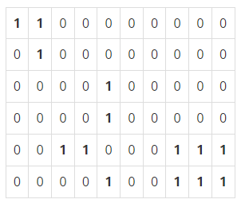

# Algorithm | 백준 1012.유기농 배추 (python)

> 본 문제의 저작권은 BAEKJOON에 있습니다.
>
> [백준 1012.유기농 배추 링크](https://www.acmicpc.net/problem/1012)

</br>

#### 문제

차세대 영농인 한나는 강원도 고랭지에서 유기농 배추를 재배하기로 하였다. 농약을 쓰지 않고 배추를 재배하려면 배추를 해충으로부터 보호하는 것이 중요하기 때문에, 한나는 해충 방지에 효과적인 배추흰지렁이를 구입하기로 결심한다. 이 지렁이는 배추근처에 서식하며 해충을 잡아 먹음으로써 배추를 보호한다. 특히, 어떤 배추에 배추흰지렁이가 한 마리라도 살고 있으면 이 지렁이는 인접한 다른 배추로 이동할 수 있어, 그 배추들 역시 해충으로부터 보호받을 수 있다. 한 배추의 상하좌우 네 방향에 다른 배추가 위치한 경우에 서로 인접해있는 것이다.

한나가 배추를 재배하는 땅은 고르지 못해서 배추를 군데군데 심어 놓았다. 배추들이 모여있는 곳에는 배추흰지렁이가 한 마리만 있으면 되므로 서로 인접해있는 배추들이 몇 군데에 퍼져있는지 조사하면 총 몇 마리의 지렁이가 필요한지 알 수 있다. 예를 들어 배추밭이 아래와 같이 구성되어 있으면 최소 5마리의 배추흰지렁이가 필요하다. 0은 배추가 심어져 있지 않은 땅이고, 1은 배추가 심어져 있는 땅을 나타낸다.



</br>

#### 입력

입력의 첫 줄에는 테스트 케이스의 개수 T가 주어진다. 그 다음 줄부터 각각의 테스트 케이스에 대해 첫째 줄에는 배추를 심은 배추밭의 가로길이 M(1 ≤ M ≤ 50)과 세로길이 N(1 ≤ N ≤ 50), 그리고 배추가 심어져 있는 위치의 개수 K(1 ≤ K ≤ 2500)이 주어진다. 그 다음 K줄에는 배추의 위치 X(0 ≤ X ≤ M-1), Y(0 ≤ Y ≤ N-1)가 주어진다. 두 배추의 위치가 같은 경우는 없다.

</br>

#### 출력

각 테스트 케이스에 대해 필요한 최소의 배추흰지렁이 마리 수를 출력한다.

</br>

#### 코드

```python
from collections import deque


def bfs(a, b, arr):
    q = deque()
    q.append((a, b))

    while q:
        x, y = q.popleft()

        for k in range(4):
            nx = x + dx[k]
            ny = y + dy[k]

            if (nx in range(N) and ny in range(M)) and arr[nx][ny] == 1:
                arr[nx][ny] = 0
                q.append((nx, ny))


dx = [0, 1, 0, -1]
dy = [1, 0, -1, 0]

T = int(input())
for tc in range(1, T+1):
    M, N, K = map(int, input().split())

    mat = [[0] * M for _ in range(N)]

    for _ in range(K):
        X, Y = map(int, input().split())
        mat[Y][X] = 1

    ans = 0
    for i in range(N):
        for j in range(M):
            if mat[i][j] == 1:
                bfs(i, j, mat)
                ans += 1

    print(ans)
```

</br>

#### 풀이

- **BFS** 를 이용하여 문제를 해결하였다.
- `NxM` 크기의 밭을 생성하고 각 위치 값을 `0` 으로 초기화한다.
- `K` 개의 `X`, `Y`  좌표에 대해서 밭의 값을 1로 변경한다. 이 때, **`X` 와 `Y` 의 위치가 바뀌어야 함을 주의**한다.
- 밭을 순회하면서 그 값이 1인 경우 `bfs()` 함수를 시행한다. 현재 좌표 `a`, `b` 에 대하여 4방향 탐색을 진행하는데, 배추가 존재한다면(값이 `1`인 경우)  해당 위치의 값을 `0` 으로 바꾸어주고, `q` 에 넣어준다.
- 한 번의 `bfs` 함수 시행이 종료되면 배추흰지렁이 수(`ans`)를 `1` 증가 시킨다.

