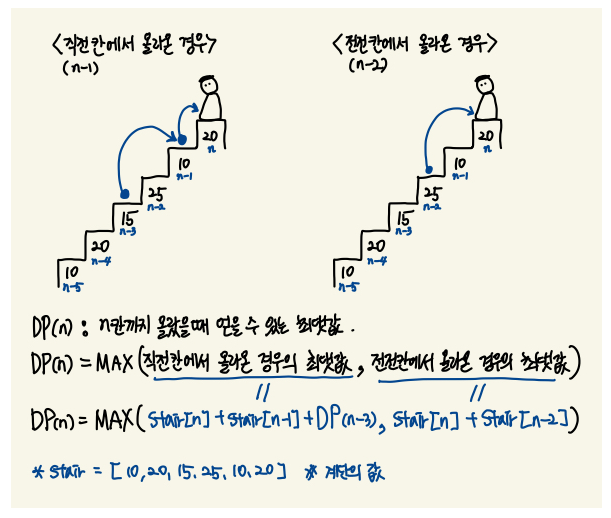

# Algorithm | 백준 2579.계단 오르기 (python)

> 본 문제의 저작권은 BAEKJOON에 있습니다.
>
> [백준 2579.계단 오르기 링크](https://www.acmicpc.net/problem/2579)

</br>

#### 문제

계단 오르기 게임은 계단 아래 시작점부터 계단 꼭대기에 위치한 도착점까지 가는 게임이다. <그림 1>과 같이 각각의 계단에는 일정한 점수가 쓰여 있는데 계단을 밟으면 그 계단에 쓰여 있는 점수를 얻게 된다.


<그림 1>

예를 들어 <그림 2>와 같이 시작점에서부터 첫 번째, 두 번째, 네 번째, 여섯 번째 계단을 밟아 도착점에 도달하면 총 점수는 10 + 20 + 25 + 20 = 75점이 된다.


<그림 2>

계단 오르는 데는 다음과 같은 규칙이 있다.

1. 계단은 한 번에 한 계단씩 또는 두 계단씩 오를 수 있다. 즉, 한 계단을 밟으면서 이어서 다음 계단이나, 다음 다음 계단으로 오를 수 있다.
2. 연속된 세 개의 계단을 모두 밟아서는 안 된다. 단, 시작점은 계단에 포함되지 않는다.
3. 마지막 도착 계단은 반드시 밟아야 한다.

따라서 첫 번째 계단을 밟고 이어 두 번째 계단이나, 세 번째 계단으로 오를 수 있다. 하지만, 첫 번째 계단을 밟고 이어 네 번째 계단으로 올라가거나, 첫 번째, 두 번째, 세 번째 계단을 연속해서 모두 밟을 수는 없다.

각 계단에 쓰여 있는 점수가 주어질 때 이 게임에서 얻을 수 있는 총 점수의 최댓값을 구하는 프로그램을 작성하시오.

</br>

#### 입력

입력의 첫째 줄에 계단의 개수가 주어진다.

둘째 줄부터 한 줄에 하나씩 제일 아래에 놓인 계단부터 순서대로 각 계단에 쓰여 있는 점수가 주어진다. 계단의 개수는 300이하의 자연수이고, 계단에 쓰여 있는 점수는 10,000이하의 자연수이다.

</br>

#### 출력

첫째 줄에 계단 오르기 게임에서 얻을 수 있는 총 점수의 최댓값을 출력한다.

</br>

#### 코드

```python
N = int(input())
stairs = []

for _ in range(N):
    stairs.append(int(input()))

dp = [stairs[0]]

if N > 1:
    dp.append(max(dp[0] + stairs[1], stairs[1]))

if N > 2:
    dp.append(max(dp[0] + stairs[2], stairs[1] + stairs[2]))

for i in range(3, N):
    dp.append(max(dp[i-3] + stairs[i-1] + stairs[i], dp[i-2] + stairs[i]))

print(dp[-1])
```

</br>

#### 풀이

- DP(동적 프로그래밍) 문제이고, **점화식**을 이용하여 문제를 해결한다.
- 시작 지점부터 어떤 계단을 밟고 가야하는지를 체크하는 것이 아닌, 도착 지점을 기준으로 **어떤 계단을 밟고 왔는지** 를 체크하는 것으로 문제를 해결해보자.



- 이미지와 같이
  - 직전 칸(`N-1`) 에서 올라온 경우
  - 전전 칸(`N-2`) 에서 올라온 경우
  - 를 나누어 생각하면 점화식을 쉽게 구할 수 있다.

<br>

#### 참고

- 문제 풀이 및 이미지는 아래 블로그 글에서 참고하였다.
  - https://daimhada.tistory.com/181
