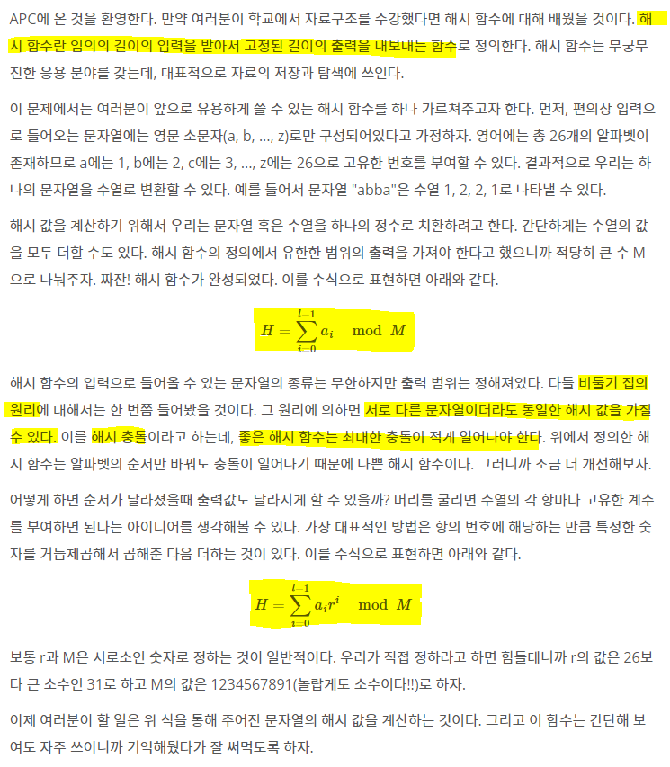

# Algorithm | 백준 15829.Hashing (python)

> 본 문제의 저작권은 BAEKJOON에 있습니다.
>
> [백준 15829.Hashing 링크](https://www.acmicpc.net/problem/15829)

</br>

#### 문제



</br>

#### 코드

```python
hash_alpha = [0, 'a', 'b', 'c', 'd', 'e', 'f',
        'g', 'h', 'i', 'j', 'k', 'l', 'm', 'n',
        'o', 'p', 'q', 'r', 's', 't', 'u',
        'v', 'w', 'x', 'y', 'z']

r = 31
M = 1234567891

L = int(input())
words = input()

total = 0

for idx, word in enumerate(words):
    val = hash_alpha.index(word)
    total += val * r ** idx

H = total % M

print(H)
```

</br>

#### 풀이

```python
알파벳 고유의 번호를 부여한 hash_alpha 리스트를 생성한다.
r, M은 문제에 제시된 상수를 할당하고, 문자열 길이 L과 문자열 words를 입력받는다.
enumerate() 함수를 사용하여, idx, word를 사용한다.
for문 내부의 수식은 주어진 문제의 해시 함수 수식을 그대로 적용한다.
```


✨문제 내부에 주어진 조건과 수식을 활용하면 문제는 쉽게 풀 수 있다. 하지만 **해시 함수** 의 개념을 설명해주는 문제 내용 자체가 너무 좋은 것 같다. 출제자 최고!!! 😁

