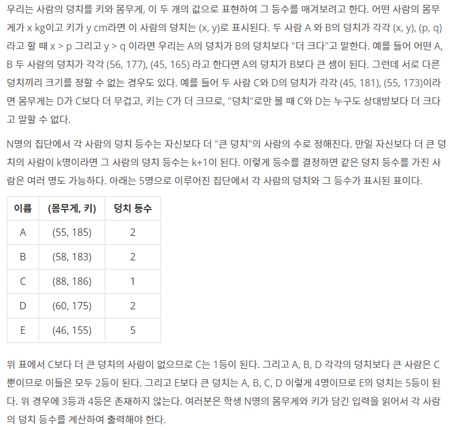

# Algorithm | 백준 7568.덩치 (python)

> 본 문제의 저작권은 BAEKJOON에 있습니다.
>
> [백준 7568.덩치 링크](https://www.acmicpc.net/problem/7568)

</br>

#### 문제



</br>

#### 코드

```python
N = int(input())

persons = []

for _ in range(N):
    w, h = map(int, input().split())
    persons.append([w, h])

for person in persons:
    rank = 1
    for people in persons:
        if  person[0] < people[0] and person[1] < people[1]:
            rank += 1
    print(rank, end=' ')import sys
```

</br>

#### 풀이

```python
브루트포스(Brute Force) 문제로, 모든 경우를 확인하면서 답을 구하는 문제이다.

1. N만큼 반복하면서 몸무게와 키를 입력받아 persons 리스트에 저장한다.
2. for문으로 persons를 반복순회하는데 이때 rank를 1로 초기화 한다.
3. 이중 for문에서 또다시 persons를 반복하는데 여기서 덩치를 비교한다. 몸무게와 키 모두 크다면, rank를 1 증가시킨다.
4. 이중 for문이 종료되면 rank를 출력한다.
```


#### 참고

https://roseline124.github.io/algorithm/2019/04/06/Altorithm-baekjoon-7568.html

https://claude-u.tistory.com/122


✨ 브루트포스 문제로, 모든 경우의 수를 체크하면서 해답을 구하는 문제이다. 코드를 보니 생각보다 간단한 문제였다. 고민을 너무 많이 하면 오히려 문제 해결을 못하는 케이스...😂 2021.12.26

