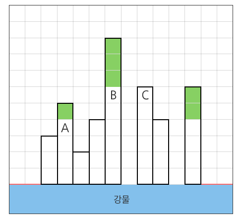

# Algorithm | SWEA 1206.View (python)

> 본 문제의 저작권은 SW Expert 아카데미에 있습니다.
>
> [SWEA 1206.View 링크](https://swexpertacademy.com/main/code/problem/problemDetail.do?contestProbId=AV134DPqAA8CFAYh&categoryId=AV134DPqAA8CFAYh&categoryType=CODE&problemTitle=1206&orderBy=FIRST_REG_DATETIME&selectCodeLang=ALL&select-1=&pageSize=10&pageIndex=1)

</br></br>

#### 문제

```
강변에 빌딩들이 옆으로 빽빽하게 밀집한 지역이 있다.

이곳에서는 빌딩들이 너무 좌우로 밀집하여, 강에 대한 조망은 모든 세대에서 좋지만 왼쪽 또는 오른쪽 창문을 열었을 때 바로 앞에 옆 건물이 보이는 경우가 허다하였다.

그래서 이 지역에서는 왼쪽과 오른쪽으로 창문을 열었을 때, 양쪽 모두 거리 2 이상의 공간이 확보될 때 조망권이 확보된다고 말한다.

빌딩들에 대한 정보가 주어질 때, 조망권이 확보된 세대의 수를 반환하는 프로그램을 작성하시오.
 
아래와 같이 강변에 8채의 빌딩이 있을 때, 연두색으로 색칠된 여섯 세대에서는 좌우로 2칸 이상의 공백이 존재하므로 조망권이 확보된다. 따라서 답은 6이 된다.

A와 B로 표시된 세대의 경우는 왼쪽 조망은 2칸 이상 확보가 되었지만 오른쪽 조망은 한 칸 밖에 확보가 되지 않으므로 조망권을 확보하지 못하였다.

C의 경우는 반대로 오른쪽 조망은 2칸이 확보가 되었지만 왼쪽 조망이 한 칸 밖에 확보되지 않았다.
```



</br></br>

#### 코드

```python
# 테스트 케이스는 총 10개
T = 10

# 10번의 테스트 케이스를 반복
for TC in range(1, T+1):
    # 건물 개수 (가로 길이) 저장
    TC_length = int(input())
    # 건물의 높이 리스트 저장
    buildingHeight = list(map(int, input().split()))
    
    # 조망권이 확보된 세대 수를 저장하는 result 변수 초기화
    result = 0
    
    # 맨 왼쪽 두 칸, 오른쪽 두 칸을 제외하고 건물을 반복
    for i in range(2, TC_length-2):
        # 해당 건물의 높이가 왼쪽으로 1, 2칸 건물과 오른쪽으로 1, 2칸 건물의 높이보다 높다면 조망권을 확보할 수 있음
        if buildingHeight[i] > buildingHeight[i-2] and buildingHeight[i] > buildingHeight[i-1] and buildingHeight[i] > buildingHeight[i+1] and buildingHeight[i] > buildingHeight[i+2]:

            #  비교하는 4개의 건물 중 가장 높은 값을 구하기 위해 변수를 초기화
            max_height = buildingHeight[i-2]
            # 왼쪽 2, 1칸 오른쪽 1, 2칸의 건물을 순회
            for j in range(-2, 3):
                # j가 0인 경우는 자기 자신이기 때문에 넘어간다.
                if j == 0:
                    continue
                # 4칸의 건물 중 가장 높은 건물의 높이를 구한다
                if buildingHeight[i-j] > max_height:
                    max_height = buildingHeight[i-j]
            # 기준이 되는 건물의 높이 - 비교 건물 중 가장 큰 건물의 높이 = 조망권 확보 세대. 이 값을 result 변수에 더해준다.
            result += buildingHeight[i] - max_height
    
    # 결과 값 출력
    print('#{0} {1}'.format (TC, result))
```

</br></br>

#### 풀이

```
빌딩의 높이가 좌우 1, 2칸 건물의 최고 높이보다 높으면 조망권이 확보되는 것을 파악하는 것이 주요하다.
문제 풀이의 핵심을 파악하고 나서는 반복문과 조건문의 중첩을 통해 결과값을 계산하는 것이 쉬웠다.
```

