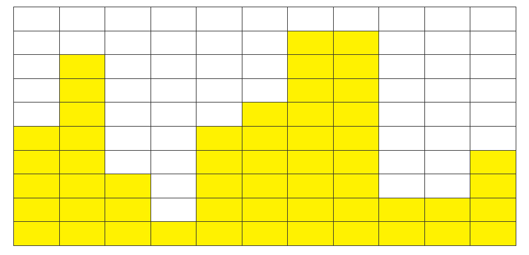

# Algorithm | SWEA 1208.Flatten (python)

> 본 문제의 저작권은 SW Expert 아카데미에 있습니다.
>
> [SWEA 1208.Flatten 링크](https://swexpertacademy.com/main/code/problem/problemDetail.do?contestProbId=AV139KOaABgCFAYh&categoryId=AV139KOaABgCFAYh&categoryType=CODE&problemTitle=1208&orderBy=FIRST_REG_DATETIME&selectCodeLang=ALL&select-1=&pageSize=10&pageIndex=1)

</br>

#### 문제

```
한 쪽 벽면에 노란색 상자들이 쌓여 있다.

높은 곳의 상자를 낮은 곳에 옮기는 방식으로 최고점과 최저점의 간격을 줄이는 작업을 평탄화라고 한다.

평탄화를 모두 수행하고 나면, 가장 높은 곳과 가장 낮은 곳의 차이가 최대 1 이내가 된다.

평탄화 작업을 위해서 상자를 옮기는 작업 횟수에 제한이 걸려있을 때, 제한된 횟수만큼 옮기는 작업을 한 후 최고점과 최저점의 차이를 반환하는 프로그램을 작성하시오.


```



</br>

#### 코드

```python
# 테스트는 총 10개
T = 10

# 10개의 테스트 케이스를 반복
for TC in range(1, T+1):
    # 덤프 횟수 받아오기
    dump = int(input())
    # 각 상자의 높이값 받아서 리스트로 저장
    box_list = list(map(int, input().split()))

    # 덤프 횟수가 0이 될 때까지 반복
    while dump > 0:
        
        # 최대값과 인덱스, 최소값과 인덱스를 초기화
        max_value = box_list[0]
        max_idx = 0
        min_value = box_list[0]
        min_idx = 0

        # box_list 를 순회하며, 최대값과 인덱스, 최소값과 인덱스를 찾는다.
        for idx, value in enumerate(box_list):
            if value > max_value:
                max_value = value
                max_idx = idx
            elif value < min_value:
                min_value = value
                min_idx = idx

        # box_list의 최대값에서 1을 빼고, 최소값에 1을 더해준다.
        box_list[max_idx] -= 1
        box_list[min_idx] += 1

        # 한 번의 덤프가 끝났기 때문에, dump 값에 -1 해준다.
        dump -= 1

    # 주어진 덤프가 완료된 후, 최대값과 최소값을 찾기 위해 변수를 초기화한다.
    max_value = box_list[0]
    min_value = box_list[0]

    # box_list 를 순회하며 최대값과 최소값을 찾는다.
    for box in box_list:
        if box > max_value:
            max_value = box
        elif box < min_value:
            min_value = box

    # 덤프 횟수가 줄어들기 전에 평탄화가 끝날 경우
    if max_value - min_value == 0 or max_value - min_value == 1:
        print(max_value - min_value)
    
    # 결과값 출력
    print('#{0} {1}'.format (TC, max_value - min_value))
```

</br>

#### 풀이

```python
최대값과 인덱스, 최소값과 인덱스를 찾을 때 enumerate() 함수를 사용하면 편리하다.
덤프 횟수가 0이 될 때까지 while 문을 반복하면서 최대값에서 1을 빼고 최소값에서 1을 더해준다.
덤프가 완료된 이후에는 다시 상자 리스트를 반복 순회하면서, 최대값과 최소값을 찾아준다.
```


