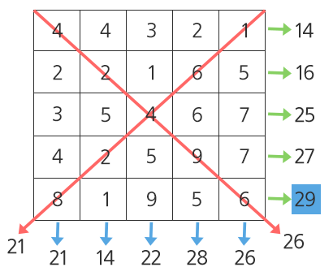

# Algorithm | SWEA 1209.Sum (python)

> 본 문제의 저작권은 SW Expert 아카데미에 있습니다.
>
> [SWEA 1209.Sum 링크](https://swexpertacademy.com/main/code/problem/problemDetail.do?contestProbId=AV13_BWKACUCFAYh&categoryId=AV13_BWKACUCFAYh&categoryType=CODE&problemTitle=1209&orderBy=FIRST_REG_DATETIME&selectCodeLang=ALL&select-1=&pageSize=10&pageIndex=1)

</br>

#### 문제

```
다음 100X100의 2차원 배열이 주어질 때, 각 행의 합, 각 열의 합, 각 대각선의 합 중 최댓값을 구하는 프로그램을 작성하여라.

다음과 같은 5X5 배열에서 최댓값은 29이다.
```



</br>

#### 코드

```python
T = 10

for tc in range(1, T+1):
    tc_num = int(input())
    
    # 100x100 array 배열 리스트 생성
    arr = [list(map(int, input().split())) for _ in range(100)]

    #행 합 구하기
    row_total_list = []
    for i in range(100):
        # 각 행의 합을 구하는 r_total 변수 초기화
        r_total = 0
        # 각 행의 합을 구하고, 그 값을 row_total_list 에 추가
        for j in range(100):
            r_total += arr[i][j]
        row_total_list.append(r_total)

    #열 합 구하기
    col_total_list = []
    for j in range(100):
        # 각 열의 합을 구하는 c_total 변수 초기화
        c_total = 0
        # 각 열의 합을 구하고, 그 값을 col_total_list 에 추가
        for i in range(100):
            c_total += arr[i][j]
        col_total_list.append(c_total)

    #좌>우 대각선 합 구하기
    l_diag_total = 0
    for i in range(100):
        l_diag_total += arr[i][i]

    #우>좌 대각선 합 구하기
    r_diag_total = 0
    # i는 0부터 +1씩, j는 N-1 부터 -1씩 감소하면서 순회
    for i in range(100):
        for j in range(99, -1, -1):
            # 대각의 합을 구해야 하기 때문에, 인덱스 값이 동일해야함
            if i + j == 99:
                r_diag_total += arr[i][j]


    #최대값 찾기
    find_max_value = [max(row_total_list), max(col_total_list), l_diag_total, r_diag_total]
    result = max(find_max_value)
    
    # 결과 출력
    print('#{0} {1}'.format (tc_num, result))

```

</br>

#### 풀이

```python
각 행의 합과 열의 합은 범위 내에서 반복 순회하면서 total 변수에 더해주면 된다.
좌상단에서 우하단으로 이어지는 대각선의 합은 i와 j의 인덱스가 0,0 1,1 2,2 ... 와 같이 동일한 경우를 계산하면 된다.
우상단에서 좌하단으로 이어지는 대각선의 합을 구하는 것은 인덱스 범위를 잡는 것이 어려운 사람에게는 꽤 시간이 걸리는 부분일 수 있다.
i와 j의 값의 합이 99일 경우 해당 대각선의 값에 접근할 수 있다.
이후에는 max() 함수를 사용해서 각각의 합 중에서 가장 큰 값을 찾아내면 된다.
```

