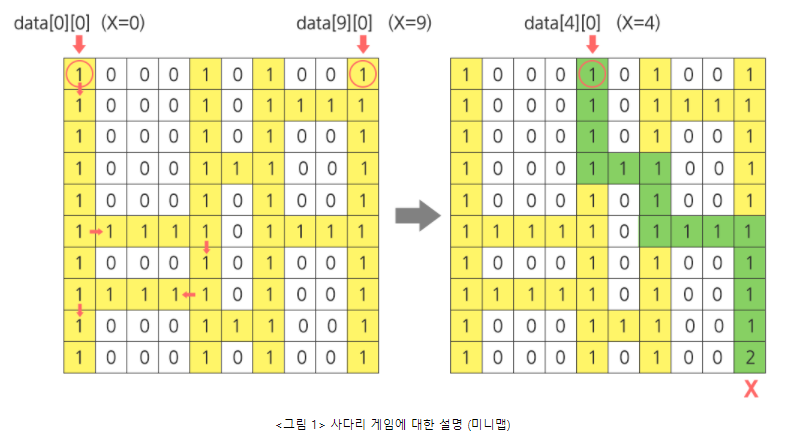

# Algorithm | SWEA 1210.ladder1 (python)

> 본 문제의 저작권은 SW Expert 아카데미에 있습니다.
>
> [SWEA 1210.ladder1 링크](https://swexpertacademy.com/main/code/problem/problemDetail.do?contestProbId=AV14ABYKADACFAYh&categoryId=AV14ABYKADACFAYh&categoryType=CODE&problemTitle=1210&orderBy=FIRST_REG_DATETIME&selectCodeLang=ALL&select-1=&pageSize=10&pageIndex=1)

</br>

#### 문제

```
점심 시간에 산책을 다니는 사원들은 최근 날씨가 더워져, 사다리 게임을 통하여 누가 아이스크림을 구입할지 결정하기로 한다.

김 대리는 사다리타기에 참여하지 않는 대신 사다리를 그리기로 하였다.

사다리를 다 그리고 보니 김 대리는 어느 사다리를 고르면 X표시에 도착하게 되는지 궁금해졌다. 이를 구해보자.

아래 <그림 1>의 예를 살펴보면, 출발점 x=0 및 x=9인 세로 방향의 두 막대 사이에 임의의 개수의 막대들이 랜덤 간격으로 추가되고(이 예에서는 2개가 추가됨) 이 막대들 사이에 가로 방향의 선들이 또한 랜덤하게 연결된다.

X=0인 출발점에서 출발하는 사례에 대해서 화살표로 표시한 바와 같이, 아래 방향으로 진행하면서 좌우 방향으로 이동 가능한 통로가 나타나면 방향 전환을 하게 된다.

방향 전환 이후엔 다시 아래 방향으로만 이동하게 되며, 바닥에 도착하면 멈추게 된다.

문제의 X표시에 도착하려면 X=4인 출발점에서 출발해야 하므로 답은 4가 된다. 해당 경로는 별도로 표시하였다.
```



</br>

#### 코드

```python
# 도착지에서 위로 올라가면서 출발지를 찾는 함수
def search(start):

    i = 99 # 행
    j = start # 열

    while i > 0: # 맨 윗줄에 도착하기 전까지 위로 올라감
        i -= 1 # 위로 한 칸 이동

        if j > 0 and ladder[i][j-1] == 1:         # 왼쪽 칸이 1이면
            while j > 0 and ladder[i][j-1] == 1:  # 사다리를 벗어나거나 0을 만날 때까지
                j -= 1                            # 왼쪽으로 이동

        elif j < 99 and ladder[i][j+1] == 1:      # 오른쪽 칸이 1이면
            while j < 99 and ladder[i][j+1] == 1: # 사다리를 벗어나거나 0을 만날 때까지
                j += 1                            # 오른쪽으로 이동

        # 좌우가 모두 0 이면 다시 위로 이동

    # 0번 행에 도착했을 때의 열(=출발지) 번호를 리턴
    return j

# 테스트 케이스 수는 10
T = 10
for tc in range(1, T+1):
    # n은 테스트 케이스 번호
    n = int(input())
    # 사다리 저장
    ladder = [list(map(int, input().split())) for _ in range(100)]

    # 도착지 검색
    # 도착지의 열 idx를 저장하는 goal 변수 초기화
    goal = 0
    # 사다리 100번 행의 i열의 값이 2이면 그 지점이 도착지이다.
    for i in range(100):
        if ladder[99][i] == 2:
            goal = i
    
    # search 함수를 통해 결과값을 ans에 저장하고 출력
    ans = search(goal)
    print('#{} {}'.format(tc, ans))
```

</br>

#### 풀이

**도착지에서 반대로 출발지를 찾아가는 방식**으로 문제를 해결할 수 있다. 사다리의 100번째 행의 i번째 열의 값이 2이면 그 곳이 도착지이므로, `if ladder[99][i] == 2: goal = i` 조건으로 도착지 열을 찾고 그 값을 활용해서 문제를 풀어나간다. 함수 안에서 while문을 반복할 때, **열(j)의 인덱스가 범위를 벗어나지 않게끔 적절하게 설정**해야 한다. 또한, **한 칸씩 위로 올라가면서 왼쪽 또는 오른쪽의 값이 1이면 수평으로 이동을 하는 과정을 사다리 0번째 행에 도달할 때까지 반복**한다.
