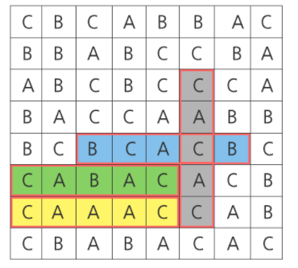

# Algorithm | SWEA 1215.회문1 (python)

> 본 문제의 저작권은 SW Expert 아카데미에 있습니다.
>
> [SWEA 1215.회문1 링크](https://swexpertacademy.com/main/code/problem/problemDetail.do?contestProbId=AV14QpAaAAwCFAYi&categoryId=AV14QpAaAAwCFAYi&categoryType=CODE&problemTitle=1215&orderBy=FIRST_REG_DATETIME&selectCodeLang=ALL&select-1=&pageSize=10&pageIndex=1)

</br>

#### 문제

```
"기러기" 또는 "level" 과 같이 거꾸로 읽어도 앞에서부터 읽은 것과 같은 문장이나 낱말을 회문(回文, palindrome)이라 한다.

주어진 8x8 평면 글자판에서 가로, 세로를 모두 보아 제시된 길이를 가진 회문의 총 개수를 구하는 문제이다.

아래와 같은 글자판이 주어졌을 때, 길이가 5인 회문은 붉은색 테두리로 표시된 4개가 있으며 따라서 4를 반환하면 된다.
```



</br>

#### 코드

```python
# 테스트 케이스 횟수는 10
T = 10
for tc in range(1, T+1):

    # palindrome 의 길이 입력
    p = int(input())
    # 평면 글자판은 8x8
    N = 8
    # 글자판 입력
    arr = [list(input()) for _ in range(N)]

    # 회문의 수를 구하기 위해 변수 초기화
    cnt = 0

    # 가로일 때
    for i in range(0, N):
        for j in range(0, N-p+1):
            # 글자판 i번째 행의 j번째 열부터 회문의 길이만큼의 문장과 그 역순 문장이 같으면
            if arr[i][j:j+p] == arr[i][j:j+p][::-1]:
                # 회문이므로, cnt에 1을 더해준다.
                cnt += 1

    # 세로일 때
    for j in range(0, N):
        for i in range(0, N-p+1):
            # 세로 문장을 확인하기 위해 char 변수 생성 및 초기화
            char = ''
            # i번째 행부터 회문의 길이만큼 문자열을 char 변수에 저장
            for ci in range(i, i+p):
                char += arr[ci][j]
            # char 문장과 그 역순 문장이 같으면 회문이므로, cnt에 1을 더해준다.
            if char == char[::-1]:
                cnt += 1

    # 결과 출력
    print('#{} {}'.format(tc, cnt))
```

</br>

#### 풀이

8x8 글자판을 가로, 세로로 반복하면서 회문의 길이만큼의 문장을 구하고 그 문장이 회문인지 여부를 판단하는 문제이다. **가로일 때는 열(j)의 인덱스 범위를 조정하고 `[::-1]` 으로 문장의 역순**을 쉽게 구할 수 있다. **세로로 반복할 때에는 범위만큼 인덱스 슬라이싱을 할 수 없기 때문에 `for문` 을 한번 더 중첩**해서 행(i)을 반복순회하여 문장을 구해야 한다. 회문인지 여부는 가로로 판별할 때와 마찬가지로 찾은 **문장의 역순 `[::-1]` 값으로 쉽게 판단**할 수 있다.
