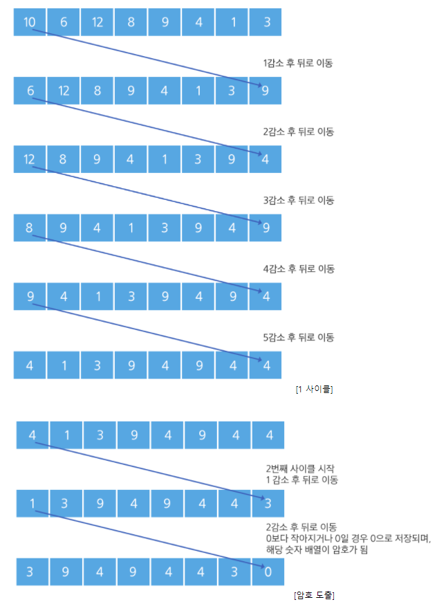

# Algorithm | SWEA 1225.암호생성기 (python)

> 본 문제의 저작권은 SW Expert 아카데미에 있습니다.
>
> [SWEA 1225.암호생성기 링크](https://swexpertacademy.com/main/code/problem/problemDetail.do?contestProbId=AV14uWl6AF0CFAYD&categoryId=AV14uWl6AF0CFAYD&categoryType=CODE&problemTitle=1225&orderBy=FIRST_REG_DATETIME&selectCodeLang=ALL&select-1=&pageSize=10&pageIndex=1&&&&&&&&&)

</br>

#### 문제

```
다음 주어진 조건에 따라 n개의 수를 처리하면 8자리의 암호를 생성할 수 있다.

- 8개의 숫자를 입력 받는다.
- 첫 번째 숫자를 1 감소한 뒤, 맨 뒤로 보낸다.
  다음 첫 번째 수는 2 감소한 뒤 맨 뒤로, 
  그 다음 첫 번째 수는 3을 감소하고 맨 뒤로, 
  그 다음 수는 4, 그 다음 수는 5를 감소한다.
  이와 같은 작업을 한 사이클이라 한다.
- 숫자가 감소할 때 0보다 작아지는 경우 0으로 유지되며, 프로그램은 종료된다. 
  이 때의 8자리의 숫자 값이 암호가 된다.
```



</br>

#### 코드

```python
# 테스트 케이스는 총 10개
T = 10
# 10번 테스트를 반복
for tc in range(1, T+1):
    # 테스트 케이스 번호 입력
    tc_num = int(input())

    # 8개의 숫자를 리스트 형태로 입력
    num_list = list(map(int, input().split()))

    # 리스트의 마지막 값이 0이 될 때까지 반복
    while num_list[-1] != 0:
        # 한 사이클은 1~5씩 감소한다.
        for i in range(1, 6):
            # 리스트의 첫번째 원소를 pop하고 i만큼 뺀 값을 임시 변수 temp에 저장
            temp = num_list.pop(0) - i
            # temp의 값이 0보다 작거나 같으면 값을 0으로 고정하고 리스트 마지막에 추가한 후 프로그램을 종료
            if temp <= 0:
                temp = 0
                num_list.append(temp)
                break
            # 그렇지 않으면 리스트의 마지막에 추가
            num_list.append(temp)
    
    # 결과 출력. 테스트 케이스 번호를 먼저 출력
    print('#{}'.format(tc_num), end=' ')
    # num_list를 순회하면서 8자리 암호를 출력한다.
    for num in num_list:
        print(num, end=' ')
    print()
```

</br>

#### 풀이

`Queue` 자료구조를 활용하여 코드를 구현해야 한다. **하나의 사이클 돌면서 1부터 5까지의 숫자를 감소시키는 과정을 계속 반복**하게 되는데, 프로그램이 종료되기 위해서는 줄어든 **숫자의 값이 0보다 작거나 같아지는 때 종료**된다. 중간에 `temp` 의 값이 0보다 작거나 같아지면 for문을 끝까지 순회하지 않고 곧바로 while문을 종료 (=8자리 암호 완성) 한다. `Queue` 자료구조를 이해할 수 있는 기초적인 문제인 것 같다.

