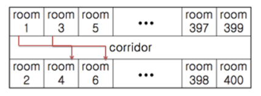

# Algorithm | SWEA 4408.자기 방으로 돌아가기 (python)

> 본 문제의 저작권은 SW Expert 아카데미에 있습니다.
>
> [SWEA 4408.자기 방으로 돌아가기 링크](https://swexpertacademy.com/main/code/problem/problemDetail.do?contestProbId=AWNcJ2sapZMDFAV8&categoryId=AWNcJ2sapZMDFAV8&categoryType=CODE&problemTitle=4408&orderBy=FIRST_REG_DATETIME&selectCodeLang=ALL&select-1=&pageSize=10&pageIndex=1)

</br>

#### 문제

```
고등학교 학생들이 학교에서 수련회를 갔다. 수련회에 간 학생들은 친구들과 음주가무를 즐기다가 밤 12시가 되자 조교들의 눈을 피해 자기방으로 돌아가려고 한다.

제 시간에 자기방으로 돌아가지 못한 학생이 한 명이라도 발견되면 큰일나기 때문에 최단 시간에 모든 학생이 자신의 방으로 돌아가려고 한다.

숙소는 긴 복도를 따라 총 400개의 방이 아래와 같이 배열되어 있다.

모든 학생들은 현재 위치에서 자신의 방으로 돌아가려고 하는데, 만약 두 학생이 자기방으로 돌아가면서 지나는 복도의 구간이 겹치면 두 학생은 동시에 돌아갈 수 없다.

예를 들어 (방1 -> 4) 와 (방3 -> 6) 은 복도 구간이 겹치므로 한 사람은 기다렸다가 다음 차례에 이동해야 한다. 이동하는 데에는 거리에 관계없이 단위 시간이 걸린다고 하자.

각 학생들의 현재 방 위치와 돌아가야 할 방의 위치의 목록이 주어질 때, 최소 몇 단위시간만에 모든 학생들이 이동할 수 있는지를 구하시오.
```



</br>

#### 코드

```python
# 테스트 케이스 수
T = int(input())

# T만큼 반복
for tc in range(1, T+1):

    # 돌아가야 할 학생 수 N 입력
    N = int(input())
    
    # 복도 리스트 생성
    corridor = [0] * 200
    
    # N만큼 반복하며
    for _ in range(N):
        # 현재방 s, 돌아갈 방 e를 입력
        s, e = map(int, input().split())
        
        # s가 e보다 작거나 같으면
        if s <= e:
            # 반복을 s -> e 로 순회하며 복도 리스트의 i번째 인덱스에 1씩 더해준다.
            for i in range((s-1)//2, (e-1)//2+1):
                corridor[i] += 1
        # s가 e보다 클 경우                
        else:
            # 반복을 e -> s 로 순회하며 복도 리스트의 i번째 인덱스에 1씩 더해준다.
            for i in range((e-1)//2, (s-1)//2+1):
                corridor[i] += 1
    
    # 복도의 0번째 값을 최대값으로 초기화
    max_value = corridor[0]
    # 복도 리스트를 순회하면서 최대값을 찾아준다. (최대값 = 모든 학생들이 방으로 돌아가는 최소 단위시간)
    for corr in corridor:
        if corr > max_value:
            max_value = corr
    
    # 결과 출력
    print('#{} {}'.format(tc, max_value))
```

</br>

#### 풀이

학생들이 자기 방으로 돌아가기 위해서는 복도(corridor)를 지나가야 한다. 따라서 **`0~200` 의 인덱스 범위를 갖는 복도 리스트를 생성**하고, 학생들이 출발하는 방 / 도착하는 방의 인덱스를 따라서 복도 리스트에 1씩 더하여 준다. 최종적으로 모든 학생들이 각자 방으로 돌아가고 나서 복도 리스트의 최대값을 구하면 된다. 이는, **최대값이 모든 학생들이 방으로 돌아가는 최소 단위시간**이기 때문이다.
