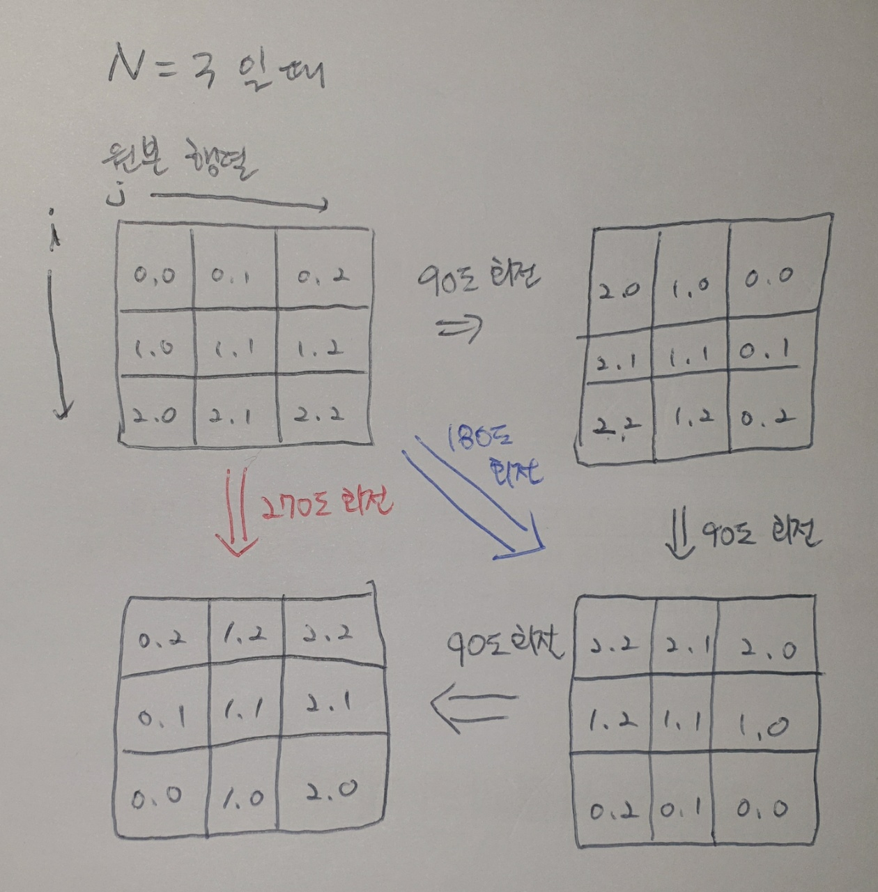

# Algorithm | SWEA 1961.숫자배열회전 (python)

> 본 문제의 저작권은 SW Expert 아카데미에 있습니다.
>
> [SWEA 1961.숫자배열회전 링크](https://swexpertacademy.com/main/code/problem/problemDetail.do?contestProbId=AV5Pq-OKAVYDFAUq&categoryId=AV5Pq-OKAVYDFAUq&categoryType=CODE&problemTitle=1961&orderBy=FIRST_REG_DATETIME&selectCodeLang=ALL&select-1=&pageSize=10&pageIndex=1&&&&&&&&&)

</br>

#### 문제

```
N x N 행렬이 주어질 때,

시계 방향으로 90도, 180도, 270도 회전한 모양을 출력하라.
```

</br>

#### 코드

```python
# 테스트 케이스 T 입력
T = int(input())
for tc in range(1, T+1):
    # 행렬의 N 값 입력
    N = int(input())

    # NxN 행렬 입력
    arr = [list(map(int, input().split())) for _ in range(N)]

    # 90도, 180,도 270도 회전한 행렬 초기화
    arr_90 = [[0 for _ in range(N)] for _ in range(N)]
    arr_180 = [[0 for _ in range(N)] for _ in range(N)]
    arr_270 = [[0 for _ in range(N)] for _ in range(N)]

    # arr 행렬 90도 회전
    for i in range(N):
        for j in range(N):
            arr_90[i][j] = arr[N-1-j][i]

    # arr_90 행렬을 90도 회전하면 arr_180 행렬
    for i in range(N):
        for j in range(N):
            arr_180[i][j] = arr_90[N-1-j][i]

    # arr_180 행렬을 90도 회전하면 arr_270 행렬
    for i in range(N):
        for j in range(N):
            arr_270[i][j] = arr_180[N-1-j][i]

    # 결과 출력
    print('#{}'.format(tc))
    for i in range(N):
        for a in range(N):
            print(arr_90[i][a], end='')
        print(end=' ')
        for b in range(N):
            print(arr_180[i][b], end='')
        print(end=' ')
        for c in range(N):
            print(arr_270[i][c], end='')
        print()
```

</br>

#### 풀이

테스트 케이스 `NxN 행렬` 을 입력받으면 그 행렬을 **시계방향으로 90도 / 180도 / 270도 회전한 행렬을 출력하는 문제**이다. **원본 행렬 `arr` 의 인덱스를 `(0,0)` 부터 `(N-1, N-1)` 까지 그려놓고 시계방향으로 90도 회전시킨 행렬의 인덱스를 계산해서 `for문` 을 반복**하면 된다. <br>또한, 원본 행렬을 각각 90도 180도 270도 돌리려고 하면 인덱스를 계산하는 것에 있어서 어려움을 겪을 수 있다. 따라서 **원본 행렬의 90도 회전 행렬을 구하고 → 90도 회전한 행렬의 90도 회전 행렬을 구하고 → 다시 그 행렬의 90도 회전 행렬을 구하면 각각 90도 회전 / 180도 회전 / 270도 회전 행렬을 찾을 수** 있다. <br>오히려 회전한 행렬을 구하는 부분보다, 마지막에 출력 예시에 맞게끔 코드를 짜는 부분이 더 어려웠다. 한 행 안에서 각 행렬의 `0~N` 열을 띄어쓰기 없이 / 행렬 사이에는 공백을 주고 출력해야 한다. <br>글로 풀어서 쓰는데도 무슨 말인지 모르겠다. 위 코드를 천천히 살펴보면 이해할 수 있을 것이다.😂



