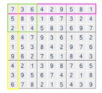

# Algorithm | SWEA 1974.스도쿠검증 (python)

> 본 문제의 저작권은 SW Expert 아카데미에 있습니다.
>
> [SWEA 1974.스도쿠검증 링크](https://swexpertacademy.com/main/code/problem/problemDetail.do?contestProbId=AV5Psz16AYEDFAUq&categoryId=AV5Psz16AYEDFAUq&categoryType=CODE&problemTitle=1974&orderBy=FIRST_REG_DATETIME&selectCodeLang=ALL&select-1=&pageSize=10&pageIndex=1)

</br>

#### 문제

```
스도쿠는 숫자퍼즐로, 가로 9칸 세로 9칸으로 이루어져 있는 표에 1 부터 9 까지의 숫자를 채워넣는 퍼즐이다.
같은 줄에 1 에서 9 까지의 숫자를 한번씩만 넣고, 3 x 3 크기의 작은 격자 또한, 1 에서 9 까지의 숫자가 겹치지 않아야 한다.
입력으로 9 X 9 크기의 스도쿠 퍼즐의 숫자들이 주어졌을 때, 아래와 같이 겹치는 숫자가 없을 경우, 1을 정답으로 출력하고 그렇지 않을 경우 0 을 출력한다.
```



</br>

#### 코드

```python
# 스도쿠 검증 함수 생성
def checkSudoku(M):
    for i in range(9):
        row_num = [0] * 10
        col_num = [0] * 10
        for j in range(9):
            # 가로 검사
            row = M[i][j]
            # 세로 검사
            col = M[j][i]

            # 이미 사용된 숫자라면, 0을 리턴
            if row_num[row]: return 0
            if col_num[col]: return 0
            
            # 아니라면, row_num과 col_num의 각 숫자 위치를 1로 변경
            row_num[row] = 1
            col_num[col] = 1

            # 3x3 행렬 검사
            if i % 3 == 0 and j % 3 == 0:
                square = [0] * 10
                for r in range(i, i+3):
                    for c in range(j, j+3):
                        num = M[r][c]
                        if square[num]: return 0
                        square[num] = 1
    
    # 반복문이 정상적으로 다 수행된다면, 올바른 스도쿠이므로 1을 리턴
    return 1

# 테스트 케이스 개수 T 입력
T = int(input())
for tc in range(1, T+1):
    # 검사를 위한 행렬 입력
    mat = [list(map(int, input().split())) for _ in range(9)]

    # checkSudoku() 함수를 사용해서 return 값을 result에 저장
    result = checkSudoku(mat)

    # 결과 출력
    print('#{} {}'.format(tc, result))
```

</br>

#### 풀이

가로, 세로 한 줄 안에서 **1~9의 숫자가 중복으로 사용된다면 온전한 스도쿠가 아니다**. 또한 행렬의 1, 4, 7번째 (인덱스로 따지자면 0, 3, 6) 행/열에서 시작되는 3x3 행렬 안에서도 1~9의 숫자가 중복으로 사용되어서도 안된다. 

<br>

`for문` 의 중첩을 통해 **`i` 번째 가로줄과 세로줄을 동시에 검사**하고, **행렬의 인덱스가 `0, 3, 6` 즉, 3으로 나누어 떨어질 때 `3x3` 행렬을 검사**한다. 반복문 내부에서 중복되는 숫자가 하나라도 나오면 바로 `0` 을 리턴하고 함수를 종료하고, `for 문` 이 끝까지 정상적으로 순회한다면 온전한 스도쿠라고 볼 수 있기 때문에 `1` 을 리턴한다.

</br>

> 2021.08.28
>
> 알고리즘 문제를 매번 풀때마다, 문제를 제대로 이해하지 못하거나 너무 꼬아서 생각하는 경우가 많다.
>
> 스도쿠 문제도 각각 가로줄, 세로줄, 3x3 행렬을 최대한 복잡하지 않게끔 반복문 코드를 짜서 검사하면 되는 문제이다. 하지만 나 스스로 문제를 너무 어렵게 만드는 경향이 있는 것 같다. 😒
>
> 최대한 간단하고 쉽게 생각하자!
