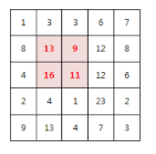

# Algorithm | SWEA 2001.파리퇴치 (python)

> 본 문제의 저작권은 SW Expert 아카데미에 있습니다.
>
> [SWEA 2001.파리퇴치 링크](https://swexpertacademy.com/main/code/problem/problemDetail.do?contestProbId=AV5PzOCKAigDFAUq&categoryId=AV5PzOCKAigDFAUq&categoryType=CODE&problemTitle=2001&orderBy=FIRST_REG_DATETIME&selectCodeLang=ALL&select-1=&pageSize=10&pageIndex=1)

</br>

#### 문제

```
N x N 배열 안의 숫자는 해당 영역에 존재하는 파리의 개수를 의미한다.

M x M 크기의 파리채를 한 번 내리쳐 최대한 많은 파리를 죽이고자 한다.
죽은 파리의 개수를 구하라!

예를 들어 M=2 일 경우 아래 예제의 정답은 49마리가 된다.
```



</br>

#### 코드

```python
# 테스트 케이스 T 입력
T = int(input())

# T만큼 테스트 반복
for tc in range(1, T + 1):
    # 배열의 행열 수 N과 파리채의 크기 M 입력
    N, M = map(int, input().split())

    # NxN 배열 입력
    mat = [list(map(int, input().split())) for _ in range(N)]

    # 영역별로 죽은 파리 수를 저장하는 빈 리스트 생성
    fly = []

    # i는 0부터 N-1까지
    for i in range(N-M+1):
        # j는 0부터 N-1까지
        for j in range(N-M+1):
            # 영역별 파리수 총합을 저장하는 변수 초기화
            total = 0
            # ci는 0부터 M-1까지
            for ci in range(M):
                # cj는 0부터 M-1까지
                for cj in range(M):
                    # 인덱스의 범위안에 해당하면, total 변수에 파리수를 저장
                    if i + ci in range(N) and j + cj in range(N):
                        total += mat[i + ci][j + cj]
            # 영역별 파리수 총합을 fly 리스트에 추가            
            fly.append(total)
    
    # 최대값을 fly 0번째 인덱스의 값으로 초기화
    max_value = fly[0]
    # fly 리스트를 순회
    for i in fly:
        # i의 값이 최대값보다 크면, i값을 최대값으로 변경
        if i > max_value:
            max_value = i
    
    # 결과 출력
    print('#{} {}'.format(tc, max_value))
```

</br>

#### 풀이

입력값을 받아와서 NxN의 행렬 리스트를 만드는 것이 가장 중요하다. **이중 리스트**를 만든 후에는 행과 열의 인덱스 범위를 결정하고 반복적으로 순회하면서 M 크기의 파리채를 이용하여 각 영역의 파리수를 더해주는 과정을 거쳐야 한다. 위 코드는 **4개의 for문을 중첩**하여 만든 코드이며, 각각의 i, j, ci, cj의 **인덱스 설정이 제대로 되지 않으면 IndexError가 발생할 수** 있다.
각 영역별 파리수의 합이 저장된 리스트를 구한 다음에 해당 리스트를 반복 순회하면서 최대값을 찾고 그 값을 출력하면 된다. max() 함수를 사용하면 쉽고 빠르게 최대값을 찾을 수 있지만, **파이썬 내장함수를 최대한 이용하지 않으면서 코드를 구현**하고자 하였다.
