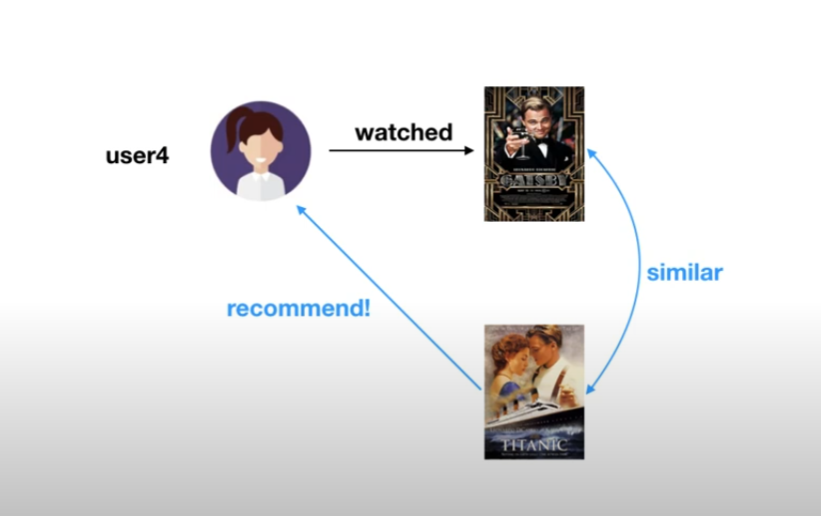

# Bigdata | Recommendation System

 

**영화** 를 주제로 하여 추천 시스템에 대해서 알아보자

- 4명의 사용자가 이미 보고 / 좋아요 표시한 영화에 대한 정보를 가지고 있음
- ex
  - `user1` 과 `user3` 이 본 영화가 유사하다.
    - 앤트맨, 어벤져스...
    - 그렇다면, `user3` 이 보지않은 영화 - 스파이더맨을 추천해줄 수 있겠다.

 

***

### Collaborative Filtering

#### 1. User-based CF

- 사용자 기반의 협업 필터링

 

- 사용자들이 **좋아요** 를 부여한 영화들의 데이터가 있을 때

 

- 좋아요 버튼을 누른 영화는 `1`, 아니라면 `0` 으로 표현

 

- `user3` 에게 영화 추천을 하기 위해서 사용자간 유사도를 측정한다.
  - `user1` 과 `user3` 간의 유사도 측정
    - **코사인 유사도 (Cosine Similarity)** 측정

 

- `user1` - `user3` 의 유사도가 높으며, `user3` 이 아직 보지 않은 영화 `Spiderman` 을 추천해줄 수 있음

 

#### 2. Item-based CF

- 아이템 기반의 협업 필터링

 

- `user4` 가 위대한 개츠비 영화를 보았다. 이 영화는 타이타닉과 유사하다.
  - 그러므로 `user4` 에게 타이타닉 영화를 추천해줄 수 있다.

 

- 사용자 기반 협업 필터링과는 다르게 영화간의 코사인 유사도를 측정한다.
  - 각 user가 보았다면 `1` 로 표현하고, 보지 않았다면 `0` 으로 표시한다.

 

***

### Content Based Filtering

- 만약 새로운 영화가 개봉한다면? 어떻게 추천해 줄 수 있을까
  - **Cold Start** 문제가 발생할 수 있음
    - 새로운 아이템이나 새로운 사용자에 대한 충분한 정보가 수집된 상태가 아니어서, 사용자에게 적절한 아이템을 추천해주지 못하는 문제

 

- Cold Start 문제 해결을 해보자
  - 영화들에 대한 `Feature`(특성) 를 정의한다. (대상 자체의 특성을 바탕으로 추천해주는 방법)
  - ex.
    - 아이언맨이 출연하는가 / 캡틴 아메리카가 출연하는가 / 스파이더맨이 출연하는가 / 레오나르도 디카프리오가 출연하는가 / 실화를 바탕으로 하였나
    - 각 특성들에 대해서 `1` 과 `0`으로 표시한다.
    - 새로 출시된 영화가 기존의 어벤져스, 스파이더맨과 비슷한 것을 알아낼 수 있다.

 

- 어벤져스, 스파이더맨을 본 사용자 `user1` 과 `user3` 에게 새로 개봉한 영화를 추천할 수 있다.

 

### 출처

[추천 시스템 기본 - (콜라보레이티브 필터링, 컨텐트 베이스 필터링)](https://youtu.be/_YndKkun2Sw)