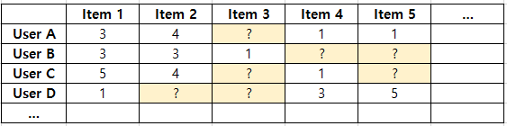
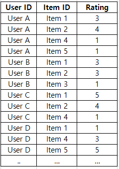
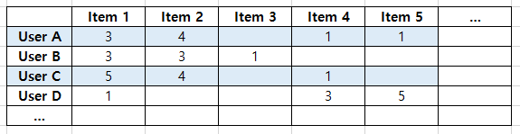
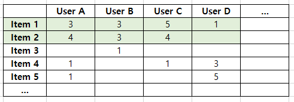
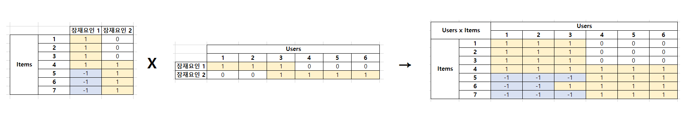

# Bigdata | Rec System 2

 

빅데이터 추천과 관련된 알고리즘은 크게 **2 가지** 로 나뉜다.

- **1. Content Based Filtering**
- **2. Collaborative Filtering**

 

***

### 1. Content Based Filtering

> 사용자가 특정 아이템을 선호하는 경우, 그 아이템과 비슷한 다른 아이템을 추천하는 방식

 

초기에 많이 사용되었던 방법으로 매우 단순한 방식이다.

 

예를 들어, 

- 영화와 관련하여 `User A` 가 `Movie A` 에 **높은 평점**을 주었다. 
- `Movie A` 의 **장르가 '로맨스'**이고, 영화 **감독이 '홍길동'**이다. 
- 그렇다면 '홍길동' 감독의 또 다른 '로맨스' 영화를 `User A` 에게 **추천**해준다.

 

이러한 방식으로 추천해주는 것이 바로 **Content Based Filtering** 알고리즘이다.

***

### 2. Collaborative Filtering

사람들은 실생활에서 타인의 평점, 평가를 확인하고 나서 상품을 구매하거나 영화를 관람하다. 어떠한 정보도 없이 구매하거나 관람했다가 시간/돈 낭비가 될 수 있기 때문이다.

 

> 사용자가 아이템에 부여한 평점, 구매 이력 등 사용자 행태(User Behavior)를 기반으로 추천해주는 방식

 

위와 같은 협업 필터링은 다시 **2 가지** 로 나뉜다.

- **2-1. Nearest Neighbor Based CF (최근접 이웃 기반)**
- **2-2. Latent Factor Based CF (잠재 요인 기반)**

 

#### 2-1. Nearest Neighbor Based CF

**사용자 x 아이템** 행렬에서 사용자가 아직 평가하지 않은 아이템을 예측하는 것이 목표

`User D` 가 `Item 2` 와 `Item 3` 에 대해서 아직 평가를 내리지 않았고, 이를 어떻게 평가할 지 예측하는 것이다.

 

데이터 분석을 위해서 위 이미지와 같이 `User ID - Item ID - Rating` 으로 구성되어 있는 하나의 테이블(데이터)을 **User x Item** 행렬로 변경해야 한다.

- Python `Pandas` 를 활용하면 `pivot table` 로 변경 가능하다.
- 하지만 행렬의 대부분이 `0` 으로 채워지기 때문에 **Sparse** 하다는 단점이 있다
  - 유튜브, 넷플릭스처럼 `Item` 이 무수히 많을 경우, 사용자가 모든 `Item`에 대해서 평점을 부여할리가 없기 때문

 

최근접 이웃 기반 협업 필터링은 다시 **2 가지**로 나뉜다.

- **2-1-1. User Based CF (사용자 기반 협업 필터링)**
- **2-1-2. Item Based CF (아이템 기반 협업 필터링)**

 

##### User Based CF

`User A` 와 `User C` 가 각 `Item` 에 부여한 평점이 비슷하기 때문에 두 사용자는 유사하다 라고 판단하는 것

- 따라서 `User C` 에게 `Item 5` 를 추천해준다

 

##### Item Based CF

`Item 1` 과 `Item 2` 가 비슷한 평점 분포를 가지고 있으므로, 두 아이템이 유사하다 라고 판단하는 것

- 따라서 `User D` 에게 `Item 2` 를 추천해준다

 

일반적으로 **아이템 기반 협업 필터링**이 **사용자 기반 협업 필터링** 보다 정확도가 좀 더 높다고 함

 

#### 2-2. Latent Factor Based CF

> 행렬 분해 (Matrix Factorization)을 기반하여 사용. 대규모 다차원 행렬을 SVD 같은 차원 감소 기법으로 분해하는 과정에서 잠재 요인(latent factor)를 찾아 뽑아내는 방법

 

**아이템 기반(Item Based cf) 보다 행렬 분해 (Matrix Factorization) 방법을 많이 사용함!**

 

아이템 기반 협업 필터링에서 사용하는 **사용자 x 아이템** 행렬 데이터를 **사용자 x 잠재요인**, **아이템 x 잠재요인** 행렬로 분해한다.

잠재 요인(Latent Factor)이 무엇인지 명확히 알 수는 없으나, 영화를 예를 들면 **장르**가 하나의 잠재 요인이 될 수 있다. 그러면 **사용자 x 장르** 와 **장르 x 아이템** 2개의 행렬로 분해될 수 있다.

 

- 사용자 x 아이템 행렬 - `R`
  - R(u, i) - `u`번째 사용자가 `i`번째 아이템에 한 평가
- 사용자 x 잠재요인 행렬 - `P`
- 아이템 x 잠재요인 행럴 - `Q`
  - `Q` 행렬은 전치 행렬로 사용. `Q.T`

 

##### Matrix Factorization의 장점

- **저장 공간 절약**
  - MF를 사용하지 않을 경우
    - `1000개 item` x `2000명의 user` → `1000 * 2000개의 파라미터`
  - MF를 사용하여 잠재요인(Latent Factor)를 뽑아낼 경우
    - 잠재요인이 `100 features` 라면,
    - `2000명의 user` x `100` + `1000개 item` x `100`
  - 200만개의 파라미터가 30만개로 줄어든다!

 

***

#### 참고 자료

[이수진의 블로그](https://lsjsj92.tistory.com/563?category=853217)

- 많은 내용을 이수진님의 블로그 글을 참고하였습니다.