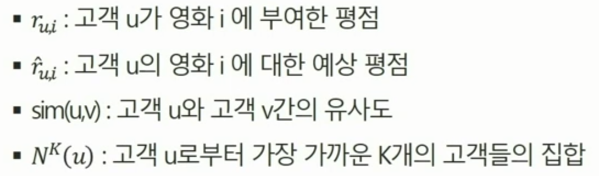
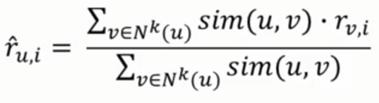
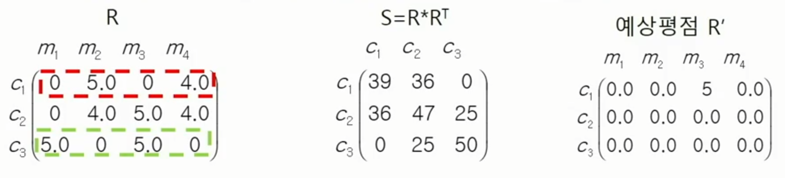
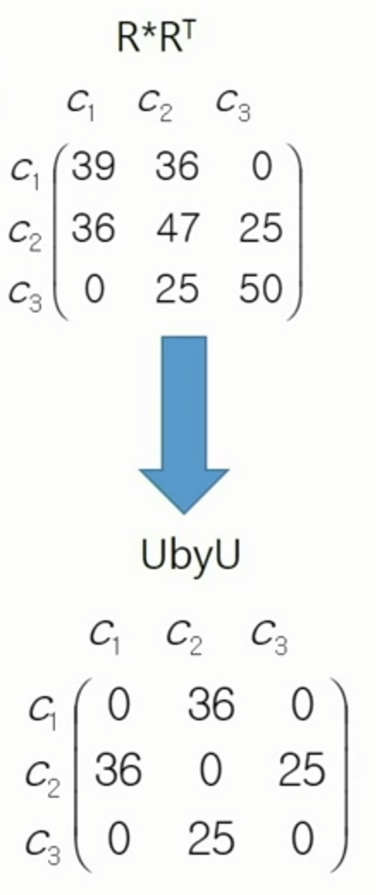
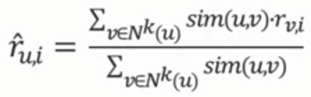
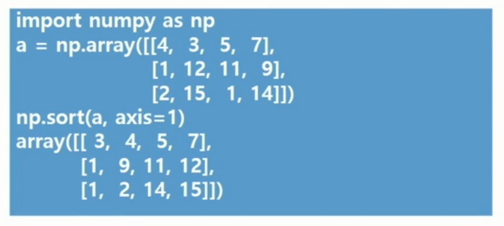
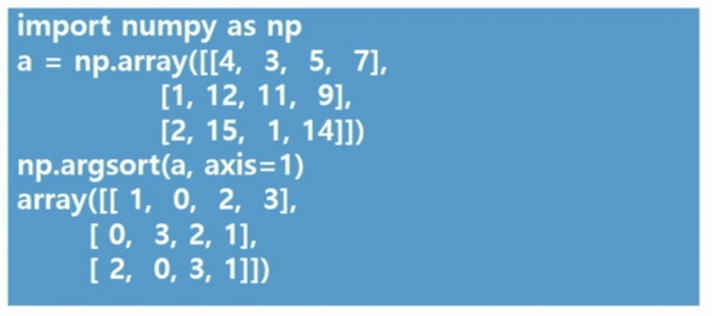

# Bigdata | Day2_KNN 추천

<br>

### movieRecProject/matrixFactorization 디렉토리

##### 파일들

- `ml_plot.dat`
- `preprocess.py`
- `train.py`
  - kNN, MF, MF + PLSIO 학습 알고리즘 코드가 들어있다

<br>

##### 서브 디렉토리

- `data/`
  - 데이터가 들어있다
- `models/`
  - 추천 알고리즘들이 들어있다
    - `knn.py` - KNN 코드
    - `matrix_factorization.py` - matrix factorization 코드, MF + PLSI 학습 알고리즘을 같이 처리
    - `plsi.py` - PLSI 코드
- `result/`
  - 추천 결과가 들어있다

<br>

#### train.py 의 메인코드

- `from models import knn`
  - `models` 디렉토리에 들어있는 `knn.py` 코드를 `include`
- 세가지 알고리즘 코드를 models 디렉토리에 넣고 train.py 에서 호출
- `Load()` 함수를 이용, pickle 모듈로 생성된 파일 R_train.pkl 과 item_ids.pkl을 input_path의 디렉토리에서 읽는다
- kNN 알고리즘이 선택되면 knn.py 파일의 predict 함수를 R_train 데이터와 k 값을 입력해서 호출

<br>

##### train.py의 입력 파라미터

- `-i` : 데이터 파일이 있는 디렉토리 이름

- `-o` : 결과 저장 디렉토리

- `-a` : 학습 알고리즘 선택 번호
  - `0` : run_kNN 함수 호출
  - `1` : run_MF 함수 호출
  - `2` : run_MF_PLSI 함수 호출
- `-k` : 이웃의 개수
  - default 값은 5
- 필요한 입력 파라미터가 제대로 제공되지 않으면 에러 메시지를 출력하고 종료됨

<br>

##### load() 함수

- `pickle.load(open(path, "rb"))`

- 파일의 이름을 경로에 포함하여 path에 넣어서 입력으로 주면 파일 전체를 읽어서 리턴함

<br>

***

### Recommend 함수 코딩

#### recommend() 함수

- 추천 알고리즘이 학습 데이터 평점 행렬과 예측 평점 행렬을 각각 train_ratings.txt 와 recommend_ratings.txt 파일로 저장
  - 모든 고객이 보지 않은 영화들에 대해서만 예측 평점을 계산, recommend_ratings.txt 로 저장
- 입력 파라미터
  - `R_train` : 학습 데이터 평점 행렬
  - `R_predicted` : 추천 알고리즘이 예측한 영화에 대한 평점 행렬
  - `item_ids` : 영화 ID 리스트
    - R에서 영화 ID에 대한 실제 영화 제목 + 부가 정보를 저장
    - 유저에게 추천을 하려면 영화 ID가 아닌 영화 제목을 보여줘야 하기 때문에 필요하다
  - `output_path` : 추천 결과를 저장할 디렉토리
    - train_ratings.txt 와 recommend_ratings.txt 2개의 파일이 저장됨
    - 파일의 형식은 user-id::movie-id::predicted-rating 의 형태로 저장
- 학습 알고리즘 수행 후 그 결과를 이용하여 유저가 관람하지 않은 영화들에 대한 예상 평점을 계산하고 저장
  - 평점 행렬 R과 R_train, R_predicted는 **Compressed Sparse Row (CSR) Matrix** 형태로 저장되어 있음
    - 0이 아닌, Non-zero 값만 저장
    - 메모리를 효율적으로 쓸 수 있음
    - 수행시간이 빨라짐
  - `R_train` 과 `R_predicted`는 크기가 같은 행렬
  - R_train 행렬에서 유저가 시청한 영화 평점은 R_predicted에서 모두 zero(0)로 바꾸어 줌
  - R_predicted에서 평점이 0보다 큰 경우만 recommend_ratings.txt 에 출력

<br>

***

### KNN 추천 시스템

##### data/ 디렉토리

- 코드를 구현하는 동안 작은 데이터를 이용하는 것이 효율적임
  - `tiny/` 와 `small/` 디렉토리에 데이터가 저장되어 있음
- 해당 디렉토리에 들어있는 파일들
  - 모든 파일은 python 객체를 파일로 저장하는데 사용되는 pickle 모듈을 이용하여 저장
  - `item_ids.pkl` : R.pkl 에서 사용하는 영화 ID에 대한 실제 영화 ID가 저장되어 있음
  - `R.pkl` : 사용자의 영화 평점 전체 데이터
  - `R_train.pkl` : R.pkl 에서 뽑은 학습에 사용할 데이터
  - `R_valid.pkl` : R.pkl 에서 뽑은 validation에 사용할 데이터
    - 학습 알고리즘의 종료 조건을 확인하는데 사용함

- Let
  - 

- 사용자마다 가장 비슷한 k명의 다른 사용자를 선택하고, 이 사용자가 아직 보지 않은 영화마다 k명의 유사한 사용자들의 평점을 종합해서 예상 평점을 계산
  - 유사도가 아주 높은 사용자의 평점은 그 평점을 높게 반영. 반대로 유사도가 낮은 사용자의 평점은 가중치를 작게 해서 반영
  - 

- 사용자 u 가 평점을 주지 않은 영화들 중에서 평점이 가장 높은 영화를 추천

<br>

***

### 기본 Knn 알고리즘 코딩



- S<sub>ij</sub> 는 고객 C<sub>i</sub>와 C<sub>j</sub>의 유사도
- 어떤 사용자 C<sub>i</sub> 가 아직 보지 않은 영화 m<sub>j</sub> 의 평점을 계산할 때
  - 유사도가 높고 낮음에 따라 가중치를 반영하여 평점을 반영
- 사용자 c<sub>1</sub>은 영화 m<sub>2</sub>, m<sub>4</sub>에 이미 평점이 있어서 m<sub>1</sub>과 m<sub>3</sub>의 예상 평점을 계산
  - ex. m<sub>1</sub>의 평점
    - 0 * 36 / (36 + 0) + 5 * 0 / (36 + 0) = 0
    - c<sub>2</sub>가 m<sub>1</sub>에 준 평점 * c<sub>1</sub>-c<sub>2</sub>의 유사도 / (c<sub>1</sub>-c<sub>2</sub>의 유사도 + c<sub>1</sub>-c<sub>3</sub>의 유사도) + c<sub>3</sub>가 m<sub>1</sub>에 준 평점 * c<sub>1</sub>-c<sub>3</sub>의 유사도 / (c<sub>1</sub>-c<sub>2</sub>의 유사도 + c<sub>1</sub>-c<sub>3</sub>의 유사도)

<br>

#### knn.py 코드

- `compute_sim_inner` 함수 or `compute_sim_cosine` 함수를 이용하여 유사도(Similarity) 계산
- `predict` 함수를 이용하여 예상 평점 계산

<br>

##### compute_sim_inner 함수

- 평점 행렬 R (sparse matrix)을 입력으로 받음
- i번째 사용자와 j번째 사용자의 유사도는 벡터 내적(inner product)을 이용
- 유사도 행렬은 array 타입의 UbyU 에 계산하여 저장
  - R 과 R<sup>T</sup> 를 이용하여 행렬 곱 UbyU = R*R<sup>T</sup> 계산
  - 행렬 R의 전치(transpose) 행렬은 R.transpose()로 계산
  - sparse 행렬을 toarray() 함수를 이용해서 모든 원소가 다 있는 array로 변경
  - 자기 자신은 이웃으로 취급하지 않기 위해서 UbyU의 diagonal 원소는 0으로 바꿔준다.



<br>

##### predict 함수

- 평점 행렬 R과 추천에 사용되는 이웃 개수 K를 입력으로 받는다

- compute_sim_inner 를 이용해서 유사도 행렬을 사용

- R_predicted = mp.zeros((num_users, num_items))

  - num_users x num_items 행렬을 만들고 모든 원소가 zero 인 행렬을 R_predicted 에 저장
  - 모든 사용자의 영화 예상 평점을 zero(0)로 초기화

- 이후 모든 사용자들에 대해서 영화의 예상 평점 행렬을 계산

  


<br>

##### numpy의 sort

- 배열 안의 원소 크기에 따라 정렬하여 새로운 배열을 생성
- 2차원 이상의 경우, 행 / 열을 각각 따로 정렬
- axis 인수를 사용하여 행을 정렬할지, 열을 정렬할지 결정
  - axis = 0 이면, 각 열을 행 축 기준으로 위에서 아래로 정렬
  - axis = 1 이면, 각 행을 열 축 기준으로 왼쪽에서 오른쪽으로 정렬

- ex. 

<br>

##### numpy의 argsort

- 정렬된 순서만 알고 싶을 때 사용
- ex. 

<br>

***

<br>

### 2일차 과제

<br>

#### recommend() 함수

```python
def recommend(R_train, R_predicted, item_ids, output_path):
    # train ratings 작성
    with open(output_path + '/train_ratings.txt', 'w') as f:
    	rows, cols = R_trains.nonzero()
    	for row, col in zip(rows, cols):
    		f.write('%d"::%s::%.1f\n' %(row, item_ids[col], R_train[row, col]))
    		# 사용자가 본 영화의 평점은 0으로 지정
            R_predicted[row, col] = 0
    
    # recommend ratings 작성
    with open(output_path + '/recommend_ratings.txt', 'w') as f:
        for i in range(R_predicted.shape[0]):
            for j in range(R_predicted.shape[1]):
                if R_predicted[i, j] > 1:
                    # 유저 ID, 영화 ID, 영화의 예상 평점
                    f.write('%d::%s::%.3f\n' %(i, item_ids[j], R_predicted[i, j]))
```

<br>

#### compute_sim_inner 함수

```python
import pandas as pd
import numpy as np
from scipy.sparse import csr_matrix

def compute_sim(R):
    num_users = R.shape[0]
    UbyU = (R * R.transpose()).toarray()
    UbyU[range(num_users), range(num_users)] = 0
    return UbyU
```

<br>

#### predict 함수

```python
def predict(R, K):
    num_users = R.shape[0]
    num_items = R.shape[1]
    
    sim = compute_sim(R)
    # 행 번호를 정렬 순서로 하고 맨 뒤의 K개만을 뽑아서 topk에 결과 행렬 저장
    topk = sim.argsort(axis=1)[:,-K:]
    
    # num_users x num_items 행렬을 만들고 모든 element가 0인 행렬을 R_predicted에 저장
    R_predicted = np.zeros((num_users, num_items))
    for i in range(num_users):
        # i번째 유저에 대해 유사도 벡터에 따른 Top-K 개의 이웃 유사도를 weights에 저장
        weights = sim[i, topk[i]]
        for j in range(K):
            # i번째 유저의 j번째 유사한 유저의 유사도 weights[j]를 곱한 결과인 행 전체를 R_predicted의 행렬의 i번째 행으로 저장
            R_predicted[i] += weights[j] * R[topk[i, j]]
        # R_predicted의 i번째 행의 모든 element를 K개 이웃의 유사도 총합으로 나누면 i번째 유저의 영화에 대한 예상 평점이 계산됨
        R_predicted[i] /= weights.sum()
        
    return R_predicted
```

<br>

#### compute_sim_cosine 함수

```python
import numpy as np
from scipy.sparse.linalg import norm
from scipy.sparse import csr_matrix

def compute_sim(R):
    num_users = R.shape[0]
    ones = csr_matrix((np.ones(R.nnz), (R.nonzero()[0], R.nonzer()[1])), shape=R.shape)
    
    UbyU = (R * R.trasnpose()).toarray()
    UbyU[range(num_users), range(num_users)] = 0
    
    sim = np.zeros((num_users, num_users))
    for i in range(num_users):
        both = ones[i].reshape(1, -1).multiply(ones)
        norm_i = norm(both.multiply(R[i].reshape(1, -1)), ord=2, axis=1)
        norm_others = norm(both.multiply(R), ord=2, axis=1)
        den = norm_i * norm_others
        den[den == 0] = 1
        sim[i] = UbyU[i] / den
```

