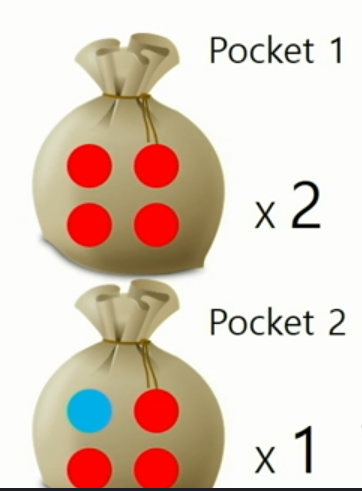
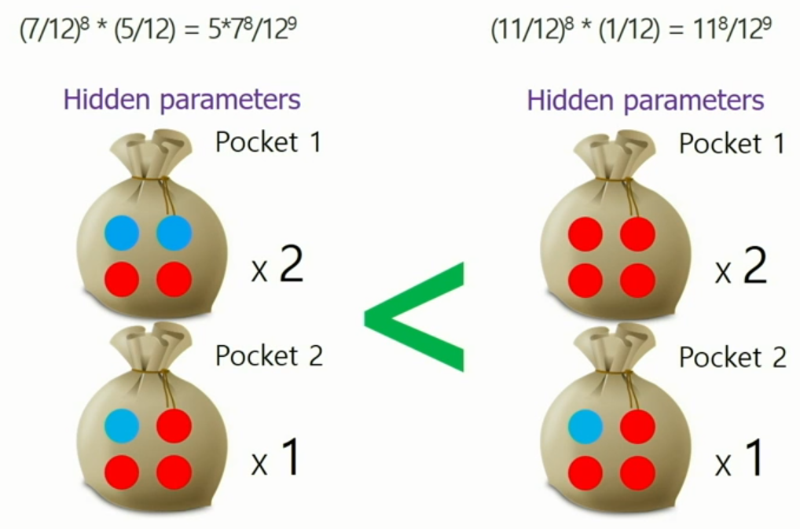

# Bigdata | Day4 PLSI

<br>

### Probabilistic Modeling

#### Generative Model (생성 모델)

- ex) 빨간공 4개가 들어있는 주머니 2개와 빨간공 3개 + 파란공 1개가 들어있는 주머니 1개가 있다.
  - 
  - 주머니를 번갈아 가면서 하나씩 꺼내 새로운 주머니에 넣는 과정을 반복한다.
  - 이 과정이 종료되면 아래와 같이 Observable Data가 생성이 된다.
  - 
  - 이를 역으로 추론(Inference) 하여 기존의 주머니가 어떤 비율로 빨간색, 파란색 공이 들어 있는지 (Hidden parameters)를 찾아낸다.
  - 가장 좋은/최적의 Hidden Parameter 를 찾는 것 → Probabilistic Model


- 생성 모델을 비교
  - 생성 확률이 가장 높은 것을 선택
  - 그렇다고 해서, 확률이 낮은 모델이 틀린 것은 아니다



<br>

#### EM Algorithm

- 실제로 주머니 개수나 공의 개수를 알지 못하기 때문에 각각을 Variable(변수)화 한다.
- 각 변수와 모델을 계속 사용하면서 최적의 Parameter를 찾는 동안 활용한다.

<br>

#### EM Clustering

- E-Step
- M-Step

<br>

***

### 4일차 과제

#### gen_document_word_frequency 함수

```python
def gen_document_word_frequency(input_path):
    # 영화 ID 정보가 들어있는 파일을 읽어서 item_ids에 저장
    item_ids = pickle.load(open(input_path + '/item_ids.pkl', 'rb'))
    
    # 텍스트가 있는 영화의 문서 ID 저장
    document_mapping = dict()
    d_id = 0
    
    # 텍스트에 나오는 단어 저장
    word_mapping = dict()
    w_id = 0
    
    # ml_plot.dat 파일의 각 라인 형태는 "document-id::text |". "|" 이 end-of-line의 기호이다.
    file = open("../ml_plot.dat", encoding="utf-8").readlines()
    for row in file:
        index = row.find("::")
        if row[:index] in item_ids:
            document_mapping[int(row[:index])] = d_id
            d_id += 1
            
            for word in row[index + 2:-2].replace("|", " ").split():
                if word not in word_mapping:
                    word_mapping[word] = w_id
                    w_id += 1
    
    # 영화와 단어 빈도수를 체크하는 행렬 생성
    dw_matrix = np.zeros((d_id, w_id))
    d_iter = 0
    for row in file:
        index = row.find("::")
        if row[:index] in item_ids:
            for word in row[index + 2:-2].replace("|", " ").split():
                dw_matrix[d_iter][word_mapping[word]] += 1
            d_iter += 1
            
    return dw_matrix
```

- item_ids 에는 모든 영화 ID가 들어 있고, document_mapping에 어떤 영화의 ID가 없으면 관련 텍스트가 ml_plot.data에 존재하지 않다는 의미임

<br>

#### compute_observed

```python
def compute_observed(self):
    observed = np.zeros((self.nDocuments, self.nVocabulary, self.nTopics))
    for doc_id in range(self.nDocuments):
        observed[doc_id] = (self.pZDW[:, doc_id, :] * self.dw_matrix[doc_id, :].reshape(1, -1)).T
    return observed
```

<br>

#### update_pZD

```python
def update_pZD(self, observed):
    self.pZD[:,:] = observed.sum(axis=1).T
    self.pZD /= self.dw_matrix.sum(axis=1).reshape(1, self.nDocuments)
```

