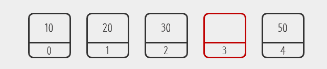
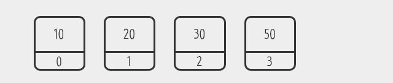
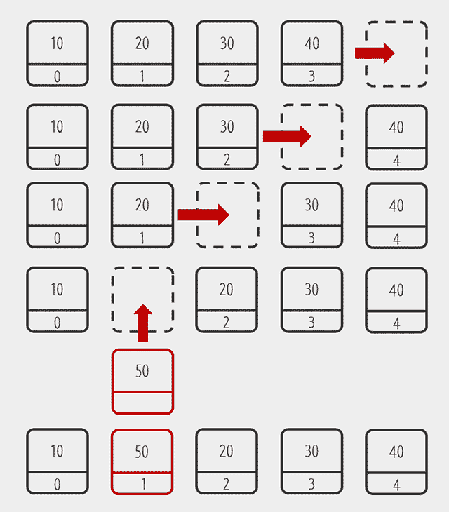
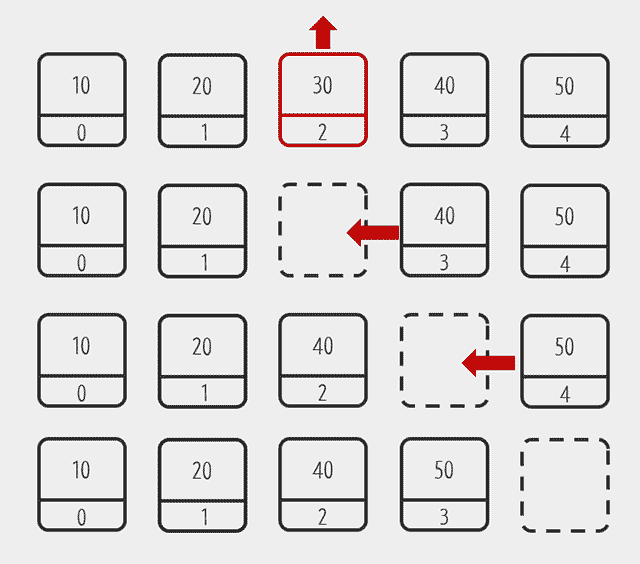
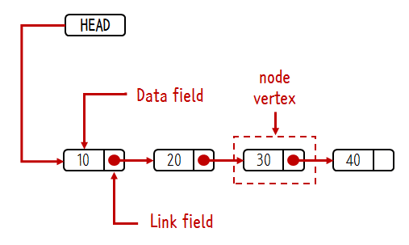

# CS | Data Structures - Array & List

### Array 배열

- 배열이란?

  - 연관된 데이터를 하나의 변수에 그루핑해서 관리하기 위한 방법
  - 인덱스를 알고 있다면 데이터 조회를 매우 빠르게 처리할 수 있다는 장점이 있음
  - 반복문과 결합할 경우 많은 정보를 효율적으로 처리할 수 있음
  - 값 `value` 와 식별자 `index` → Element

  

- 비유

  - 25명 정원의 A 학급에 1~25번을 부여받은 학생이 있다.
  - 만약 13번 학생이 전학을 가면, 13번은 결번이 됨
  - 새로 전학온 학생은 26번을 부여받는다.

- 배열의 한계점

  - `index` 에 따라서 값을 유지하기 때문에 엘리먼트가 삭제되어도 빈자리가 남는다.
  - 즉, 메모리 낭비가 생긴다는 의미.
  - 배열에 데이터가 있는지 없는지 체크하는 로직이 필요함

- 리스트와의 차이점

  - List 는 데이터가 순서에 따라서 빈틈없이 연속적으로 위치하는 자료구조

- 따라서, 인덱스가 중요한 경우 배열을 / 중요하지 않은 경우 리스트를 사용

  

### List 리스트

- 리스트란?
  - 연속적으로 데이터를 적재하는 자료구조. 순서가 있는 데이터 모임
  - 내부적으로 인덱스가 존재하나 인덱스가 중요하지 않고, 순서가 중요하다 = `sequence`
  
- 특징

  - 처음 / 중간 / 끝 모두에 엘리먼트를 추가하고 삭제할 수 있다
  - 데이터를 새롭게 추가할 경우 그 이후에 있던 데이터는 뒤로 밀리고, 삭제하면 빈 공간이 채워진다
  - 빈 엘리먼트는 허용되지 않는다
  - 중복을 허용한다
  - C 언어는 `List` 를 지원하지 않는다
  - `JavaScript` 에서는 배열이 리스트이기도 하다
  - `Python` 에서는 배열을 지원하지 않고 리스트를 지원한다. (리스트와 배열이 같은 의미로 쓰임)

  

  

<인덱스 3번의 데이터가 지워지면 인덱스 4번의 50 데이터가 3번 인덱스로 당겨져야한다>

  

### ArrayList 와 LinkedList

- 공통점

  - 둘다 List 라는 것
  - 실행결과가 같다
  - `JAVA` 에서 제공

- 차이점

  - Array 와 Linked 의 차이를 알아야 한다.
  - 내부적인 구현 방법이 서로 다르다

  

- 속도

  - 인덱스를 이용해서 데이터를 가져오는 경우가 빈번하다면 ArrayList 가 훨씬 빠르다
  - 데이터의 추가/삭제가 빈번할 경우 LinkedList 가 훨씬 효과적임

  

- **ArrayList**

  - 데이터를 리스트 처음 or 중간에 추가하면 데이터를 한칸씩 뒤로 물려야 한다
  - 데이터를 삭제할 때도 빈자리가 생기면 빈자리를 채우기 위해 데이터를 순차적으로 한칸씩 땡겨야 한다

  

<ArrayList 에서 데이터를 추가할 때와 삭제할 때>

- **LinkedList**

  - 엘리먼트 간 연결(link) 를 이용해서 리스트를 구현하는 것
  - 연결된 엘리먼트를 노드(node) 혹은 버텍스(vertex) 라고 부른다.

  

  

  

### 참고

> [생활코딩](https://opentutorials.org/module/1335/8636) - 해당 문서에 쓰인 이미지의 출처이기도 하다.
>
> https://woovictory.github.io/2018/12/27/DataStructure-Diff-of-Array-LinkedList/
>
> https://velog.io/@adam2/Array%EC%99%80-List%EA%B7%B8%EB%A6%AC%EA%B3%A0-Java-List
>
> https://velog.io/@rudus1012/CS-%EA%B8%B0%EC%B4%88-%EC%9E%90%EB%A3%8C%EA%B5%AC%EC%A1%B0%EC%95%8C%EA%B3%A0%EB%A6%AC%EC%A6%98