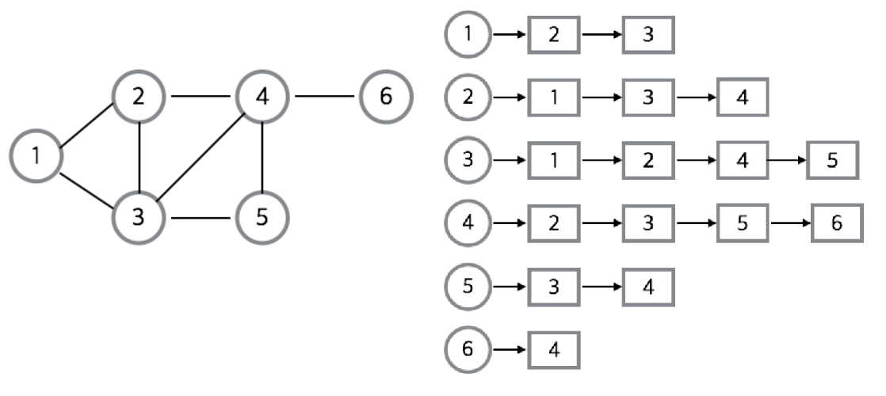

# CS | Data Structures - Graph

### Graph 그래프

- 그래프란?
  - `vertex`(=`node`) 와 `edge` 로 구성된 자료구조
  - 연결되어 있는 객체 간의 관계를 표현할 수 있음
  - ex. 지도, 지하철 노선도의 최단 경로, 전기 회로의 소자들, 도로, 선수 과목 등
  - 여러개의 고립된 부분 그래프 (Isolated Subgraphs) 로 구성될 수 있다.
- 그래프와 트리의 차이

|           | 그래프                                                   | 트리                                                         |
| --------- | :------------------------------------------------------- | ------------------------------------------------------------ |
| 정의      | node 와 이를 연결하는 edge 를 하나로 모아 놓은 자료 구조 | 그래프의 한 종류. DAG (Directed Acyclic Graph, 방향성이 있는 비순환 그래프) 의 한 종류. |
| 방향성    | Directed, Undirected 모두 존재                           | Directed Graph                                               |
| 사이클    | Cycle 가능. Self-loop도 가능. Cyclic, Acyclic 모두 존재  | Cycle 불가능. Self-loop 불가능. Acyclic Graph (비순환)       |
| 루트노드  | 루트 노드라는 개념이 없음                                | 한 개의 루트 노드. 모든 자식 노드는 하나의 부모 노드를 가진다. |
| 부모-자식 | 부모-자식 개념이 없음                                    | 부모-자식 관계. top-bottom / bottom-top 으로 이루어짐        |
| 모델      | 네트워크 모델                                            | 계층 모델                                                    |
| 순회      | DFS, BFS                                                 | DFS, BFS 안에 Pre-, In-, Post-order                          |
| 간선의 수 | 그래프에 따라 간선 수가 다르며, 없을 수도 있다           | 노드가 N인 트리는 항상 N-1의 간선을 가진다                   |
| 경로      | -                                                        | 임의의 두 노드간 경로는 유일하다                             |
| 예시      | 지도, 지하철 노선도의 최단 경로, 선수 과목               | 이진 트리, 이진 탐색 트리, 이진 힙 등                        |

- 오일러 경로 (Eulerain trail)
  - 그래프 내에 모든 edge 를 한번만 통과하면서 처음 node 로 되돌아 오는 경로
  - edge 갯수가 짝수일 때만 오일러 경로가 존재
  - 시작점과 도착점이  같으면 오일러 회로(Circuit) 이 된다
  - 한붓 그리기를 생각하면 된다

  

#### 용어

- vertex : 정점. 위치. 노드라고도 부른다
- edge : 간선. 위치간 관계. 노드를 연결하는 선. = link, branch
- adjacent vertex : 인접 정점. 간선에 의해서 직접 연결된 정점
- degree : 정점의 차수. 무방향 그래프에서 하나의 정점에 인접한 정점의 숫자
  - 무방향 그래프에 존재하는 정점의 차수 합 = 그래프 간선 수 x 2
- in-degree : 진입 차수. 방향 그래프에서 외부에서 오는 간선의 수 (내차수)
- out-degree : 진출 차수. 방향 그래프에서 외부로 향하는 간선의 수 (외차수)
  - 방향 그래프에 있는 정점의 진입 차수 or 진출 차수의 합 = 방향 그래프 간선 수 (내차수 + 외차수)
- path length : 경로 길이. 경로를 구성하는데 사용된 간선의 수
- simple path : 단순 경로. 경로중에서 반복되는 정점이 없는 경우
- cycle : 사이클. 단순 경로의 시작 정점과 종료 정점이 동일한 경우

  

#### 특징

- 그래프는 **네트워크 모델**
- 2개 이상의 경로 가능
- self-loop 뿐 아니라 loop/circuit 모두 가능
- 루트 노드라는 개념이 없다
- 부모-자식 관계라는 개념이 없다
- 순회는 DFS, BFS 로 이루어진다.
- 순환(Cyclic) or 비순환(Acyclic)이다
- 방향 그래프 / 무방향 그래프
- 간선의 유무는 그래프에 따라 다르다

  

#### 종류

##### 무방향 그래프 & 방향 그래프

- 무방향 그래프 (Undirected Graph)
  - 간선을 통해서 양방향으로 갈 수 있다
  - 정점 A와 정점 B를 연결하는 간선은 (A, B) 처럼 정점의 쌍으로 표현한다.
    - 양방향이 가능하기 때문에 (A, B) 와 (B, A) 는 동일
  - ex. 양방향 통행 도로
- 방향 그래프 (Directed Graph)
  - 간선에 방향성이 존재
  - A에서 B로 가는 간선은 <A, B> 로 표시
    - 방향성이 있기 때문에 <A, B> 와 <B, A> 는 다름
  - ex. 일방 통행 도로

##### 가중치 그래프

- Weighted Graph
- 간선에 비용, 가중치가 할당된 그래프
- 네트워크(Network) 라고도 한다.
- ex. 도시-도시 간 연결, 도로의 길이, 회로 소자의 용량, 통신망 사용료 등

##### 연결 그래프 & 비연결 그래프

- 연결 그래프 (Connected Graph)
  - 무방향 그래프에 있는 모든 정점쌍에 대해서 항상 경로가 존재하는 경우
  - ex. 트리 : 사이클을 가지지 않는 연결 그래프
- 비연결 그래프 (Disconnected Graph)
  - 무방향 그래프에서 특정 정점쌍 사이에 경로가 존재하지 않는 경우

##### 사이클 & 비순환 그래프

- 사이클 (Cycle)
  - 단순 경로의 시작 정점과 종료 정점이 동일한 경우
- 비순환 그래프 (Acyclic Graph)
  - 사이클이 없는 그래프

##### 완전 그래프

- Complete Graph
- 그래프에 속해 있는 모든 정점이 서로 연결되어 있는 그래프
- 무방향 완전 그래프
  - 정점 수 = n이면, 간선의 수 = n * (n-1) / 2

  

#### 그래프의 2가지 구현

##### 1. 인접 리스트 (Adjacency List)

- 인접리스트로 그래프를 표현하는 것이 **가장 일반적인 방법**임
- 모든 정점을 인접 리스트에 저장하여 각 정점에 인접한 정점을 리스트로 표시
- ArrayList, LinkedList 등을 이용해서 인접리스트를 표현
- 정점의 번호만 알면 이 번호를 배열의 인덱스로 하여 각 정점의 리스트에 쉽게 접근할 수 있다
- 장점
  - 정점 간 연결 정보를 탐색할 때 `O(n)` 의 시간이면 가능 (n = 간선의 수)
  - 필요한 만큼만 공간을 사용하기 때문에 공간 낭비가 적다
- 단점
  - 특정 두 점이 연결되었는지 확인하려면 인접행렬에 비해 시간이 오래 소요됨 (배열보다 search 속도가 느리다)
  - 구현이 비교적 어렵다.

##### 2. 인접 행렬 (Adjacency Matrix)

- `NxN` Boolean 행렬로써, `matrix[i][j]` 가 `True` 라면 `i` > `j` 로의 간선이 있다는 뜻이다
- 0과 1을 이용한 정수 행렬(Integer Matrix)을 사용할 수도 있다.
- 노드의 개수가 N인 그래프를 인접 행렬로 표현
  - 간선 수와 무관하게 항상 `n^2` 개의 메모리 공간이 필요
- 무방향 그래프를 인접행렬로 표현하면 이 행렬은 대칭 행렬 (Symmetric Matrix) 이 된다
  - 방향그래프는 대칭행렬이 안될수도 있다
- 인접리스트를 사용한 그래프 알고리즘들은 인접행렬에서도 사용이 가능하지만 효율성이 떨어진다.
- 인접행렬에서 인접한 노드를 찾기위해서는 모든 노드를 전부 순회해야 하기 때문
- 장점
  - 배열의 위치를 확인하면 두 점에 대한 연결 정보를 조회 할때 `O(1)` 의 시간 복잡도면 가능
  - 구현이 비교적 간편
- 단점
  - 모든 정점에 대해 간선 정보를 대입해야 하므로 `O(n²)` 의 시간복잡도가 소요됨
  - 무조건 2차원 배열이 필요하기 때문에 필요 이상의 공간이 낭비됨

  

#### 그래프 탐색 - DFS / BFS

- 첫 노드부터 그래프에 존재하는 모든 노드를 한번씩 방문하는 것을 그래프 탐색이라고 한다.

##### 1. 깊이 우선 탐색 (DFS, Depth-First Search)

- 루트 노드(혹은 다른 임의의 노드)에서 시작해서 다음 branch로 넘어가기 전에 해당 분기를 완벽하게 탐색하는 방법
- 넓게(wide) 탐색하기 전에 깊게(deep) 탐색하는 것이다
- **모든 노드를 방문** 하고자 하는 경우 이 방법을 선택한다.
- DFS 가 BFS 보다 좀 더 간단하다
- 재귀호출 / 스택을 사용하여 구현

##### 2. 너비 우선 탐색 (BFS, Breadth-First Search)

- 루트 노드(혹은 다른 임의의 노드)에서 시작해서 인접한 노드를 먼저 탐색하는 방법
- 깊게 탐색하기 전에 넓게 탐색하는 것이다
- **두 노드 사이의 최단 경로 or 임의의 경로를 찾고 싶을 때** 이 방법을 선택한다
- 큐를 사용해서 지금 위치에서 갈 수 있는 것들을 모두 큐에 넣는 방식으로 구현

##### Ex. 지구상에 존재하는 모든 친구 관계 그래프를 그린 후 Ash - Vanessa 사이에 존재하는 경로를 찾는 경우

- DFS - 모든 친구 관계를 다 살펴봐야 할지도 모름
- BFS - Ash 와 가까운 관계부터 탐색

#### 참고

> https://gmlwjd9405.github.io/2018/08/13/data-structure-graph.html
>
> https://coding-factory.tistory.com/610
>
> https://kosaf04pyh.tistory.com/131

