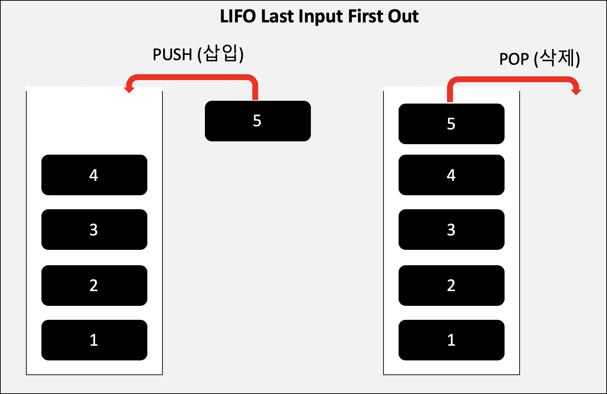
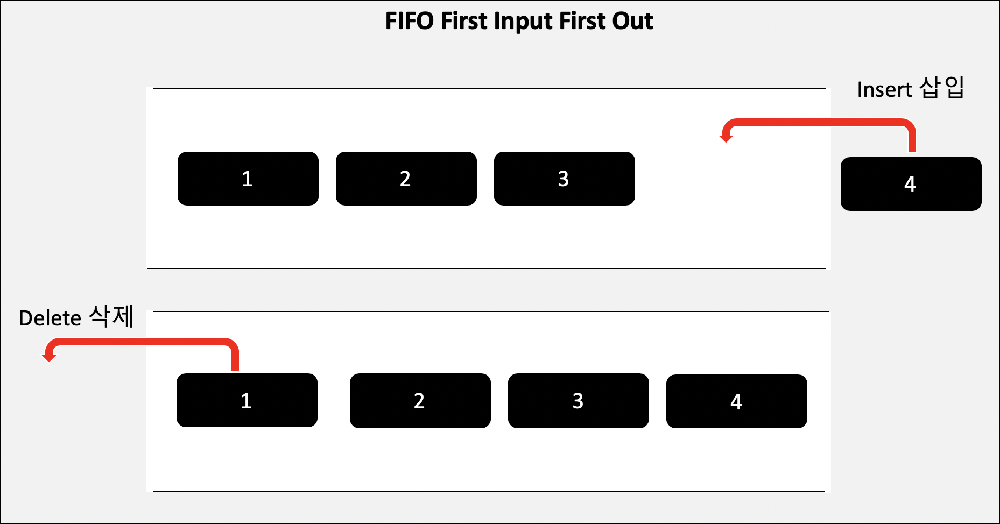

# CS | Data Structures - Stack & Queue

### Stack 스택

- 스택이란?

  - 객체들의 집합소, 데이터를 기록하는 구조
  - **LIFO** (**L**ast **I**nput **F**irst **O**ut) : 마지막에 넣은 요소가 가장 먼저 나온다

  

  - 위로 차곡차곡 쌓는 구조

  - 삽입은 `Push` / 삭제는 `Pop`

  - 스택오버플로우 (Stack Overflow) : 정해진 크기 안에 뭔가를 계속해서 넣다가 받아들일 수 있는 크기를 초과하여 흘러넘쳐버린 것을 의미함. 재귀함수를 호출할 때 많이 발생.

  - 사용 예시

    - 브라우저 뒤로 가기
  - 문서 작업 중 Ctrl + Z 로 이전상태 되돌리기
    - 사칙연산 계산기 만들 때 (후위 표기법)
    - DFS (깊이 우선 탐색)
  
    ```
  # 후위 표기법이란?
    사칙 연산 프로그램을 만들 때 사용하는 수식의 표현법.
    우리는 주로 중위 표기법을 사용. (A+B) * (C+D) 연산자가 피연산자들 사이에 위치
    후위 표기법은 AB+CD+* 연산자가 피연산자 뒤에 위치
    ```
  
    > 지금은 뭔말인지 모르겠는데, 나중에 다시보자...
  > (https://jamanbbo.tistory.com/54?category=838061)

</br></br>

### Queue 큐

- 큐란?

  - 단순하게 하자면, 스택의 반대 개념
  - **FIFO** (**F**irst **I**nput **F**irst **O**ut) : 먼저 들어간 데이터가 먼저 나오는 구조

  
  - 순서대로 처리하는 형태
  - 삽입은 `Insert` / 삭제는 `Delete`
  - 물건을 살 때, 줄을 선 순서대로 살 수 있는 것과 같은 구조
  - 마지막에 삽입한 요소를 삭제하기 위해서는 앞 요소들이 전부 삭제되어야 함
  - 사용 예시
    - CPU. 하나의 Task가 처리된 후 다음 Task를 처리. 실행 순서대로 처리
    - BFS (너비 우선 탐색)

### Deque 덱

- Double Ended Queue
- 큐와 비슷하지만, front 와 end 에서 모두 삭제와 삽입이 가능하다.
- 연속적인 메모리를 기반으로 하는 시퀀스 컨테이너
- 새로운 메모리 단위를 할당하여 요소로 추가
- 크기가 가변적


#### ✨스택과 큐의 차이점

- 가장 큰 차이점은 처리 방식이다.
- LIFO 이냐. FIFO 이냐의 차이.