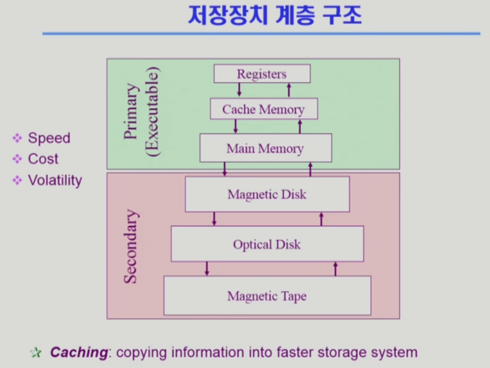
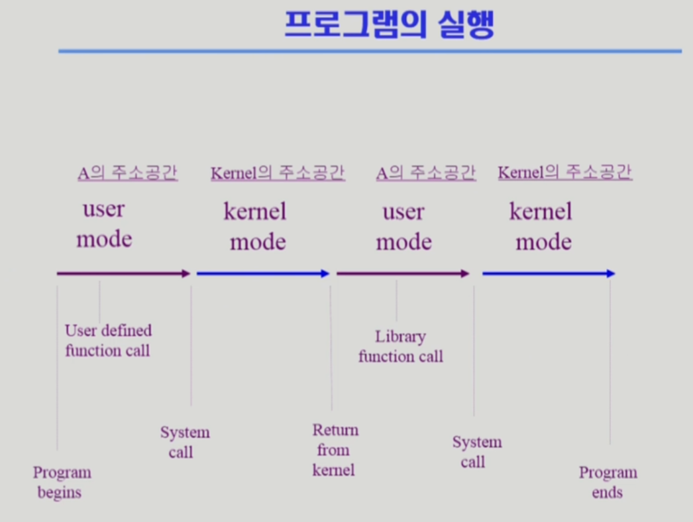

# Operating System 02 | System Structure & Program Execution

### 1. System Structure

#### 컴퓨터 시스템 구조

- Computer

  - CPU
    - registers
    - mode bit
      - 사용자 프로그램의 잘못된 수행으로 다른 프로그램이나 OS에 피해가 가지 않도록 하기 위한 보호 장치
      - `0` : 모니터 모드(커널 모드, 시스템 모드), OS 코드 수행
      - `1` : 사용자 모드, 사용자 프로그램 수행
      - 보안을 해칠 수 있는 명령어는 모니터 모드에서만 수행 가능한 '특권 명령'으로 규정
      - Interrupt, Exception 발생시 하드웨어가 mode bit을 0으로 바꿈
      - 사용자 프로그램에게 CPU를 넘기기 전에 mode bit을 1로 바꿈
    - interrupt line
  - Memory
    - memory controller
  - DMA controller (Direct Memory Acess controller)
  - timer
    - 특정 프로그램이 CPU를 독점하는 것을 방지
    - 정해진 시간이 흐른 뒤 OS에게 제어권이 넘어가도록 interrupt를 발생시킴
    - time sharing을 구현하기 위해 사용 + 현재 시간을 계산하는 데에도 사용

- I/O Device

  - Disk
  - Keyboard
  - Monitor

  - device controller
    - 해당 I/O 장치 유형을 관리하는 일종의 작은 CPU
    - control register, status register를 가짐
    - local buffer (data register)
    - I/O가 끝났을 경우 interrupt로 CPU에 그 사실을 알림

 

#### 인터럽트 (Interrupt)

- 인터럽트 당한 시점의 register와 program counter를 save한 후 CPU 제어를 인터럽트 처리 루틴에 넘긴다.

- 넓은 의미

  - interrupt : 하드웨어가 발생시킨 인터럽트 (device controller가 요청하는 것)

  - trap : 소프트웨어가 발생시킨 인터럽트

    - exception : 프로그램이 오류를 범한 경우
    - system call : 프로그램이 커널 함수를 호출하는 경우

    ##### 시스템 콜(System Call)

    - 사용자 프로그램이 운영체제에게 I/O를 요청하는 것
    - OS의 서비스를 받기 위해 커널 함수를 호출하는 것

- 용어

  - 인터럽트 벡터 : 해당 인터럽트의 처리 루틴 주소를 가지고 있음
  - 인터럽트 처리 루틴(=interrupt service routine, 인터럽트 핸들러) : 해당 인터럽트를 처리하는 커널 함수

 

#### 동기식 입출력 & 비동기식 입출력

- 동기식 입출력 (Synchronous I/O)
  - I/O 요청 후 입출력 작업이 완료된 후에야 제어가 사용자 프로그램에 넘어감
  - 구현 방법 1
    - I/O가 끝날때까지 CPU를 낭비시킴
    - 매 시점 하나의 I/O만 일어날 수 있다
  - 구현 방법 2
    - I/O가 완료될 때까지 해당 프로그램에게서 CPU를 빼앗음
    - I/O 처리를 기다리는 줄에 위 프로그램을 줄 세움
    - 다른 프로그램에게 CPU를 준다.
- 비동기식 입출력(Asynchronous I/O)
  - I/O가 시작된 후 입출력 작업이 끝나기를 기다리지 않고 제어가 사용자 프로그램에 즉시 넘어감

→ 두 경우 모두 인터럽트를 통해 I/O의 완료를 알림

 

#### DMA (Direct Memory Acess)

- 빠른 입출력 장치를 메모리에 가까운 속도로 처리하기 위해서 사용
- CPU의 중재 없이, device controller가 device의 buffer storage의 내용을 메모리에 block 단위로 직접 전송
- 바이트 단위가 아닌, block 단위로 인터럽트를 발생시킨다.

 

#### 서로 다른 입출력 명령어

- I/O를 수행하는 special instruction에 의해
  - 메모리에 접근하는 것과 I/O를 수행하는 것이 별개
- Memory Mapped I/O에 의해
  - 메모리의 주소를 각각의 I/O에도 할당해서 매핑

 

#### 저장장치 계층 구조

- CPU → Cache Memory → Main Memory |휘발성 → 비휘발성 | Magnetic Disk → Optical Disk → Magnetic Tape
- Speed / Cost / Volatility

 

### 2. Program Execution

- 파일 시스템의 실행파일이 실행되면, Virtual memory에 프로세스로써 할당이 된다.
- 이후 메모리 주소변환을 통해 Physical memory 로 프로세스가 전달되고 물리적인 메모리에 직접 전달되지 않아도 되는 데이터는 디스크의 Swap area로 보내진다.

 

#### OS 커널 주소 공간(Kernel Address Space)의 내용

- code (커널 코드)
  - 시스템콜, 인터럽트 처리 코드
  - 자원 관리를 위한 코드
  - 편리한 서비스 제공을 위한 코드
- data
  - PCB
  - CPU, mem, disk (Data Structure)
- stack
  - 프로세스들의 커널 스택

 

#### 사용자 프로그램이 사용하는 함수

- 사용자 정의 함수
  - 자신의 프로그램에서 정의한 함수
- 라이브러리 함수
  - 자신의 프로그램에서 정의하지 않고 가져다 쓴 함수
  - 자신의 프로그램의 실행 파일에 포함되어 있음
- 커널 함수
  - 운영체제 프로그램의 함수
  - 커널 함수의 호출 = 시스템 콜

 

> 본 내용은 이화여자대학교 반효경 교수님 운영체제 강의 내용입니다.
>
> [운영체제 | 이화여자대학교 반효경](http://www.kocw.net/home/search/kemView.do?kemId=1046323)

