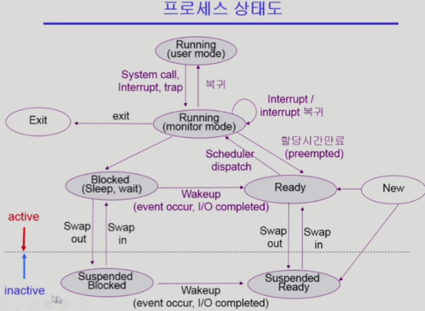
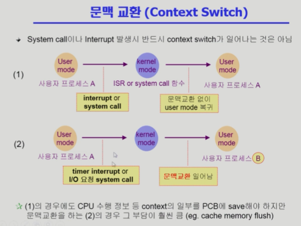

# Operating System 03 | Process

### 프로세스 Process

**" Process is a program in execution "**

- 프로세스의 문맥(context)
  - CPU 수행 상태를 나타내는 하드웨어 문맥
    - Program Counter (PC)
    - 각종 register
  - 프로세스의 주소 공간
    - code, data, stack
  - 프로세스 관련 커널 자료 구조
    - PCB (Process Control Block)
    - Kernel stack

 

#### 프로세스의 상태 (Process State)

- 프로세스는 상태가 변경되며 수행된다
  - Running
    - CPU를 잡고 Instruction을 수행중인 상태
  - Ready
    - CPU를 기다리는 상태 (메모리 등 다른 조건을 모두 만족하고)
  - Blocked (wait, sleep)
    - CPU를 주어도 당장 instruction을 수행할 수 없는 상태
    - Process 자신이 요청한 event(ex.I/O)가 즉시 만족되지 않아 이를 기다리는 상태
    - ex. 디스크에서 file을 읽어와야 하는 경우
  - Suspended (stopped)
    - 외부적인 이유로 프로세스의 수행이 정지된 상태
    - 프로세스는 통째로 디스크에 swap out 된다
    - ex
      - 사용자가 프로그램을 일시정지 시킨 경우 (break key)
      - 시스템이 여러 이유로 프로세스를 잠시 중단시킴 (메모리에 너무 많은 프로세스가 올라와 있을 때)
  - New - 프로세스가 생성중인 상태
  - Terminated - 수행(execution)이 끝난 상태

 

#### Process Control Block (PCB)

- PCB란?
  - 운영체제가 각 프로세스를 관리하기 위해 프로세스당 유지하는 정보
  - 구성요소
    - OS가 관리상 사용하는 정보
      - Process state, Process ID
      - scheduling information, Priority
    - CPU 수행 관련 하드웨어 값
      - Program Counter, Registers
    - 메모리 관련
      - code, data, stack의 위치 정보
    - 파일 관련
      - Open file descriptors

 

#### 문맥 교환 (Context Switch)

- **CPU를 한 프로세스에서 다른 프로세스로 넘겨주는 과정**
- CPU가 다른 프로세스에게 넘어갈 때 OS는 다음을 수행한다.
  - CPU를 내어주는 프로세스의 상태를 그 프로세스의 PCB에 저장
  - CPU를 새롭게 얻는 프로세스의 상태를 PCB에서 읽어옴

 

#### 프로세스를 스케쥴링하기 위한 큐

- Job queue
  - 현재 시스템 내에 있는 모든 프로세스의 집합
- Ready queue
  - 현재 메모리 내에 있으면서 CPU를 잡아서 실행되기를 기다리는 프로세스의 집합
- Device queue
  - I/O device의 처리를 기다리는 프로세스의 집합
- 프로세스들은 각 큐들을 오가면서 수행됨

 

#### 스케쥴러 (Scheduler)

- Long-term scheduler (장기 스케쥴러 / Job scheduler)
  - 시작 프로세스 중 어떤 것을 ready queue로 보낼지 결정
  - 프로세스에 **메모리 및 자원을 주는** 문제
  - degree of Multiprogramming을 제어
  - time sharing system에는 보통 장기 스케쥴러가 없다
- Short-term scheduler (단기 스케쥴러 / CPU scheduler)
  - 어떤 프로세스를 다음에 running 시킬지 결정
  - 프로세스에 **CPU를 주는** 문제
  - 충분히 빨라야 함 (millisecond 단위)

- Medium-term scheduler (중기 스케쥴러 / Swapper)
  - 여유 공간 마련을 위해 프로세스를 통째로 메모리에서 디스크로 쫓아냄
  - 프로세스에게서 **memory를 뺏는** 문제
  - degree of Multiprogramming을 제어

 

> 본 내용은 이화여자대학교 반효경 교수님 운영체제 강의 내용입니다.
>
> [운영체제 | 이화여자대학교 반효경](http://www.kocw.net/home/search/kemView.do?kemId=1046323)
