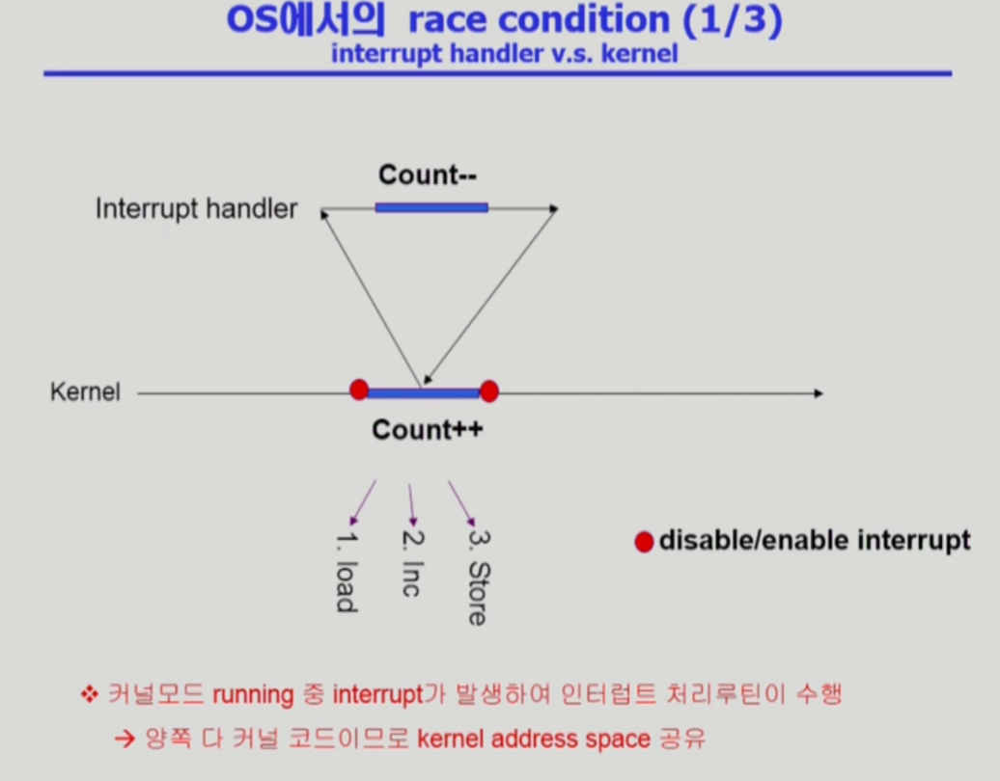

# Operating System 07 | Process Synchronization

#### Race Condition (경쟁 상태)

- Storage box를 공유하는 Execution box가 여러개 있을 경우 발생할 수 있음
- ex.
  - E-box 1은 S-box의 data를 더하는 연산을 하는 기능
  - E-box 2는 S-box의 data를 빼는 연산을 하는 기능
  - 연산 이후, 결과가 저장될 때 E-box 2의 연산 결과만 저장될 수도 있음

<br>

### OS에서 race condition이 언제 발생하는가?

- kernel 수행 중 인터럽트 발생 시



- Process가 System call을 하여 kernel mode로 수행 중인데 context switch가 일어나는 경우


- Multiprocessor에서 shared memory 내의 kernel data


<br>

### Process Synchronization 문제

- 공유 데이터(shared data)의 동시 접근(concurrent access)은 데이터의 불일치 문제(inconsistency)를 발생시킬 수 있음
- 일관성(consistency) 유지를 위해서는 협력 프로세스(Cooperating process) 간의 실행 순서(orderly execution)를 정해주는 메커니즘이 필요
- Race Condition
  - 여러 프로세스들이 동시에 공유 데이터에 접근하는 상황
  - 데이터의 최종 연산 결과는 마지막에 그 데이터를 다룬 프로세스에 따라서 달라짐
- race condition을 막기 위해서 concurrent process는 동기화(synchronize)되어야 함

<br>

### The Critical-Section Problem

- 각 프로세스 code segment 안에 공유 데이터에 접근하는 코드인 **critical section**이 존재


<br>

#### 프로그램적 해결법의 충족 조건

- Mutual Exclusion (상호 배제)
  - 프로세서 Pi가 critical section 부분을 수행 중이면 다른 모든 프로세스들은 그 critical section에 들어가면 안됨

- Progress (진행)
  - 아무도 critical section에 있지 않은 상태에서 critical section에 들어가고자 하는 프로세스가 있으면 critical section에 들어가게 해주어야 함
- Bounded Waiting (유한 대기)
  - 프로세스가 critical section에 들어가려고 요청한 후부터 그 요청이 허용될 때까지 다른 프로세스들이 critical section에 들어가는 횟수에 한계가 있어야 함
- 가정
  - 모든 프로세스의 수행 속도는 0보다 큼
  - 프로세스들 간 상대적인 수행속도는 가정하지 X

<br>

### Algorithm 1

- Synchronization variable

  ```C
  int turn;
  initially turn = 0;
  ```

```c
do {
    while (turn != 0)
    critical section
    turn = 1;
    remainder section
} while (1);
```

### Algorithm 2

- Synchronization variable

  ```c
  boolean flag[2];
  initially flag [모두] = false;
  ```

```c
do {
    flag[i] = true;
    while (flag[j]);
    critical section
    flag [i] = false;
    remainder section
} while (1);
```

- 상호배제는 만족하지만, progress는 만족하지 못함
- 둘 다 2행까지 수행 후 끊임 없이 양보하는 상황이 발생 가능

### Algorithm 3 (Peterson's Algorithm)

- Algo 1과 Algo 2의 synchronization variable을 혼합

```c
do {
    flag [i] = true;
    turn = j;
    while (flag[j] && turn == j);
    critical section
    flag[i] = false;
    remainder section
} while(1);
```

- 3가지 충족 조건을 모두 만족한다
- Busy Waiting(=spin lock). 계속해서 CPU와 Memory를 쓰면서 wait. 비효율적임

<br>

### Synchronization Hardware

- 하드웨어적으로 Test & modify를 atomic하게 수행할 수 있도록 지원하는 경우 앞의 문제를 간단히 해결할 수 있음


<br>

### Semaphores

- 앞의 방식들을 추상화시킴

- Semaphore S

  - integer variable
  - 아래의 두 가지 atomic 연산에 의해서만 접근이 가능

  ```c
  P (S) : while (S<=0) do no-op;
  		S--;
  ```

  ```c
  V (S): S++;
  ```

<br>

### Critical Section of n Processes

```c
/* Synchronization variable */
semaphore mutex; /* initially 1; 1개가 cs에 들어갈 수 있다 */

/* Process Pi */
do {
    P(mutex);
    critical section
    V(mutex);
    remainder section
} while (1);
```

- busy-wait는 효율적이지 못함 (=spin lock)
- Block & Wakeup 방식의 구현 (=sleep lock)

<br>

### Block & Wakeup Implementation

- Semaphore를 다음과 같이 정의

```
typedef struct
{	int value;
	struct process *L;
} semaphore;
```

- block과 wakeup을 다음과 같이 가정
  - block
    - 커널은 block을 호출한 프로세스를 suspend 시킴
    - 이 프로세스의 PCB를 semaphore에 대한 wait queue에 넣음
  - wakeup(P)
    - block된 프로세스 P를 wakeup 시킴
    - 이 프로세서의 PCB를 ready queue로 옮김


### Busy-wait vs Block/Wakeup

- 전반적으로 block/wakeup 방식이 효율적
- critical section의 길이가 긴 경우 block/wakeup이 적당
- critical section의 길이가 매우 짧은 경우 block/wakeup 오버헤드가 busy-wait 오버헤드보다 더 커질 수 있음

<br>

### Two Types of Semaphores

- Counting semaphore
  - 도메인이 0 이상인 임의의 정수값
  - 주로 resource counting에 사용
- Binary semaphore (=mutex)
  - 0 또는 1 값만 가질 수 있는 semaphore
  - 주로 mutual exclusion (lock/unlock)에 사용

<br>

### Deadlock & Starvation

- Deadlock

  - 둘 이상의 프로세스가 서로 상대방에 의해 충족될 수 있는 event를 **무한히 기다리는** 현상

- Starvation

  - indefinite blocking

  - 프로세스가 suspend된 이유에 해당하는 semaphore 큐에서 빠져나갈 수 없는 현상

<br>

> 본 내용은 이화여자대학교 반효경 교수님 운영체제 강의 내용입니다.
>
> [운영체제 | 이화여자대학교 반효경](http://www.kocw.net/home/search/kemView.do?kemId=1046323)

