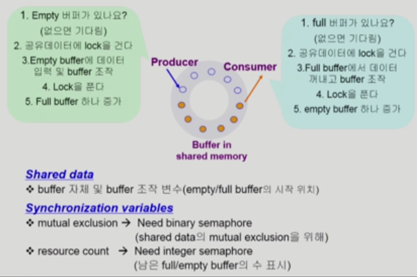
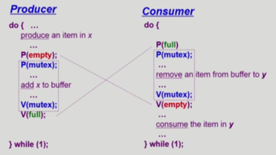
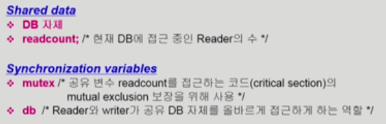
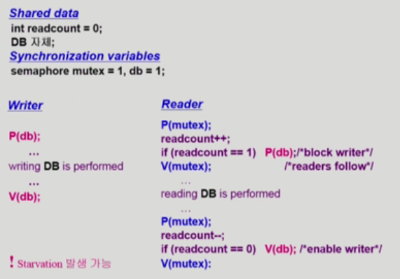
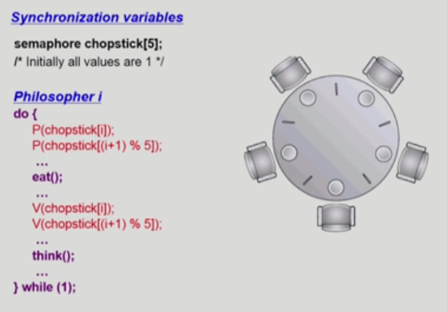
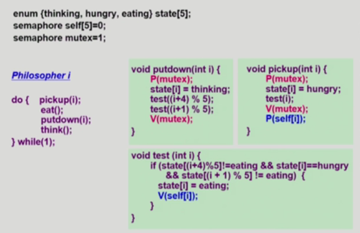
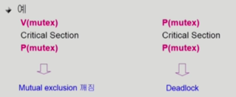
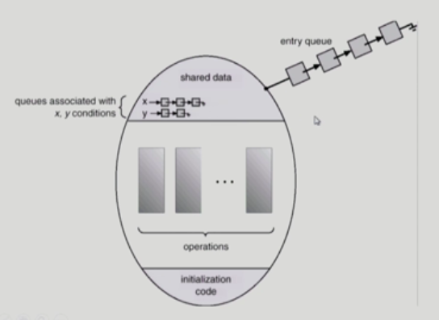
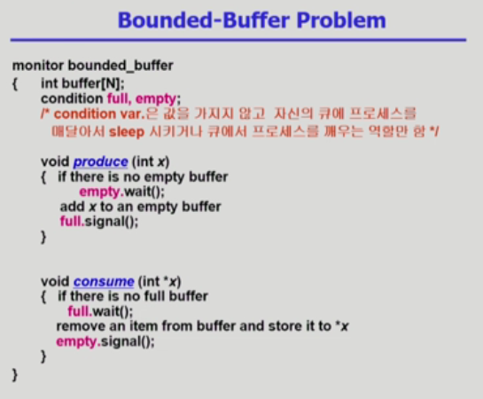
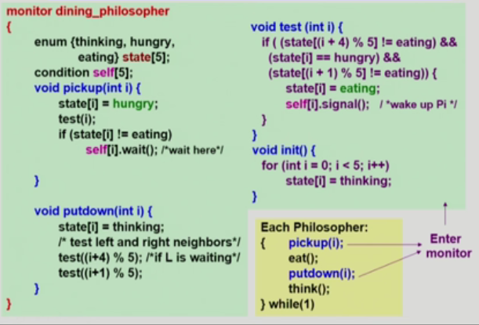

# Operating System 08 | Process Synchronization 2

> Process Synchronization
>
> = Concurrency control (병행 제어)

### Classical Problems of Synchronization

- Bounded-Buffer Problem (Producer-Consumer Problem)
- Readers and Writers Problem
- Dining-Philosophers Problem

<br>

#### 1. Bounded-Buffer Problem

- 개념



- 구현

```c
/* Synchronization variables */
semaphore full = 0, empty = n, mutex = 1;
```



<br>

#### 2. Readers-Writers Problem

- 한 process가 DB에 write 중일 때 다른 process가 접근하면 안됨
- read는 동시에 여럿이 해도 된다.
- solution
  - writer가 DB에 접근 허가를 아직 얻지 못한 상태에서는 모든 대기중인 reader들을 DB에 접근하게 해줌
  - writer는 대기 중인 reader가 하나도 없을 때 DB 접근이 허용됨
  - 일단 writer가 DB에 접근 중이면 reader들의 접근이 금지됨
  - writer가 DB를 빠져나가야만 reader의 접근이 허용됨



- Pseudo Code



> 신호등이 없는 도로..
>
> 차가 지나가는 타이밍을 봐서 건너가려고 하는데, 갑자기 뒤에서 빠른속도로 다른 차들이 달려오면
>
> 나는 언제 건너가지??? > Starvation...
>
> 예시 미쳤네 😙 설명 너무 잘하심.!!

<br>

#### 3. Dining-Philosophers Problem



- 위 Solution의 문제점

  - Deadlock 가능성이 있음
  - 모든 철학자가 동시에 배가 고파져서 왼쪽 젓가락을 잡아버린 경우

- 해결 방안

  - 4명의 철학자만이 테이블에 동시에 앉을 수 있도록 한다 > 자리는 5개. 사람은 4명
  - 젓가락을 2개 모두 잡을 수 있을 때에만 젓가락을 잡을 수 있게 한다.

  

  - 비대칭
    - 짝수(홀수) 철학자는 왼쪽(오른쪽) 젓가락부터 집도록..

<br>

### Monitor

- Semaphore의 문제점

  - 코딩하기 어려움
  - 정확성(correctness)의 입증이 어려움
  - 자발적 협력 (voluntary cooperation)이 필요함
  - 한번의 실수가 모든 시스템에 치명적인 영향을 미침

  

- **Monitor**

  - 동시에 수행중인 프로세스 사이에서 abstract data type의 안전한 공유를 보장하기 위한 **high-level synchronization construct**

  

  - 모니터 내에서는 한번에 하나의 프로세스만이 활동 가능
  - 프로그래머가 동기화 제약 조건을 명시적으로 코딩할 필요 없음 (프로그래머가 lock을 걸 필요가 없음)
  - 프로세스가 모니터 안에서 기다릴 수 있도록 하기 위해 **condition variable**을 사용
    - `condition x, y;`
    - wait와 signal 연산에 의해서만 접근 가능
      - `x.wait();`
        - `x.wait()`을 invoke한 프로세스는 다른 프로세스가 `x.signal()`을 invoke 하기 전까지 suspend 됨
      - `x.signal();`
        - `x.signal()`은 정확하게 하나의 suspend된 프로세스를 resume 한다.
        - suspend된 프로세스가 없으면 아무일도 일어나지 않음

<br>

### Monitor 개념을 활용한 Synchronization 문제 해결

#### Bounded-Buffer Problem



#### Dining-Philosophers Problem



<br>

> 본 내용은 이화여자대학교 반효경 교수님 운영체제 강의 내용입니다.
>
> [운영체제 | 이화여자대학교 반효경](http://www.kocw.net/home/search/kemView.do?kemId=1046323)

