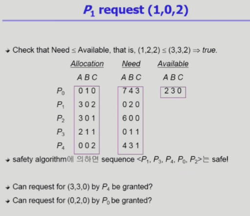

# Operating System 09 | Deadlock

### Deadlock (교착 상태)

> 교차로에서 어느누구도 양보하지 않아서 차들이 전혀 움직일 수 없는 모습...

- deadlock 이란?
  - 일련의 프로세스들이 서로가 가진 자원을 기다리며 block된 상태
- Resource(자원)
  - 하드웨어, 소프트웨어 등을 포함하는 개념
  - ex. I/O device, CPU cycle, memory space, semaphore 등
  - 프로세스가 자원을 사용하는 절차
    - Request, Allocate, Use, Release

 

### Deadlock 발생의 4가지 조건

- Mutual exclusion (상호 배제)
  - 매 순간 하나의 프로세스만이 자원을 사용할 수 있음
- No preemption (비선점)
  - 프로세스는 자원을 스스로 내어놓을 뿐 강제로 빼앗기지 않음
- Hold and Wait (보유 대기)
  - 자원을 가진 프로세스가 다른 자원을 기다릴 때 보유 자원을 놓지 않고 계속 가지고 있음
- Circular wait (순환 대기)
  - 자원을 기다리는 프로세스 간에 사이클이 형성되어야 함

 

#### Resource-Allocation Graph (자원할당 그래프)

- 그래프에 cycle이 없으면 deadlock이 아니다.

- 그래프에 cycle이 있으면
  -  자원당 인스턴스가 하나면, deadlock
  - 자원당 인스턴스가 여러개면, deadlock일수도 있고 아닐수도 있음

 

### Deadlock의 처리 방법

- Deadlock Prevention
  - 자원 할당 시 deadlock의 4가지 필요 조건 중 어느 하나가 만족되지 않도록 하는 것
- Deadlock Avoidance
  - 자원 요청에 대한 부가적인 정보를 이용해서  deadlock의 가능성이 없는 경우에만 자원을 할당
  - 시스템 state가 원래 state로 돌아올 수 있는 경우에만 자원 할당
- Deadlock Detection and Recovery
  - Deadlock 발생은 허용하되 그에 대한 detection 루틴을 두어 deadlock 발견시 recover하는 방법
- Deadlock Ignorance
  - Deadlock을 시스템이 책임지지 않음
  - UNIX를 포함한 대부분의 OS가 채택

 

#### 1. Deadlock Prevention

- Mutual Exclusion
  - 공유해서는 안되는 자원의 경우 이 조건은 반드시 성립해야 함
- Hold and wait
  - 프로세스가 자원을 요청할 때 다른 어떤 자원도 가지고 있지 않아야 한다
  - 방법 1. 프로세스 시작 시 모든 필요한 자원을 할당받게 하는 방법
  - 방법 2. 자원이 필요할 경우 보유 자원을 모두 놓고 다시 요청
- No Preemption
  - Process가 어떤 자원을 기다려야 하는 경우 이미 보유한 자원이 선점됨
  - 모든 필요한 자원을 얻을 수 있을 때 그 프로세스는 다시 시작됨
  - state를 쉽게 저장(save)하고 restore할 수 있는 자원에서 주로 사용 (CPU, memory)

- Circular Wait
  - 모든 자원 유형에 할당 순서를 정하여 정해진 순서대로만 자원을 할당

→ Utilization(이용률) 저하, throughput(성능) 감소, starvation 문제 발생 가능

 

#### 2. Deadlock Avoidance

- 자원 할당이 deadlock으로부터 안전한지를 동적으로 조사해서 안전한 경우에만 할당
- 가장 단순하고 일반적인 모델은 프로세스들이 필요로 하는 각 자원별 최대 사용량을 미리 선언하도록 하는 방법
- safe state
  - 시스템 내의 프로세스들에 대한 safe sequence가 존재하는 상태
- safe sequence
  - 프로세스의 sequence가 안전하려면 Pi의 자원 요청이 가용자원 + 모든 Pj의 보유 자원에 대해 충족되어야 함
  - 위 조건을 만족하면 다음 방법으로 모든 프로세스의 수행을 보장
    - Pi의 자원 요청이 즉시 충족될 수 없으면 Pj가 종료될 때까지 기다린다
    - Pi-1이 종료되면 Pi의 자원요청을 만족시켜 수행한다.

- 2가지 avoidance 알고리즘
  - 자원당 하나의 인스턴스 > Resource Allocation Graph Algorithm
  - 자원당 여러개의 인스턴스 > Banker's Algorithm

##### Resource Allocation Graph Algorithm

##### Banker's Algorithm

- 가정
  - 모든 프로세스는 자원의 최대 사용량을 미리 명시
  - 프로세스가 요청 자원을 모두 할당받은 경우 유한 시간 안에 이들 자원을 다시 반납한다.
- 방법
  - 기본 개념 : 자원 요청시 safe 상태를 유지할 경우에만 할당
  - 총 요청 자원의 수가 가용 자원의 수보다 적은 프로세스를 선택
    - 만약 그러한 프로세스가 없으면 unsafe 상태
  - 그러한 프로세스가 있으면 그 프로세스에게 자원을 할당
  - 할당받은 프로세스가 종료되면 모든 자원을 반납
  - 모든 프로세스가 종료될 때까지 위 과정을 반복

- Example

 

#### 3. Deadlock Detection and Recovery

- **Deadlock Detection**

  - 자원당 인스턴스가 하나인 경우

    - 자원할당 그래프에서의 cycle이 곧 deadlock을 의미
    - Wait-for Graph 알고리즘
      - 자원당 인스턴스가 하나인 경우
      - Wait-for Graph
        - 자원할당 그래프의 변형
        - 프로세스만으로 node를 구성
        - Pj가 가지고 있는 자원을 Pk가 기다리는 경우 Pk → Pj
      - Algorithm
        - Wait-for Graph에 사이클이 존재하는지를 주기적으로 조사
        - `O(n²)`

    

  - 자원당 인스턴스가 여러개인 경우

    - Banker's Algorithm과 유사한 방법 활용

- **Recovery**
  - Process Termination
    - 데드락에 관련된 모든 프로세스를 종료
    - 데드락 cycle이 종료될 때까지 프로세스를 하나씩 종료
  - Resource Preemption
    - 비용을 최소화할 victim을 선정
    - safe state로 rollback하여 process를 restart
    - Starvation 문제
      - 동일한 프로세스가 계속해서 victim으로 선정되는 경우
      - cost factor에 rollback 횟수도 같이 고려

 

#### 4. Deadlock Ignorance

- Deadlock이 일어나지 않는다고 생각하고 아무런 조치도 취하지 않는 방법
  - Deadlock이 매우 드물게 발생하므로 deadlock에 대한 조치 자체가 더 큰 overhead일 수 있음
  - 시스템에서 deadlock이 발생한 경우 시스템이 비정상적으로 작동하는 것을 사람이 느낀 후 직접 process를 죽이는 등의 방법으로 대처
  - UNIX, Windows 등 대부분의 범용 OS가 채택하는 방법

 

> 본 내용은 이화여자대학교 반효경 교수님 운영체제 강의 내용입니다.
>
> [운영체제 | 이화여자대학교 반효경](http://www.kocw.net/home/search/kemView.do?kemId=1046323)

