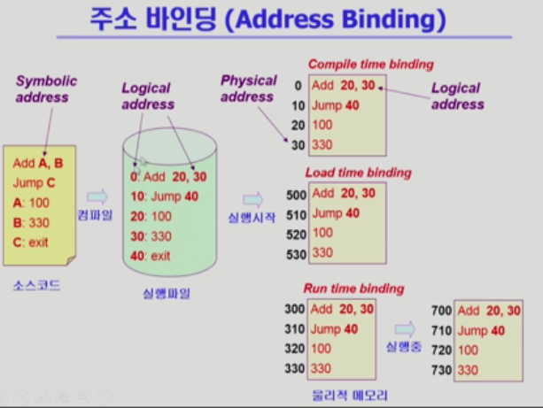
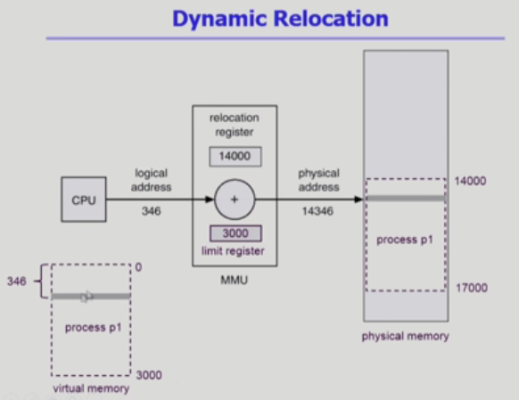
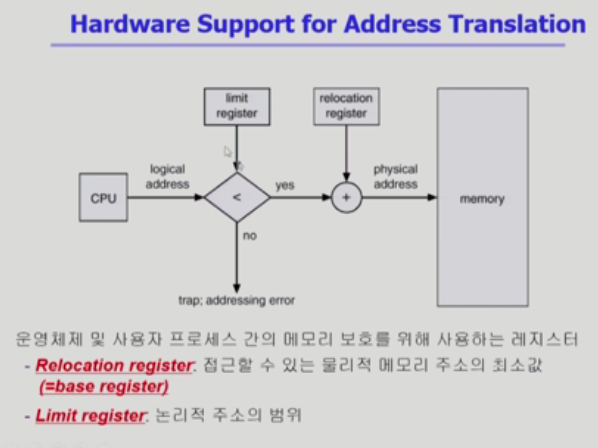
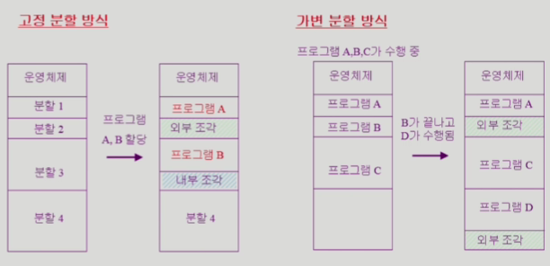

# Operating System 10 | Memory Management

### Logical vs. Physical Address

- ##### Logical Address

  - virtual address
  - 프로세스마다 독립적으로 가지는 주소 공간
  - 각 프로세스마다 0번지부터 시작
  - CPU가 보는 주소는 logical address임

- ##### Physical Address

  - 메모리에 실제 올라가는 위치

- 주소 바인딩

  - 주소를 결정하는 것
  - Symbolic Address → Logical Address → Physical Address

 

### 주소 바인딩 (Address Binding)

- ##### Compile time binding

  - 물리적 메모리 주소(physical address)가 컴파일 시 알려짐
  - 시작 위치 변경시 재컴파일해야 함
  - 컴파일러는 절대 코드(absolute code)를 생성

- ##### Load time binding

  - Loader의 책임하에 물리적 메모리 주소 부여
  - 컴파일러가 재배치가능코드(relocatable code)를 생성한 경우 가능

- ##### Execution time binding (=Run time binding)

  - 수행이 시작된 이후에도 프로세스의 메모리 상 위치를 옮길 수 있음
  - CPU가 주소를 참조할 때마다 binding을 점검 (address mapping table)
  - 하드웨어적인 지원이 필요
    - e.g., base and limit resigters, MMU

 

### Memory-Management Unit (MMU)

- logical address를 physical address로 매핑해 주는 Hardware device
- MMU Scheme
  - 사용자 프로세스가 CPU에서 수행되며 생성해내는 모든 주소값에 대해  base register (=relocation register)의 값을 더한다
- User Program
  - logical address만을 다룬다
  - 실제 physical address를 볼 수 없으며 알 필요가 없음

 

#### Dynamic Loading

- 프로세스 전체를 메모리에 미리 다올리는 것이 아닌 해당 루틴이 불려질 때 메모리에 load하는 것
- memory utilization의 향상
- 가끔씩 사용되는 많은 양의 코드의 경우 유용
  - ex. 오류 처리 루틴
- OS의 특별한 지원 없이 프로그램 자체에서 구현 가능 (OS는 라이브러리를 통해 지원 가능)
- Loading이란
  - 메모리로 올리는 것

 

#### Dynamic Linking

- Linking을 실행시간(execution time)까지 미루는 기법

- ##### Static linking

  - 라이브러리가 프로그램의 실행 파일 코드에 포함됨
  - 실행 파일의 크기가 커짐
  - 동일한 라이브러리를 각 프로세스가 메모리에 올리므로 메모리 낭비가 발생

- ##### Dynamic linking

  - 라이브러리가 실행시 연결됨
  - 라이브러리 호출 부분에 라이브러리 루틴의 위치를 찾기위한 stub이라는 작은 코드를 둠
  - 라이브러리가 이미 메모리에 있으면 그 루틴의 주소로 가고 없으면 디스크에서 읽어옴
  - OS의 도움이 필요

 

#### Overlays

- 메모리에 프로레스의 부분 중 실제 필요한 정보만을 올림
- 프로세스의 크기가 메모리보다 클 때 유용
- OS의 지원없이 사용자에 의해 구현
- 작은 공간의 메모리를 사용하던 초창기 시스템에서 수작업으로 프로그래머가 구현
  - Manual Overlay
  - 프로그래밍이 매우 복잡

 

#### Swapping

- 프로세스를 일시적으로 메모리에서 backing store로 쫒아내는 것

- Backing Store (=swap area)

  - 디스크 - 많은 사용자의 프로세스 이미지를 담을만큼 충분히 빠르고 큰 저장 공간

- ##### Swap In / Swap Out

  - 일반적으로 중기 스케쥴러(swapper)에 의해 swap out 시킬 프로세스를 선정
  - priority-based CPU scheduling algorithm
    - priority가 낮은 프로세스를 swapped out 시킴
    - priority가 높은 프로세스를 메모리에 올려 놓음
  - Compile time 혹은 load time binding에서는 원래 메모리 위치로 swap in 해야 함
  - Execution time binding에서는 추후 빈 메모리 영역 아무곳에나 올릴 수 있음
  - swap time은 대부분 transfer time (swap되는 양에 비례하는 시간)이다.

 

### Allocation of Physical Memory

- 메모리는 일반적으로 두 영역으로 나뉘어 사용

  - OS 상주 영역
    - interrupt vector와 함께 낮은 주소 영역 사용
  - 사용자 프로세스 영역
    - 높은 주소 영역 사용

- 사용자 프로세스 영역의 할당 방법

  - ##### Contiguous allocation (연속 할당)

    - 각각의 프로세스가 메모리의 연속적인 공간에 적재되도록 하는 것
    - Fixed partition allocation
    - Variable partition allocation

  - ##### Noncontiguous allocation (불연속 할당)

    - 하나의 프로세스가 메모리의 여러 영역에 분산되어 올라갈 수 있음
    - Paging
    - Segmentation
    - Paged Segmentation

 

#### Contiguous Allocation

##### 고정분할(Fixed partition) 방식

- 물리적 메모리를 몇 개의 역구적 분할(partition)로 나눔
- 분할의 크기가 모두 동일한 방식과 서로 다른 방식이 존재
- 분할당 하나의 프로그램 적재
- 융통성이 없음
  - 동시에 메모리에 load되는 프로그램의 수가 고정됨
  - 최대 수행 가능 프로그램 크기 제한
- Internal fragmentation 발생 (external fragmentation도 발생)

##### 가변분할(Variable partition) 방식

- 프로그램의 크기를 고려해서 할당
- 분할의 크기, 개수가 동적으로 변함
- 기술적 관리 기법 필요
- External fragmentation 발생

- ##### External fragmentation (외부 조각)

  - 프로그램 크기보다 분할의 크기가 작은 경우
  - 아무 프로그램에도 배정되지 않은 빈 곳인데도 프로그램이 올라갈 수 없는 작은 분할

- ##### Internal fragmentation (내부 조각)

  - 프로그램 크기보다 분할의 크기가 큰 경우
  - 하나의 분할 내부에서 발생하는 사용되지 않는 메모리 조각
  - 특정 프로그램에 배정되었지만 사용되지 않는 공간

- ##### Hole

  - 가용 메모리 공간
  - 다양한 크기의 hole들이 메모리 여러 곳에 흩어져 있음
  - 프로세스가 도착하면 수용가능한 hole을 할당
  - OS는 다음의 정보를 유지
    - 할당 공간
    - 가용 공간 (hole)

#### Dynamic Storage-Allocation Problem

- 가변 분할 방식에서 size n인 요청을 만족하는 가장 적절한 hole을 찾는 문제

- ##### First-fit

  - size가 n 이상인 것 중 최초로 찾아지는 hole에 할당

- ##### Best-fit

  - size가 n 이상인 가장 작인 hole을 찾아서 할당
  - hole들의 리스트가 크기순으로 정렫뢰지 않은 경우 모든 hole의 리스트를 탐색해야 함
  - 많은 수의 아주 작은 hole들이 생성됨

- ##### Worst-fit

  - 가장 큰 hole에 할당
  - 모든 리스트를 탐색해야 함
  - 상대적으로 아주 큰 hole들이 생성됨

#### Compaction

- external fragmentation 문제를 해결하는 한 가지 방법
- 사용중인 메모리 영역을 한군데로 몰고 hole들을 다른 한 곳으로 몰아 아주 큰 block을 만드는 것
- 매우 비용이 많이 드는 방법
- 최소한의 메모리 이동으로 compaction하는 방법 (매우 복잡한 문제)
- Compaction은 프로세스의 주소가 실행 시간에 동적으로 재배치 가능한 경우에만 수행될 수 있음

 

#### Noncontiguous Allocation

 

> 본 내용은 이화여자대학교 반효경 교수님 운영체제 강의 내용입니다.
>
> [운영체제 | 이화여자대학교 반효경](http://www.kocw.net/home/search/kemView.do?kemId=1046323)

