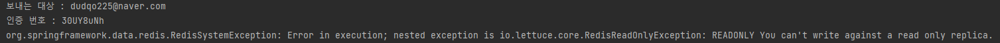
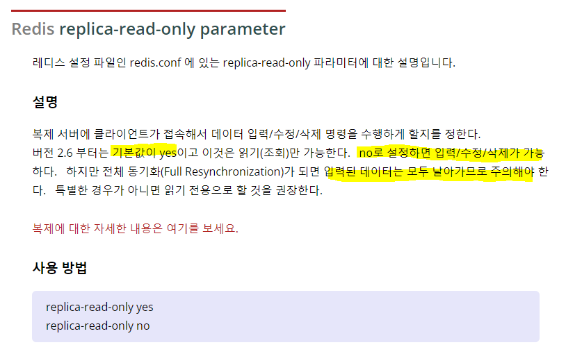
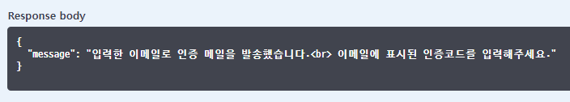
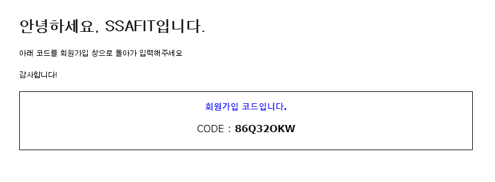

# Database | Redis Error

</br>

빅데이터 추천 서비스 개발 프로젝트를 진행하면서, 우리팀은 **Redis**를 활용하여 회원가입 시 **이메일 인증** 기능을 구현하였다.

<br>

**이메일 인증** 기능은 다음 흐름으로 진행된다.

1. 사용자가 본인이 자주 쓰는 or 회원가입하길 원하는 **이메일 주소**를 입력한다.
2. 클라이언트에서 서버로 이메일 인증 API 요청을 보낸다.
3. Spring Boot 서버에 작성되어 있는 **SMTP** 설정에 따라서 이메일이 생성되고, 해당 주소로 이메일이 전송된다.
4. ...

<br>

정상적으로 작동하던 이메일 인증 기능이 갑자기 안된다는 이슈가 발생했다.



사용자가 입력한 **이메일**과 난수값으로 생성된 **인증코드**는 정상적으로 로그에 찍히지만, 그 아래에 보이는 오류는 무엇인가...

<br>

##### RedisSystemException ???

</br>

관련하여 구글링해보면 아래 이미지와 같은 내용을 볼 수 있다.



<br>

**no** 로 파라미터 값을 바꾸면 입력/수정/삭제가 가능하지만 데이터가 다 날아간다는 내용...

<br>

딱 봐도 위험한 내용이다.

<br>

지난 프로젝트에서 이메일 인증 구현을 내가 했기 때문에, **Redis** 설치 및 `.conf` 설정에 대한 기억이 남아 있었다.

이번에 `.conf` 파일에 설정을 몇 가지 안했던 것도 기억이 났다.

<br>

바로 `.conf` 파일을 수정하자!

<br>

```bash
# Redis 최대 사용 메모리 설정
maxmemory 1g

# 최대 사용 메모리 초과 시 오래된 데이터 삭제 및 최근 데이터 사용 설정
maxmemory-policy allkeys-lru
```

최대 사용 메모리 설정을 해주고,

<br>

```bash
# Redis 재시작
sudo systemctl restart redis-server.service
```

Redis를 재시작한다.

<br>

**Swagger**로 다시 API 요청을 해보니 메일이 전송된다.



<br>



메일이 정상적으로 온 것도 확인할 수 있다.

<br>

해결. 끝.