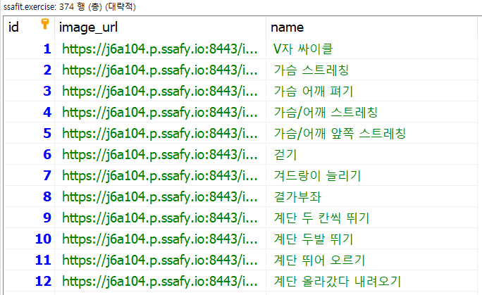

# Database | DB명 변경

<br>

프로젝트 개발 단계에서 사용하던 데이터베이스를 그대로 운영 DB로 사용하려고 한다.

<br>

**MySQL** 기준으로 `5.1.7` 버전에서는 **RENAME DATABASE** 명령어를 통해서 DB 이름을 쉽게 바꿀 수 있었으나,

데이터 손실 위험성이 발견되어 `5.1.23` 버전 이후로 위 명령어가 삭제되었다고 한다.

<br>

그렇다면...

<br>

Database 이름을 바꾼다? → 불가능!!!

**새로운 Database를 생성하고, 기존 Database의 데이터를 옮겨야 한다.**

<br>

```mysql
# 우분투 서버에서 MySQL 접속
mysql -uroot -p

# 새로운 DB 생성
CREATE DATABASE 'DB명';

# 특정 사용자에게 DB 권한 부여
GRANT ALL PRIVILEGES ON 'DB명'.'TABLE명' TO '사용자명'@'host' IDENTIFIED BY 'PW';

# 권한부여 명령어 적용
FLUSH PRIVILEGES;
```

- 우분투 서버에서 직접 MySQL에 접속하여, 새로운 DB 생성, 사용자에게 권한부여, 권한부여 명령어 적용 등의 쿼리를 수행한다.

<br>

```mysql
# 기존 DB.TABLE → 신규 DB.TABLE 변경
RENAME TABLE '기존DB'.'TABLE명' TO '신규DB'.'TABLE명';
```

- 테이블 갯수가 많을 경우, 좀 더 효율적인 방식을 쓰면 좋으나, 우리 프로젝트의 경우 테이블이 6개여서 위 쿼리를 6번 수행하였다.

<br>

모든 명령어, 쿼리 적용 이후 데이터가 정상적으로 신규 DB에 넘어온 것을 확인하였다.



<br>

***

##### 참고 자료

- https://ryean.tistory.com/41
- https://nickjoit.tistory.com/144