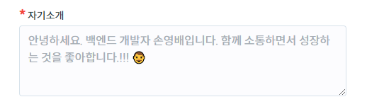
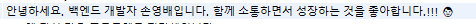

# Database | utf8 → utf8mb4 변경

프로젝트를 배포하기 전 여러가지 테스트를 진행하던 중 텍스트를 입력하는 부분, 예컨대 '자기소개', '팀소개', '채팅' 등에서 이모티콘/이모지 입력이 안되는 오류를 발견하였다.

문제의 원인은 DB의 특정 컬럼 **Character Set** 이 `utf8` 로 설정되어 있어서이다.

`utf8` 인코딩이 3 Bytes로 처리되는 반면, 이모지는 65,536 범위를 넘어가서 4 Bytes로 처리되기 때문에 DB에 입력이 안되는 것이다.

<br>

문제 해결을 위해 프로젝트에 사용하는 MySql의 **데이터베이스**, **테이블**, **컬럼** 에 대한 인코딩 수정을 진행하였다.

<br>

```sql
# 데이터베이스 수정
ALTER DATABASE [database_name] CHARACTER SET = utf8mb4 COLLATE = utf8mb4_unicode_ci;
```

<br>

```sql
# 테이블 수정
ALTER TABLE [db.table_name] CONVERT TO CHARACTER SET utf8mb4 COLLATE utf8mb4_unicode_ci;
```

<br>

```sql
# 컬럼 수정
ALTER TABLE [db.table_name] CHANGE [column_name] [column_name] VARCHAR(***) CHARACTER SET utf8mb4 COLLATE utf8mb4_unicode_ci;
```

<br>

오류를 수정하면서 보니, 데이터베이스의 인코딩 설정만 변경한다고 해서 오류가 잡히는 것이 아니었다. **DB 자체의 인코딩과 더불어 이모지가 사용될만한 테이블/컬럼에 대한 수정이 필요**했다.

또한, 특정 테이블에서는 다르게 맞물려 있는 문제때문에 테이블 자체에 대한 인코딩 수정이 안될 때도 있었다. 이때는, **특정 테이블 - 특정 컬럼만 따로 골라서 인코딩을 수정**했다. 위의 3번째 코드 블럭의 경우이다.

<br>





<br>

정상적으로 이모지가 작성되고, DB에도 잘 저장되는 것을 확인할 수 있다.

***


#### 참고자료

https://solbel.tistory.com/1062

https://nakanara.tistory.com/230

https://blog.naver.com/deersoul6662/222621541412

