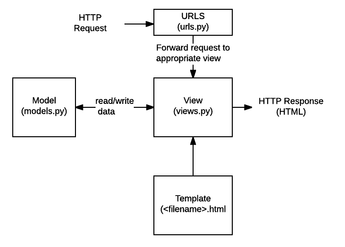

# Django | The Web Framework

### 목차

> - Web Framework
> - Django Intro
> - 요청 - 응답
> - Template
> - HTML From
> - URL
> - Namespace

<br>

### 1. Web Framework

#### Page

- Static web page (정적 웹 페이지)
  - 서버에 미리 저장된 파일을 사용자에게 그대로 전달하는 웹페이지
  - 서버가 static page에 대한 요청을 받은 경우, 추가적인 처리과정 없이 클라이언트에게 응답을 보냄
  - 모든 상황에서 모든 사용자에게 동일한 정보를 표시
  - `HTML`, `CSS`, `JavaScript` 로 작성
  - = flat page
- Dynamic web page (동적 웹 페이지)
  - 요청을 받은 경우, 서버는 추가적인 처리 과정 이후 클라이언트에게 응답을 보냄
  - 동적 페이지는 사용자와 상호작용하기 때문에 페이지 내용이 상황마다 다름
  - 서버 사이드 프로그래밍 언어(python, java, c++ 등)가 사용됨
  - 파일을 처리하고 DB와의 상호작용이 이루어진다

#### Framework

- 프로그래밍에서 특정 운영체제를 위한 응용 프로그램 표준 구조를 구현하는 클래스와 라이브러리 모임
- **재사용**할 수 있는 많은 코드를 프레임워크로 통합시킴으로써 개발자가 매번 코드를 새로 작성하지 않아도 된다
- = Application Framework

#### Web framework

- 웹 페이지를 개발하는 과정에서 겪는 어려움을 줄이는 것이 주 목적
- DB 연동, 템플릿 형태 표준, 세션 관리, 코드 재사용 등의 기능을 포함한다
- Dynamic page, Web application, 웹 서비스 개발 보조용으로 만들어지는 Application Framework의 일종

#### Framework Architecture

- **MVC** Design Pattern (Model-View-Controller)
  - 소프트웨어 공학에서 사용되는 디자인 패턴 중 하나
  - User Interface로부터 프로그램 로직을 분리하여 application의 시각적 요소나 이면에서 실행되는 부분을 서로 영향 없이 쉽게 고칠 수 있는 application을 만들 수 있음
- **MTV** Pattern (Django)
  - Model
    - 응용 프로그램의 데이터 구조를 정의하고 데이터베이스의 기록을 관리 (추가, 수정, 삭제)
  - Template
    - 파일 구조, 레이아웃을 정의
    - 실제 내용을 사용자에게 보여주는데 사용됨
  - View
    - HTTP 요청을 수신하고 HTTP 응답을 반환
    - Model을 통해 요청을 충족시키는데에 필요한 데이터에 접근
    - Template에게 응답의 서식 설정을 맡김



**✨ Django의 작동 방식 (매우 중요하다!!!)**

<br>

### 2. Django Intro

#### Project

- Project는 Application의 집합 (collection of apps)
- 프로젝트에는 여러 앱이 포함될 수 있고, 앱은 여러 프로젝트에 있을 수 있다

- 구조
  - `__init__.py` 

    - Python에게 이 디렉토리를 하나의 Python 패키지로 다루도록 지시

  - `asgi.py`

    - Asynchronous Server Gateway Interface
    - django 애플리케이션이 비동기식 웹 서버와 연결/소통하는 것을 도움

  - `settings.py`

    - 애플리케이션의 모든 설정을 포함

  - `urls.py`

    - 사이트 url과 적절한 views의 연결을 지정한다

  - `wsgi.py`

    - Web Server Gateway Interface
    - django 애플리케이션이 웹서버와 연결/소통하는 것을 도움

  - `manage.py`

    - django 프로젝트와 다양한 방법으로 상호작용하는 커맨드라인 유틸리티

    ```
    python manage.py <command> [options]
    ```

#### Application

- 앱은 실제 요청을 처리하고 페이지를 보여주는 역할 등을 담당
- 하나의 프로젝트는 여러 앱을 가진다
- 일반적으로 앱은 하나의 역할 및 기능 단위로 작성한다
- 구조
  - `admin.py`
    - 관리자용 페이지를 설정하는 곳
  - `apps.py`
    - 앱의 정보가 작성된 곳
  - `models.py`
    - 앱에서 사용하는 Model을 정의하는 곳
  - `tests.py`
    - 프로젝트의 테스트 코드를 작성하는 곳
  - `views.py`
    - view 함수들이 정의되는 곳

<br>

### 3. 요청과 응답

- URLs
  - `urls.py` 에 HTTP 요청(`request`) 을 알맞은 view로 전달
- View
  - `views.py`에서 요청을 수신하고 HTTP 응답을 반환하는 함수 작성
  - Model을 통해 요청에 맞는 필요 데이터에 접근
  - Template에게 HTTP 응답 서식을 맡김

- Templates
  - 실제 내용을 보여주는데 사용되는 파일
  - 파일의 구조, 레이아웃을 정의 (HTML)
  - Template 파일 경로의 기본 값은 `<app_folder>/templates` 로 지정되어 있다

<br>

### 4. Template

- Django Template
  - 데이터 표현을 제어하는 도구이자 표현에 관련된 로직
  - 사용하는 built-in system
    - **D**jango **T**emplate **L**anguage
- **코드 작성 순서**
  - `urls.py` → `views.py` → `templates`

#### DTL

- django template에서 사용하는 built-in template system
- 조건, 반복, 변수 치환, 필터 등의 기능을 제공
- 단순히 Python이 HTML에 포함된 것이 아니며 프로그래밍적 로직이 아닌 프레젠테이션을 표현하기 위한 것이다
- python처럼 if, for 등을 사용할 수 있지만, 이것이 python 코드로 실행되는 것이 아니다

- Syntax

  - Variable

    - `render()`를 사용하여 views.py에서 정의한 변수를 template 파일로 넘겨 사용하는 것
    - `.` 을 사용하여 변수 속성에 접근 가능
    - `render()` 의 세번째 인자로 `{'key': value}` 와 같이 딕셔너리 형태로 넘겨준다
    - `key`에 해당하는 문자열이 template에서 사용 가능한 변수명이 됨

  - Filters

    - 표시할 변수를 수정할 때 사용

    ```python
    {{ variable|filter }}
    
    # 예시
    {{ name|lower }}
    ```

    - 60개의 built-in template filters를 제공
    - `chained` 이 가능하고, 일부 필터는 인자를 받기도 한다

  - Tags

    - 출력 텍스트를 만들거나, 반복 or 조건 논리를 수행해서 제어 흐름을 만드는 등의 변수보다 복잡한 일을 수행
    - 일부 태그는 시작과 종료 태그가 필요

    ```python
    
    ```

    - 24개의 built-in template tags를 제공

  - Comments

    - 주석을 표현하기 위해서 사용
    - 한 줄 주석에만 사용 가능 `{# #}`
    - 여러 줄 주석은 아래와 같이 입력

    ```python
     
    ```

<br>

#### Template inheritance (템플릿 상속)

- 템플릿 상속은 기본적으로 코드 재사용성에 초점을 맞춤
- 탐플릿 상속을 사용하면 사이트의 모든 공통 요소를 포함하고, 하위 템플릿이 재정의(override) 할 수 있는 블록을 정의하는 기본 **skeleton** 템플릿을 만들 수 있다.

- tags
  - ``
    - 자식 템플릿이 부모 템플릿을 확장한다는 것을 알리고, 반드시 템플릿 최상단에 작성되어야 한다
  - ` `
    - 하위 템플릿에서 재정의(override)할 수 있는 블록을 정의

<br>

#### Django Template System

- 표현과 로직(view)을 분리
  - 템플릿 시스템은 표현을 제어하는 도구이자 표현에 관련된 로직일 뿐이다.
  - 따라서, 기본 목표를 넘어서는 기능을 지원하지 말아야 한다.
- 중복을 배제
  - 대부분의 동적 웹사이트는 공통 header, footer, navbar 같은 사이트 공통 디자인을 갖는다.
  - django 템플릿 시스템은 이런 요소를 한 곳에 저장해서 중복 코드를 없애야 한다.

<br>

### 5. HTML Form

#### form

- 웹에서 사용자 정보를 입력하는 여러가지 방식을 제공하고, 사용자로부터 입력받은 데이터를 서버로 전송하는 역할을 담당
- 핵심 속성(attribute)
  - `action` : 입력 데이터가 전송될 URL을 지정
  - `method` : 입력 데이터 전달 방식 지정 (Get / POST)

#### input

- 사용자로부터 데이터를 입력받기 위해서 사용
- type 속성에 따라 동작 방식이 달라진다
- 핵심 속성(attribute)
  - `name`
    - 중복 가능
    - 양식을 제출했을 때 name이라는 이름에 설정된 값을 넘겨서 값을 가져올 수 있음
    - GET / POST 방식으로 서버에 전달하는 파라미터로 `?key=value&key=value` 의 형태로 전달됨

#### label

- 항목에 대한 설명(caption)
- label을 input 요소와 연결하기
  - input에 id 속성 부여
  - label에는 input id와 동일한 값을 for 속성에 넣어준다
- label - input 연결의 이점
  - 시각적 기능 + 
  - 화면 리더기에서 label을 읽어서 사용자가 입력해야 하는 텍스트가 무엇인지 이해할 수 있도록 돕는 이점이 있다
  - label을 클릭해서 input에 초점(focus)을 맞추거나 활성화(activate) 시킬 수 있다

#### for, id...

#### HTTP

- Hyper Text Transfer Protocol
- 웹에서 이루어지는 모든 데이터 교환의 기초
- 주어진 리소스가 수행할 원하는 작업을 나타내는 request methods를 정의
- request method 종류
  - GET, POST, PUT, DELETE 등
  - `GET`
    - 서버로부터 정보를 조회하는데에 사용
    - 데이터를 가져올 때만 사용
    - 데이터를 서버로 전송할 때 body가 아닌 Query String Parameters 를 통해 전송
    - 서버에 요청을 하면 HTML 문서 파일 한 장을 받는데, 이때 사용하는 방식이 GET 이다

<br>

### 6. URL

- Dispatcher(발송자, 운항 관리자) 로서의 URL
- 웹 애플리케이션은 URL을 통한 클라이언트 요청에서부터 시작된다

#### Variable Routing

- URL 주소를 변수로 사용하는 것
- URL의 일부를 변수로 지정해서 view 함수의 인자로 넘길 수 있음
- 변수 값에 따라서 하나의 `path()`에 여러 페이지를 연결시킬 수 있음

```
# 예시
path('accounts/user/<int:user_pk>/', ...)

accounts/user/1 → 1번 user 관련 페이지
accounts/user/2 → 2번 user 관련 페이지
```

#### URL Path Converters

- `str`
  - `/` 를 제외하고 비어 있지 않은 모든 문자열과 매치
  - 작성하지 않을 경우 **기본 값**
- `int`
  - 0 또는 양의 정수
- `slug`
  - ASCII 문자 또는 숫자, 하이픈 및 밑줄 문자로 구성된 모든 슬러그 문자열과 매치

#### App URL Mapping

- app의 view 함수가 많아지면서 `path()`가 많아지고, app 또한 많이 작성되기 때문에 프로젝트의 `urls.py` 에서 모두 관리하는 것은 유지보수 측면에서 좋지 않다
- 따라서 각각의 app에서 `urls.py` 를 작성하게 된다

- `include` 활용
  - 다른 URLconf 를 참조할 수 있도록 도움
  - `include()` 를 만나게 되면, URL의 그 시점까지 일치하는 부분을 잘라내고, 남은 부분을 후속 처리하기 위해 include 된 URLconf로 전달
  - django는 명시적 상대 경로 (`from .module import ..`) 를 권장

#### Naming URL patterns

- 링크에 url을 직접 작성하는 것이 아니라 `path()` 함수의 name 인자를 정의해서 사용
- Django Template Tag 중 하나인 url 태그를 사용해서 `path()` 함수에 작성한 name을 사용할 수 있다

```
path('index/', views.index, name='index'),

<a href="">메인 페이지</a>
```

<br>

### 7. Namespace

- django에서는 서로 다른 app의 같은 이름을 가진 url name은 이름공간을 설정해서 구분
- templates, static 등 django는 정해진 경로 하나로 모아서 보기 때문에 중간에 폴더를 임의로 만들어줌으로써 이름공간을 설정

#### URL namespace

- URL namespace를 사용하면 서로 다른 앱에서 동일한 URL 이름을 사용하는 경우에도 이름이 지정된 URL을 고유하게 사용할 수 있음

- 참조

  - `:`  연산자를 사용하여 지정

  ```python
  ### 예시
  # urls.py 에 app_name 설정
  app_name = 'pages'
  urlpatterns = [
  	path('index/', views.index, name='index'),
  ]
  
  # template 에서 사용
  <a href=""
  ```

#### Template namespace

- Django는 기본적으로 `app_name/templates/` 경로에 있는 templates 파일들만 찾을 수 있고,
- `INSTALLED_APPS` 에 작성한 app 순서로 template를 검색 후 렌더링 함
- 따라서, 임의로 templates 폴더 구조를 `app_name/templates/app_name` 으로 변경해서 임의의 이름 공간을 생성 후 변경된 추가 경로로 수정

