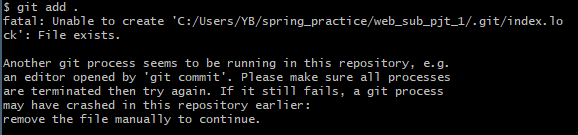

### command

> git 기본 명령어 정리


#### 생성

- **`init`** : 로컬 저장소 설정.
  - 현재 폴더를 git으로 관리 하겠다.
  - 현재 폴더에 `.git` 폴더를 생성
  - **최초 1회만 실행**하는 명령어
  - PJT 단위에서 실행

```bash
git init
```


#### 확인

- `status` : 상태 확인
  - 현재 git이 관리하고 있는 파일들의 상태를 보여주는 명령어

```bash
git status
```


- `log` : 커밋의 히스토리를 보여주는 명령어

```bash
git log
```


#### 관리

##### 1) 로컬 관리

- **`add`** : 커밋할 목록에 추가
  - Working Directory에서 Staging Area에 파일을 업로드 하는 명령어
    - `.` : 현재 폴더 및 파일 +  하위 폴더 및 파일 모두를 의미

```bash
git add <file name>
git add .
```


- **`commit`** : 커밋 만들기
  - Staging Area에 올라온 파일들을 하나의 커밋으로 만들어주는 명령어 (스냅샷을 찍는)
  - `-m` 옵션으로 수정 이유와 같은 코멘트를 남길 수 있다.

```bash
git commit -m "commit message"
```


##### 2) 원격 관리

- **`remote add`** : 원격 저장소 등록
  - 원격 저장소 주소를 로컬에 저장하는 명령어
  - nickname에는 일반적으로 `origin`

```bash
git remote add <nickname> <URL>
```


- **`push`** : GitHub or GitLab 과 같은 곳에 새로 생성한 커밋들 반영
  - 원격 저장소로 로컬의 커밋기록을 업로드 하는 명령어

```bash
git push <nickname> <branch name> # 생성한 커밋들을 원격 저장소에 업로드
```


#### 수정

- **`mv`**  : 파일명 변경
  - 기존 `git`으로 관리되고 있는 폴더 내 파일명을 바꿔주는 명령어

```
git mv <preivous file name> <following file name>
```

<br>

#### 특이 상황

- 오류 발생
  - 아래와 같이 git 프로세스가 이미 동작하고 있어서 `index.lock` 파일에 대해 문제가 생긴 상황
  - 해결 방법
    - 문제가 발생한 Git 저장소의 폴더 상단으로 이동
    - Git bash, CMD 등 Terminal 실행
    - 커맨드 입력 : `rm -f ./.git/index.lock`
    - 이후 정상적으로 `add`, `commit` 작동하는 것을 확인

<br>

- Commit Author 수정
  - 협업을 하거나 로컬에서 혼자 작업하다 보면, 여러 아이디를 사용하다 보니 커밋 작성자가 뒤바뀌는 상황이 발생하기도 함. 필자의 경우, `github` 와 `gitlab` 을 동시에 사용하다 보니, 원격으로 git 저장소 설정시 `git config --global` 설정을 하면서 user.name과 user.email 이 수정되는 상황이 발생했다. 이러한 상황에서 commit 자체에 대한 내용, 작성자 등을 수정할 수 있는 기능을 활용할 수 있다.
  - 해결방법
    - commit의 hash 값 찾기
      - `git log` 명령어로 확인 가능
    - `rebase` 사용하기
      - `git rebase -i {변경할 커밋의 해시값}^`  입력
      - 편집모드 이동
    -  `i` 버튼으로 편집모드로 전환
      - `pick` → `edit` 으로 수정
      - `:wq` 명령어로 저장 후 종료
    - `git commit --amend --author="작성자명 <email 주소>"` 입력
    - `git rebase --continue` : rebase 작업 종료
    - `git push origin +브랜치명` : 강제로 push 진행
