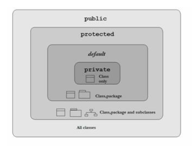

# JAVA | 접근 제어자

### 목차

>1. 접근 제어자
>2. 클래스의 접근 제어자
>3. 참고 자료

<br>

***

### 1. 접근 제어자

- Access Modifier

- 클래스 멤버(변수와 메소드)의 접근 권한을 지정

#### public & private

##### public

- 클래스 밖에서도 접근할 수 있음

##### private

- 클래스 밖에서 접근 불가능
- 내부적으로 사용하기 위함

<br>

#### 접근 제어자 사용 이유

- 객체의 로직을 보호하기 위해서 멈베어 따라 외부 접근을 허용 or 차단
- 사용자에게 객체를 조작할 수 있는 수단만 제공
  - 객체의 사용에 집중할 수 있도록 도움

<br>

#### 세밀한 제어



##### protected

- 상속 관계에 있다면 서로 다른 패키지에 있는 클래스의 접근도 허용

##### default

- 접근 제어 지시자가 없는 경우를 의미
- 같은 패키지에 있고 상속 관계에 있는 메소드에 대해서만 접근을 허용

|                          | public | protected | default  | private  |
| ------------------------ | ------ | --------- | -------- | -------- |
| 같은 패키지, 같은 클래스 | 허용   | 허용      | 허용     | 허용     |
| 같은 패키지, 상속 관계   | 허용   | 허용      | 허용     | **불용** |
| 같은 패키지, 상속 관계 X | 허용   | 허용      | 허용     | **불용** |
| 다른 패키지, 상속 관계   | 허용   | 허용      | **불용** | **불용** |
| 다른 패키지, 상속 관계 X | 허용   | **불용**  | **불용** | **불용** |

<br>

***

### 2. 클래스의 접근 제어자

#### public & default

- public : 다른 패키지의 클래스에서도 사용 가능
- default : 같은 패키지에서만 사용 가능


##### public 클래스 제약 사항

- public 클래스의 클래스 명과 소스코드의 파일명이 반드시 같아야 함

```java
// 정상 작동 코드
package org.opentutorials.javatutorials.accessmodifier.inner;

public class PublicClass {}
class DefaultClass {}

// 같은 패키지에서 위 2개의 클래스 사용
public class ClassAccessModifierInnerPackage {
    PublicClass publicClass = new PublicClass();
    DefaultClass defaultClass = new DefaultClass();
}
```

```java
// 오류 발생 코드
package org.opentutorials.javatutorials.accessmodifier.outter;
import org.opentutorials.javatutorials.accessmodifier.inner.*;

public class ClassAccessModifierOuterPackage {
    PublicClass publicClass = new PublicClass();
    //DefaultClass defaultClass = new DefaultClass();
}
```

- public 클래스로 만들어진 클래스는 사용 가능하지만, 접근 제어자가  default 인 클래스는 다른 패키지에서 사용 불가능

<br>

***

### 참고 자료

[생활코딩 - JAVA | 접근 제어자](https://opentutorials.org/course/1223/6061)

