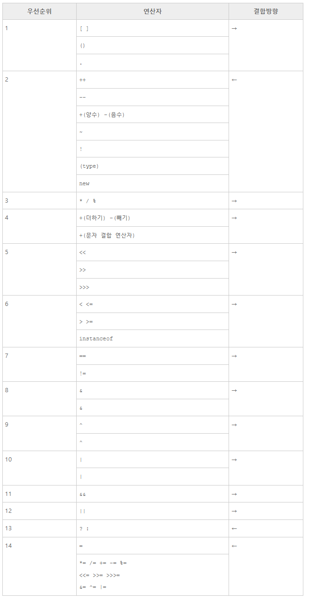

# JAVA | Operator

### 목차

> 1. 산술 연산자
> 2. 단항 연산자
> 3. 연산의 우선순위
> 4. 비교와 Boolean
> 5. 참고 자료


### 1. 산술 연산자

#### 연산자 (operator)

- 특정한 작업을 하기 위해서 사용하는 기호
- 대입 / 산술 / 비교 / 논리 연산자 등


#### 산술 연산자란?

- 수학적인 계산에 사용되는 연산자

| 연산자 | 의미   |
| ------ | ------ |
| +      | 더하기 |
| -      | 빼기   |
| *      | 곱하기 |
| /      | 나누기 |
| %      | 나머지 |


### 2. 단항 연산자

- unary 연산자.
- 하나의 항을 대상으로 연산이 이루어지는 연산자

| 연산자 | 의미                                               |
| ------ | -------------------------------------------------- |
| +      | 양수를 표현. 실제로는 사용할 필요 X                |
| -      | 음수를 표현                                        |
| ++     | 증가(increment) 연산자로 항의 값을 1씩 증가 시킨다 |
| --     | 감소(Decrement) 연산자로 항의 값을 1씩 감소 시킨다 |


### 3. 연산의 우선순위




### 4. 비교와 Boolean

#### Boolean

- 참과 거짓을 의미.
- true or false


#### 비교 연산자 (관계 연산자)

##### ==

- 좌항과 우항을 비교해서 값이 같으면 true 다르면 false

##### !=

- 좌항과 우항이 같지 않은지 비교. 같지 않으면 true 같으면 false

##### > or <

- 크거나 작거나를 비교

##### >= or =<

- 크거나 같음 or 작거나 같음을 비교


##### .equals

- 문자열을 비교할 때 사용하는 메서드

```java
// 문자열 비교 메서드 예제
package org.opentutorials.javatutorials.compare;
 
public class EqualStringDemo {
 
    public static void main(String[] args) {
        String a = "Hello world";
        String b = new String("Hello world");
        System.out.println(a == b);
        System.out.println(a.equals(b));
    }
 
}
```

```java
// 결과
false
true
```

- `==` 연산자는 두 개의 데이터 타입이 동일한 객체인지 알아보는 연산자이기 때문에 a와 b의 객체가 일치하지 않는 결과가 나옴.
- `.equals()` 는 타입이 서로 다른 객체간 값이 같은지 비교할 수 있음. 문자와 문자를 비교할 때는 `.equals` 사용!


### 5. 참고 자료

[생활코딩 - JAVA](https://opentutorials.org/course/1223/5331)

