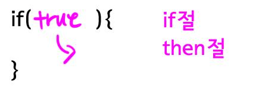
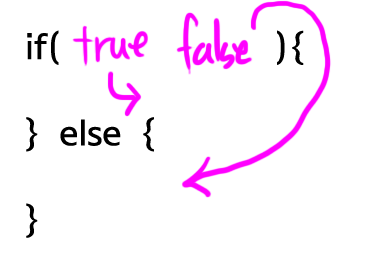
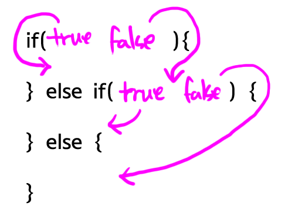
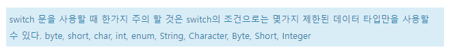

# JAVA | Statement

### 목차

> 1. 조건문
> 2. 반복문
> 3. 참고 자료


### 1. 조건문

#### if

- if절의 값이 true일 때 then절이 실행됨
- if절 값이 false이면 then 절은 실행되지 않는다.



```java
// if 예제1
package org.opentutorials.javatutorials.condition;
 
public class Condition1Demo {
 
    public static void main(String[] args) {
        if(true){
            System.out.println("result : true");
        }
    }
 
}
```

```java
// 예제1 결과
result : true
```

```java
// if 예제2
package org.opentutorials.javatutorials.condition;
 
public class Condition2Demo {
 
    public static void main(String[] args) {
        if (true) {
            System.out.println(1);
            System.out.println(2);
            System.out.println(3);
            System.out.println(4);
        }
        System.out.println(5);
    }
 
}
```

```java
// 예제2 결과
1
2
3
4
5
```


#### else

- if-else 절은 if 절의 값이 true일 때 then 절이 실행되고, false일 때 else 절이 실행된다



#### else if

- if절이 true면 then절이 실행되고, false라면 else if절로 넘어간다.
- else if절이 true라면 else if의 then절이 실행되고, false라면 else절이 실행됨
- else if 절은 여러개 쓸 수 있고, else 절은 생략 가능
- else 절이 else if 보다 먼저 등장할 수 X




#### switch

- 조건문이 많을 경우, if문 대신 사용하여 로직을 명료하게 보여줄 수 있음
- `break` 를 만나면 switch 문의 실행이 즉시 중지됨.
- `default` 는 주어진 케이스가 없을 때 실행된다




### 2. 반복문

- loop, iteration


#### while

```java
// 기본 문법
while (조건) {
    반복 실행 영역
}
```


#### for

- 특정 횟수만큼 반복 실행하는 경우 사용

```java
// 기본 문법
for (초기화; 종료조건; 반복실행) {
    반복적으로 실행될 구문
}
```


#### 반복문의 제어

##### break

- 반복작업을 중간에 중단하고 싶을 때 사용

##### continue

- 반복문 자체를 중단하지는 않고, continue 구문 이후의 로직을 실행하지 않음.


#### 반복문의 중첩

```java
public class LoopDepthDemo {
 
    public static void main(String[] args) {
        for (int i = 0; i < 10; i++) {
            for (int j = 0; j < 10; j++) {
                System.out.println(i + "" + j);
            }
        }
 
    }
```


### 3. 참고 자료

[생활코딩 - JAVA](https://opentutorials.org/course/1223/5335)


> 자바 언어는 처음 배우는 것이지만 이미 파이썬을 공부하고 나서 공부를 하다보니, 기초 개념들은 익숙하다. 다만 문법만 다르다는 것 뿐! 2021.12.29
