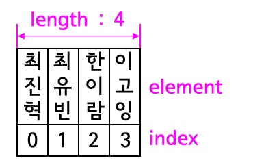

# JAVA | Array

### 목차

>1. 배열
>2. 배열의 사용
>3. 배열의 오류 및 한계
>4. 참고 자료


### 1. 배열

#### 배열이란?

- 연관된 데이터를 모아서 관리하기 위해 사용하는 데이터 타입
- 변수 > 하나의 데이터를 저장하기 위한 것
- 배열 > 여러 개의 데이터를 저장하기 위한 것


#### 배열 생성

- `String[] 변수명 = { 여러 개의 데이터 }`

```java
// 배열 생성
public class DefineDemo {
    public static void main(String[] args) {
        String[] classGroup = {"손흥민", "박지성", "황희찬", "황의조"};
    }
}
```



- Element(원소) : 배열에 담긴 각각의 데이터
- Index(식별자) : 중복될 수 없으며 0부터 시작
- Length(원소의 개수) : 배열이 담을 수 있는 원소의 개수. 배열에 담긴 원소의 숫자가 아닌 **배열을 선언할 때 지정한 배열이 담을 수 있는 값의 크기**


### 2. 배열의 사용

#### for-each

- 배열의 내용을 탐색할 때 for문을 좀 더 간편하게 사용할 수 있는 방법
- `for (String e : 배열이름)`
- 종료조건, 기준값 증가 등 반복적인 작업을 내부적으로 감춘 것 (자바 5.0부터 도입)

```java
// 기존 for문

public static void main(String[] args) {
 
    String[] members = { "홍길동", "임꺽정", "장발장" };
    for (int i = 0; i < members.length; i++) {
        String member = members[i];
        System.out.println(member + "이 상담을 받았습니다");
    }
 
}
```

```java
// for-each
public static void main(String[] args) {
    
    String[] members = { "최진혁", "최유빈", "한이람" };
    for (String e : members) {
        System.out.println(e + "이 상담을 받았습니다");
    }
}
```


### 3. 배열의 오류 및 한계

#### 오류

- `ArrayIndexOutOfBoundsException` : 존재하지 않는 인덱스를 사용하려고 할 때 발생하는 오류

```java
// 인덱스 오류 예시 1 - 인덱스가 2까지 존재하는데 3을 호출하여 오류 발생
String[] members = { "손흥민", "황의조", "박지성"};
System.out.printIn(members[3]);

// 인덱스 오류 예시 2 - 3개의 문자열을 수용할 수 있는 크기로 지정하였으나, 4번째 데이터를 입력하려고 하여 오류 발생
String[] members = new String[3];
...
members[3] = "황희찬";
```


#### 한계

- 배열은 초기화할 때 크기가 정해지기 때문에 정해진 크기 이상의 값을 넣을 수 없음
- JavaScript, Python, PHP 와 같은 언어들은 배열의 크기를 미리 정의하지 않고 사용함..
- 자바의 `Collection` 기능을 사용하면 유연하게 배열을 사용할 수 있음


### 참고 자료

[생활코딩 - JAVA](https://opentutorials.org/course/1223/5373)

