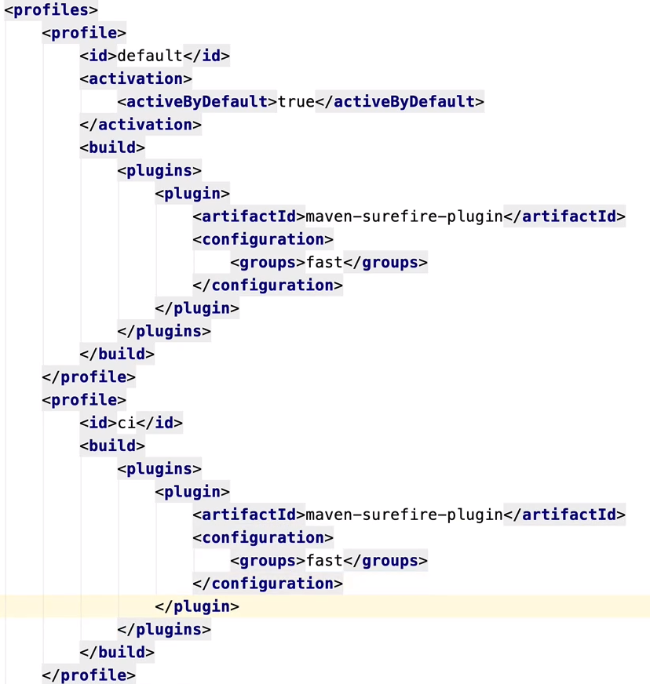

# Java | JUnit 2

<br>

### 조건에 따라 테스트하기

- 코드

  - `assumeTrue()`, `assumingThat()`
    - 조건을 만족할 때 다음 테스트 코드를 수행함

- 어노테이션

  - 특정 운영체제에서 테스트

    - `@EnabledOnOs`

    - `@DisabledOnOs`

      - `{}` 배열로 여러개 작성 가능

      - ```java
        @EnabledOnOs({OS.MAC, OS.LINUX})
        ```

  - 특정 자바 버전에서 테스트

    - `@EnabledOnJre`

      - ```java
        @EnabledOnJre({JRE.JAVA_8, JRE.JAVA_9, JRE.JAVA_10, JRE_JAVA_11})
        ```

  - 특정 환경 변수에서 테스트

    - `@EnabledIfEnviromentVariable()`

      - ```java
        @EnabledIfEnviromentVariable(named = "TEST_ENV", mathces = "LOCAL")
        ```

<br>

### 태깅과 필터링

- 테스트를 그룹화, 모듈화 할 수 있음

- 태깅
  - `@Tag()`
  - `Edit Configurations` 에서 설정 가능
    - 
- 필터링
  - `maven` 또는 `gradle`에서 **profile**을 설정해서, profile별 테스트 그룹화 가능
    - 
  - 

<br>

### 커스텀 태그

- 애노테이션을 조합하여 커스텀 태그를 만들 수 있음

- ex

  - ```java
    // Annotation 클래스 생성
    
    @Target(ElementType.METHOD)
    @Retention(RetentionPolicy.RUNTIME)
    @Test
    @Tag("fast")
    public @interface FastTest {
    }
    ```

<br>

### 테스트 반복하기

- `@RepeatedTest(반복횟수)`

  - ```java
    @DisplayName("스터디 만들기")
    @RepeatedTest(value = 10, name = "{displayName}, {currentRepetition}/{totalRepetition}")
    void repeatTest(RepetitionInfo repeatitionInfo) {
      System.out.println("test" + repeatitionInfo.getCurrentRepetition() + "/" +
                         repeatitionInfo.getTotalRepetitions());
    }
    ```

- `@ParameterizedTest()`

  - ```java
    @DisplayName("스터디 만들기")
    @ParameterizedTest(name = "{index} {displayName} message={0}")
    @ValueSource(strings = {"날씨가", "많이", "추워지고", "있네요"})
    void parameterizedTest(String message) {
      System.out.println(message);
    }
    ```

  - Source 추가 가능

    - `@NullSource`
    - `@EmptySource`
    - `@NullAndEmptySource`
    - `@ValueSource(ints = {10, 20, 40})`
    - `@CsvSource()`
    - etc

  - **ArgumentConverter**

    - 를 활용하여 하나의 인자를 받아올 때, 원하는 Type으로 형변환하여 받아올 수 있음
    - 커스텀 Converter 구현 가능
      - 구현 이후 `@ConvertWith()` 어노테이션으로 사용

  - **ArgumentAccessor**

    - 여러개의 인자를 원하는 Type으로 형변환하여 받을 수 있음
    - 커스텀 Accessor 구현 가능
      - 구현 이후에는`@AggregateWith()` 어노테이션으로 사용 가능

<br>

### 테스트 인스턴스

- 기본 전략
  - 테스트 메소드마다 인스턴스를 새로 만든다
  - 독립적으로 실행하여 예상치 못한 부작용을 방지
  - JUnit 5에서 변경 가능
- **@TestInstance(TestInstance.Lifecycle.PER_CLASS)**
  - 클래스마다 인스턴스를 생성
  - 클래스 내의 모든 테스트는 **하나**의 인스턴스를 공유
  - 경우에 따라, 테스트 간에 공유하는 모든 상태를 `@BeforeEach` 또는 `@AfterEach`에서 초기화 할 필요가 있음
  - `@BeforeAll`과 `@AfterAll`을 `void` 메소드로 정의 가능

<br>

### 테스트 순서

- 단위 테스트는 순서에 의존해서 안됨
- But, 원하는 순서대로 테스트를 작성하고 싶을 때가 있음
  - 회원가입 > 로그인 > 마이 페이지 이동 등의 시나리오, 순서가 있을 때
  - 테스트 간 의존성이 있고, 서로 데이터를 공유해야 함

- **@TestMethodOrder**

  - 하나의 인스턴스(데이터를 공유)로 테스트를 하고 싶으면 `@TestInstance(TestInstance.Lifecycle.PER_CLASS)` 와 함께 사용

  - ```java
    // 테스트 클래스에 어노테이션 작성
    @TestMethodOrder(MethodOrderer.OrderAnnotation.class)
    ```

  - ```java
    // 원하는 메소드에 @Order 어노테이션 작성
    @Order(1)
    ...
      
    @Order(2)
    ...
    ```

<br>

### JUnit 설정파일

- `src/test/resources/` 경로에 파일 작성
- 파일명 - `junit-platform.properties`
- 설정 가능 내용
  - Test 인스턴스 라이프사이클 설정
    - `junit.jupiter.testinstance.lifecycle.default = per_class`
  - 확장팩 자동 감지 기능
    - `junit.jupiter.extensions.autodetection.enabled = true`
  - @Disabled 무시하고 테스트 실행하기
    - `junit.jupiter.conditions.deactivate = org.junit.*DisabledCondition`
  - 테스트 이름 표기 전략 설정
    - `junit.jupiter.displayname.generator.default = \  org.junit.jupiter.api.DisplayNameGenerator$ReplaceUnderscores`

