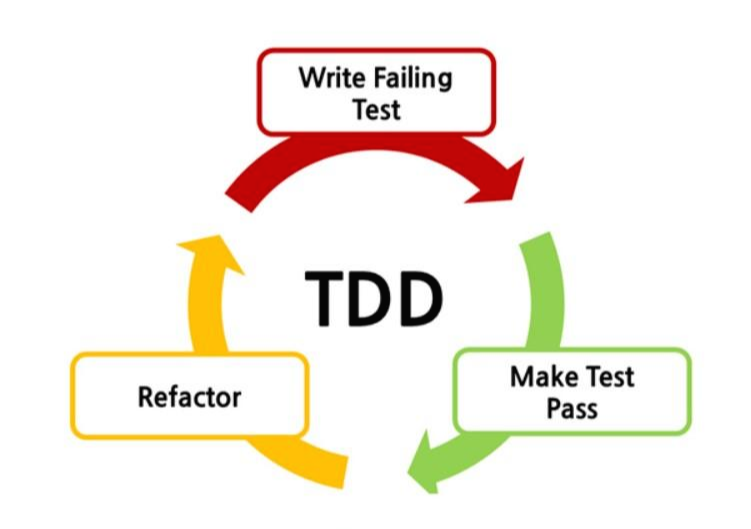

# JAVA | TDD 1

 

프로젝트 개발에서 중요한 개념으로 널리 알려진 **TDD**에 대해 공부하려고 한다.

 

### TDD란?

- Test Driven Development
- 테스트 주도 개발
- 목적
  - 코드로 인한 **버그 발생을 즉시 파악**
  - **코드가 올바르게 작동**하도록 하기 위함
  - Test를 통해서 기능이 정상적으로 작동하는 것을 확인하고 나서 코드 **Refactoring** 작업 수행
- 원칙
  - Unit 테스트는 DB 연결을 하지 않음
  - 주요 로직에 대한 테스트 코드 작성 (주로 Public Method)
- 장점
  - 내장 톰캣(`was`)을 포함한 무거운 스프링부트를 재시작하지 않아도 코드 반영 확인 가능
  - `print`를 찍지 않아도 검증 가능
  - 새로운 기능 개발로 인해 기존 기능에 문제가 생기는 것을 사전 예방할 수 있음

 

### TDD 과정

1. 테스트 코드 작성 (**red**)
2. 테스트 코드를 통과하는 구현 코드 작성 (**green**)
3. 테스트 통과 시 코드 리팩토링 (**refactoring**)

 

 

***

### 참고자료

- https://codingmoonkwa.tistory.com/251
- https://velog.io/@rivernine/Spring-boot-TDD
- https://velog.io/@noneobj/Spring-Boot-TIL-2.-TDD%EB%A1%9C-%EA%B0%9C%EB%B0%9C%ED%95%98%EA%B8%B0
- https://taes-k.github.io/2021/03/19/spring-tdd-practice/
- https://mangkyu.tistory.com/
- https://aonee.tistory.com/57
- https://otrodevym.tistory.com/entry/Spring%EC%97%90%EC%84%9C-%ED%85%8C%EC%8A%A4%ED%8A%B8-%EC%BC%80%EC%9D%B4%EC%8A%A4-TDD-%EC%9E%91%EC%84%B1%ED%95%98%EA%B8%B0
- https://github.com/wenodev/youthcon-spring-boot-tdd-start
- https://data-make.tistory.com/717