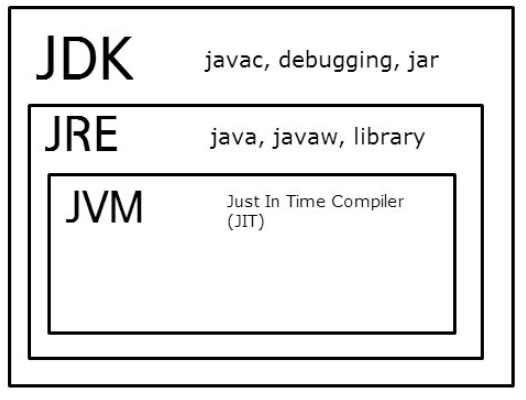
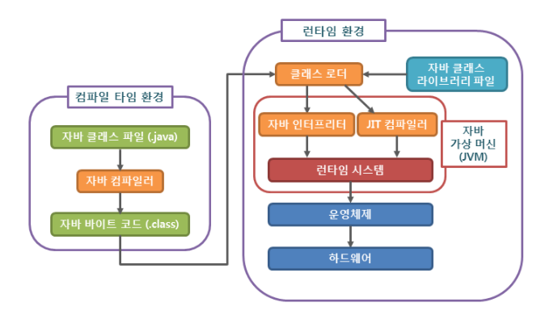

# JAVA | Basic

### 목차

> 1. 자바 개요
> 2. 자바 기초
> 3. 자바 프로그래밍
> 4. 자바 프로그램
> 5. System.out.printIn()
> 6. JAVA8 변경 사항
>
> 7. 참고 자료


### 1. 자바 개요

#### 자바(JAVA)

- 자바는 객체 지향 언어로 개발된 프로그래밍 언어
- 자바 가상 머신(JVM)을 사용하여 어느 OS에서나 같은 형태로 실행 가능함
- 전세계에서 가장 많이 사용하는 프로그래밍 언어 중 하나


#### 용어

##### Java SE

- Java Platform, Standard Edition. 자바의 표준안
- 구체적인 소프트웨어가 아닌, 소프트웨어의 설계도 (명세서, spec, specification)
- JCP(Java Community Process)라는 조직에 의해 만들어짐

##### JDK

- Java Development Kit
- JAva SE의 표준안에 따라서 만들어진 구체적인 소프트웨어.
- Java 프로그램을 실행하면 Java 코드를 컴파일하는 컴파일러와 개발에 필요한 각종 도구 및 JRE가 포함되어 있음
- 개발자를 위한 자바 버전

##### JRE

- Java Runtime Environment
- 자바가 실제로 동작하는 데 필요한 JVM, 라이브러리, 가종 파일들이 포함되어 있음
- 일반인을 위한 자바 버전

##### JVM

- Java Virtual Machine
- 자바가 실제로 구동하는 환경




### 2. 자바 기초

#### 역사

- 가전제품 내에서 동작하는 임베디드 프로그램을 위한 언어로 썬 마이크로시스템즈사의 제임스 고슬링 팀에 의해 개발됨
- 1991년 오크(Oak), 1996년 1.0.2버전부터 자바(Java) 이름 사용
- 1998년. J2SE 1.2에서 웹에서 자바를 돌릴 수 있게 해주는 자바 애플릿(Java Applet)이 추가됨
- 2009년 썬 마이크로시스템즈사가 오라클에 인수합병되면서 소유권이 오라클로 넘어감


#### 특징

##### 장점

- OS와 독립적으로 실행 가능함
- 불필요한 기능을 과감히 제거하여 타 언어에 비해 배우기 쉬움
- 자동 메모리 관리 등을 지원하여 타 언어에 비해 안정성이 높음
- 연산자 오버로딩을 금지하고 제네릭을 도입하여 코드의 가독성을 높임
- 참고자료가 다양함

##### 단점

- 실행을 위해 JVM을 거쳐야 하기 때문에, 타 언어에 비해 실행 속도가 느림
- 예외 처리가 잘 되어 있지만, 개발자가 일일이 처리를 지정해줘야함
- 타 언어에 비해 작성해야 하는 코드 길이가 긴 편임


#### 자바 표준

- 1997년 ISO/IEC에서 표준화 절차를 밟았으나 성사되지 못함
- 자발적 표준(de facto)으로써 자바 커뮤니티 프로세스(Java Community Process)를 통해 관리됨
- 2007년. 자바 코어 부분을 GPL 라이선스로 오픈
- 자바 버전
  - JDK (Java Development Kit)
  - Java SE (Java Standard Edition)


### 3. 자바 프로그래밍

#### 실행 과정

1. 코드 작성
2. 컴퓨터가 실행할 수 있는 형태로 코드를 컴파일
3. 컴파일된 프로그램을 실행



##### 자바 컴파일러 (Java Compiler)

- 자바 소스 코드를 JVM이 이해할 수 있는 자바 바이트 코드로 변환
- `javac.exe` 라는 실행 파일 형태로 설치됨


##### 자바 바이트 코드 (Java bytecode)

- JVM이 이해할 수 있는 언어로 변환된 자바 소스 코드를 의미함
- 자바 컴파일러에 의해 변환되는 코드의 명령어 크기가 1바이트여서 자바 바이트 코드로 불림
- 확장자는 `.class`
- JVM만 설치되어 있으면, 어떤 OS에서도 실행될 수 있음


##### 자바 가상 머신 (JVM)

- 자바 가상 머신 (JVM, Java Virtual Machine)이란 자바 바이트 코드를 실행시키기 위한 가상의 기계
- 자바로 작성된 모든 프로그램은 JVM에서만 실행 가능.
- 오라클은 대부분의 주요 OS뿐만 아니라 웹 브라우저, 스마트폰, 가전기기 등에서도 JVM을 쉽게 설치할 수 있도록 지원함
- 서로 다른 OS라도 JVM만 설치되어 있다면, 같은 자바 프로그램을 추가 조치 없이 동작하게 할 수 있음
  - 개발자는 한 번만 프로그램을 작성하면, 모든 OS에서 같이 사용할 수 있는 장점이 있음
- 단, JVM은 OS에 종속적. 각 운영체제에 맞는 JVM을 설치해야 함 

- **구성**
  - 자바 인터프리터 (Interpreter)
    - 자바 컴파일러에 의해 변환된 자바 바이트 코드를 읽고 해석하는 역할
  - 클래스 로더 (Class loader)
    - 자바는 동적으로 클래스를 읽어오므로, 프로그램이 실행 중인 런타임에서야 모든 코드가 JVM과 연결됨
    - 동적으로 클래스를 로딩해주는 역할을 수행
  - JIT 컴파일러 (Just-In-Time Compiler)
    - 프로그램이 실행 중인 런타임에 실제 기계어로 변환해 주는 컴파일러
    - 동적 번역(dynamic translation)이라고 불리는 이 기법은, 프로그램 실행 속도를 향상시키기 위해 개발됨
  - 가비지 컬렉터  (Garbage Collector)
    - 사용하지 않는 메모리를 자동으로 회수해 줌
    - 개발자가 따로 메모리 관리를 하지 않아도 되므로, 손쉽게 프로그래밍 할 수 있음


### 4. 자바 프로그램

- 자바 프로그램은 한 개 이상의 클래스(class)로 구성됨
- 클래스는 한 개 이상의 필드(field)나 메소드(method)로 구성됨

```java
// 기본 구조
class 클래스 이름 {
    필드의 선언
    필드의 선언
    ...
    메소드의 선언
    메소드의 선언
    ...
}
```

```java
// 예제
class Test {
    int field1;
    String field2;
    
    public void method1() {
        system.out.printIn("자바 프로그래밍!");
    }
}
```


##### main() 메소드

- 자바 프로그램이 실행되면 맨 먼저 main() 메소드를 찾아서 그 안의 모든 명령문을 차례대로 실행함
- 따라서, **하나의 자바프로그램에는 main() 메소드를 가지는 클래스가 반드시 하나 존재**해야 함

```java
// main() 메소드 선언
public static void main(String[] args) {
    ...
}
```

🎈 자바 클래스 파일(`*.java`)에 public 클래스가 존재하면 소스 파일의 이름이 반드시 해당 public 클래스의 이름과 같아야 함. 이러한 public 클래스는 자바 클래스 파일마다 단 한개만 가질 수 있음


##### 명령문 (Statement)

- 자바 프로그램의 동작을 명시하고, 이러한 동작을 컴퓨터에 알려주는 데 사용되는 문장을 명령문(statement)이라고 한다.
- 자바의 모든 명령문은 반드시 세미콜론(;)으로 끝나야 함


##### 주석 (Comment)

- 코드에 대한 이해를 돕는 설명을 적거나 디버깅을 위해 작성하는 일종의 메모
- 자바 컴파일러는 주석을 무시하고 컴파일하므로, 실제 실행 결과에 아무런 영향을 주지 않음
- 방법
  - 한 줄 주석
  - 여러 줄 주석

```java
// 한 줄 주석
/* 여러
 줄	
 주석 */
```

- 아래와 같이 여러 줄 주석 안에 또 다른 여러 줄 주석을 중첩 사용할 수 없음 ❌

```java
/* 여러 줄
	/* 또 다른 여러 줄 주석 */
주석 */
```


### 5. System.out.printIn()

#### 자바 표준 입출력 클래스

- 사용자 - 프로그램 사이의 입출력을 담당하는 수단이 필요함
- C언어의  `printf()` 함수, `scanf()` 함수처럼 자바에서는 System이라는 표준 입출력 클래스를 정의하여 제공함
- System 클래스는 java.lang 패키지에 포함되어 제공됨
- 클래스 변수 (static variable)
  - System.in
  - System.out
  - System.err


##### System.out.printIn()

- 모니터에 전달된 데이터를 출력한 후 줄 바꿈까지 해줌

```java
System.out.printIn(출력할데이터);
```

- `print()` 메소드는 줄 바꿈을 하지 않음


### 6. JAVA8 변경 사항

- 2014년, Java SE 8 버전에 많은 사항이 변경되고 새롭게 추가됨
- 변경 및 추가 사항
  1. 람다 표현식 (lambda expression) : 함수형 프로그래밍
  2. 스트림 API (stream API) : 데이터의 추상화
  3. java.time 패키지 : Joda-Time을 이용한 새로운 날짜와 시간 API
  4. 나즈혼(Nashorn) : 자바스크립트의 새로운 엔진


##### 람다 표헌식 (Lambda Expression)

- 메소드를 하나의 식으로 표현한 것
- 식별자 없이 실행할 수 있는 함수 표현식, 익명 함수(anonymous function)이라고도 불림
- 메소드를 람다 표현식으로 표현하면 클래스를 만들고 객체를 생성하지 않아도 메소드를 사용할 수 있음
- 메소드의 매개변수로 전달될 수도 있고, 메소드의 결과값으로 반환될 수도 있음
- 기존의 불필요한 코드를 줄여주고, 코드의 가독성을 높여줌

```java
// 전통적인 방식
new Thread(new Runnable() {
    public void run() {
        System.out.printIn("전통적인 방식의 일회용 스레드 생성");
    }
}).start();

// 람다 표현식
new Thread(()->{
  System.out.printIn("람다 표현식을 사용한 일회용 스레드 생성");  
}).start();
```


##### 스트림 API(Stream API)

- 자바에서는 많은 양의 데이터를 저장하기 위해서 배열 or 컬렉션을 사용
- 이렇게 저장된 데이터에 접근하기 위해서 반복문 or 반복자(iterator)를 사용하여 매번 코드를 작성해야 했음
  - 코드 길이가 너무 길고, 가독성이 떨어지며 코드의 재사용이 거의 불가능함
  - DB 쿼리와 같이 정형화된 처리 패턴을 가지지 못하기 때문에 데이터마다 다른 방법으로 접근해야 함
- 이러한 문제를 극복하기 위한 것이 스트림 API.
  - 데이터를 추상화하여 다루므로, 다양한 방식으로 저장된 데이터를 읽고 쓰기 위한 공통된 방법을 제공함
  - 배열, 컬렉션뿐만 아니라 파일에 저장된 데이터도 같은 방법으로 다룰 수 있음

```java
// 스트림 API 예제
String[] arr = new String[]{"넷", "둘", "셋", "하나"};

// 배열에서 스트림 생성
Stream<String> stream1 = Arrays.stream(arr);
stream1.forEach(e -> System.out.print(e + " "));
System.out.printIn();

// 배열의 특정 부분만을 이용한 스트림 생성
Stream<String> stream2 = Arrays.stream(arr, 1, 3);
stream2.forEach(e -> System.out.print(e + " "));
```

```java
// 실행 결과
넷 둘 셋 하나
둘 셋
```


##### java.time 패키지

- JDK 1.0에서는 Date 클래스를 사용하여 날짜에 관한 처리를 수행
  - 현재 대부분의 메소드가 사용을 권장하지 않고 있음 (Deprecated)
- JDK 1.1부터 새롭게 제공된 Calendar 클래스는 날짜/시간 정보를 얻을 수있지만 몇 가지 문제점이 있음
  - Calendar 인스턴스는 불변 객체(immutable object)가 아니라서 값이 수정될 수 있음
  - 윤초(leap second)와 같은 특별한 상황을 고려하지 않음
  - 월(month)을 나타낼 때 1월 ~ 12월을 0부터 11로 표현해야 하는 불편함이 있음
- 자바 개발자들은 Calendar 클래스 외에도 더 나은 성능의 Joda-Time 라이브러리를 사용해 옴
- Java SE 8 버전에서 **Joda-Time 라이브러리를 발전시킨 새로운 날짜/시간 API인 java.time 패키지를 제공**함

```java
// 예제
LocalDate today = LocalDate.now();
System.out.printIn("올해는 " + today.getYear() + "년입니다.");

LocalDate otherDay = today.withYear(1992);
System.out.printIn("올해는 " + otherDay.getYear() + "년입니다.");
```

```java
// 결과
올해는 2021년입니다.
올해는 1992년입니다.
```


##### 나즈혼(Nashorn)

- 기본 엔진은 모질라의 리노(Rhino)
- Java SE 8 버전부터 오라클의 나즈혼(Nashorn)을 도입
  - 리노에 비해 성능과 메모리 관리 면에서 크게 개선된 스크립트 엔진


### 7. 참고 자료

[TCPSCHOOL - JAVA 1.자바 시작](http://www.tcpschool.com/java/intro)