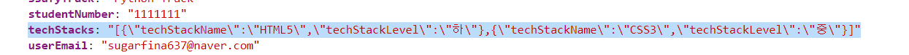

# Java | Gson


프로젝트 개발 진행 중 Front-End에서 다음과 같은 문제가 발생하였다.


> 유저 회원가입 단계에서 Form-data에 데이터를 담아서 보내게 되는데...
>
> **"React 특성상, Json 형태의 데이터를 String 형태로 보낼 수 밖에 없다."**
>
> 라는 문제가 발생한 것이다.





그렇다면

Spring Boot 프레임워크로 구현한 백엔드 서버에서 

→ 1. String 형태의 데이터를 받고

→ 2. 데이터를 Json Object 혹은 Java Object로 변환

하는 과정이 필요하다.


구글링을 하면서 여러가지 해결방법에 대해서 찾아보던 중 **Gson** 에 대해서 알게 되었다.


##### Gson 이란?

JSON 구조의 객체를 Java 객체로 직렬화(Serialize)하거나 역직렬화(Deserialize) 하는 것을 도와주는 라이브러리이다


**Json Object ↔ Java Object**


이처럼 양방향으로 객체 변환이 가능한 것이다

***


### Gson 사용하기


####  의존성  설정

- Gradle 프로젝트에 맞는 의존성 추가가 필요하다
- https://mvnrepository.com/artifact/com.google.code.gson/gson

```java
# build.gradle

dependencies {
	implementation 'com.google.code.gson:gson:2.8.6'
}
```


객체를 변환하는 다양한 방법들 중 우리 프로젝트에서 직면한 문제와 관련된 내용에 대해서 살펴보자


#### Json을 Java List로 변환


##### 코드

```java
// 1. Request에서 string 데이터 받아오기
String jsonString = userRequestDto.getTechStacks();

// 2. gson 객체 생성
Gson gson = new GsonBuilder().setPrettyPrinting().create();

// 3. 변환하고자 하는 자바 객체 설정
Type listType = new TypeToken<ArrayList<UserStack>>(){}.getType();

// 4. gson.fromJson() 메서드로 json 형태의 String을 원하는 Type의 객체로 변환
List<UserStack> techStacks = gson.fromJson(jsonString, listType);
```


위 코드에서 **Gson** 라이브러리를 사용하면 아주 쉽고 편리하게 Json 형태의 String 데이터를 원하는 타입의 자바 객체로 변환할 수 있다.


참고 블로그 글이 굉장히 큰 도움이 되었다. 👍


##### 참고

https://codechacha.com/ko/java-gson/