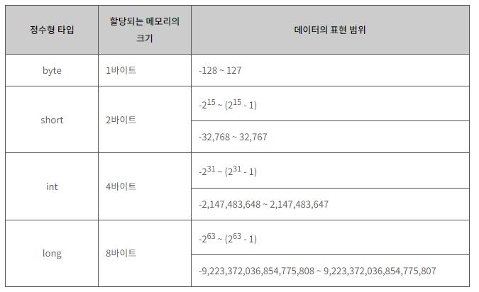
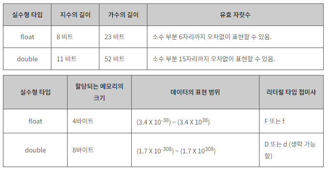
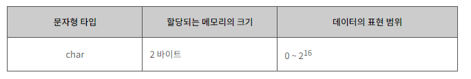
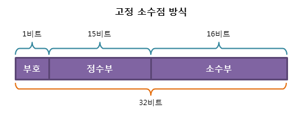
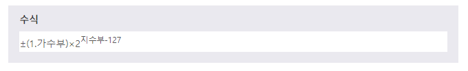
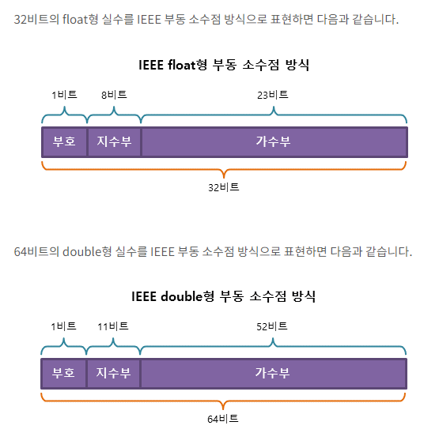
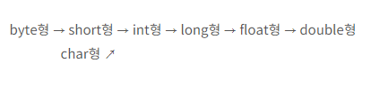

# JAVA | Type

### 목차

> 1. 변수
> 2. 상수
> 3. 기본 타입
> 4. 실수의 표현
> 5. 타입 변환
> 6. 참고 자료


### 1. 변수

#### 변수(variable)

- 변수란 데이터를 저장하기 위해 프로그램에 의해 이름을 할당받은 메모리 공간
- 저장된 값은 변경될 수 있다.


#### 변수의 이름 생성 규칙

- 변수의 이름은 영문자(대소문자), 숫자, 언더스코어(_), 달러($)로만 구성할 수 있음
- 변수의 이름은 숫자로 시작할 수 없다.
- 변수의 이름 사이에는 공백을 포함할 수 없다.
- 변수의 이름으로 자바에서 미리 정의된 키워드(keyword)는 사용할 수 없다.


#### 변수의 종류

1. 기본형(primitive type) 변수
   - 정수형 : byte, short, int, long
   - 실수형 : float, double
   - 문자형 : char
   - 논리형 : boolean
2. 참조형(reference type) 변수
   - 8개의 기본형 변수를 사용하여 사용자가 직접 만들어 사용하는 변수


#### 변수의 선언

- 자바에서는 변수를 사용하기 전에 반드시 먼저 변수를 선언하고 초기화 해야 함
- 선언 방법
  1. 변수의 선언만 하는 방법
  2. 변수의 선언과 동시에 초기화 하는 방법

##### 변수의 선언만 하는 방법

- 변수를 선언하여 메모리 공간을 할당받고, 나중에 변수를 초기화 하는 방법
- 초기화되지 않았으므로, 해당 메모리 공간에는 알 수 없는 쓰레기값이 들어가 있음
- 선언만 된 변수는 반드시 초기화한 후에 사용해야 함
- 초기화되지 않은 변수를 사용하려고 하면, 자바 컴파일러는 오류를 발생시킴

```java
// 예제
int num; 				 // 변수의 선언
System.out.printIn(num); // 오류 발생
num = 20;				 // 변수의 초기화
System.out.printIn(num); // 20
```

##### 변수의 선언과 동시에 초기화 하는 방법

- 변수의 선언과 동시에 그 값을 초기화 할 수 있음
- 선언하고자 하는 변수들의 타입이 같다면 동시에 선언할 수 있음

```java
// 기본 문법
타입 변수이름[, 변수이름];
타입 변수이름 = 초기값[, 변수이름 = 초기값];
```

```java
// 예제
int num1, num2;					// 같은 타입의 변수를 동시에 선언
double num3 = 3.14; 			// 선언과 동시에 초기화
double num4 = 1.23, num5 = 4.56 // 같은 타입의 변수를 동시에 선언하면서 초기화
```

```java
// 잘못된 예제
double num1, num2; 		 // 같은 타입의 변수를 동시에 선언
num1 = 1.23, num2 = 4.56 // 이미 선언된 여러 변수를 동시에 초기화할 수 없음
```


### 2. 상수

#### 상수(constant)

- 상수란, 변수와 마찬가지로 데이터를 저장할 수 있는 메모리 공간
- 변수와 달리, 프로그램이 실행되는 동안 메모리에 저장된 데이터를 변경할 수 없다.


#### 상수의 선언

- 상수는 **선언과 동시에 반드시 초기화해야 함**
- C++에서는 const 키워드로 상수를 선언하지만, 자바에서는 **final** 키워드를 사용하여 선언함
- 일반적으로 상수의 이름은 모두 대문자를 사용. 여러 단어로 이루어진 경우 언더스코어(_) 사용.

```java
final int AGES = 30;
```


#### 리터럴(literal)

- 그 자체로 값을 의미하는 것
- 변수, 상수와 달리 데이터가 저장된 메모리 공간을 가리키는 이름을 가지고 있지 않음

```java
int var = 30; 		 // 30이 리터럴임
final int AGES = 50; // 50이 리터럴임
```


##### 타입에 따른 리터럴

1. 정수형 리터럴(integer literals) : 123, -456과 같이 아라비아 숫자와 부호로 직접 표현됨
2. 실수형 리터럴(floating-point literals) : 3.14, -4.56과 같이 소수 부분을 가지는 아라비아 숫자로 표현됨
3. 논리형 리터럴(boolean literals) : `true`나 `false`로 표현됨
4. 문자형 리터럴(string literals) :  큰따옴표("")로 감싸진 문자열로 표현됨
5. null 리터럴(null literals) : 단 하나의 값인 `null`로 표현됨
   - null이란, 아무런 값도 가지고 있지 않은 빈 값을 의미함


##### 리터럴 타입 접미사 (literal type suffix)

- 3.14 같은 실수형 리터럴을 그대로 사용하면, 실수형 타입 중에서 double형으로 인식될 것임
- 하지만 실수형 리터럴 맨 뒤에 `F` 나 `f` 를 추가하면, 자바는 해당 실수형 리터럴을 float형으로 인식할 것임
- 이처럼 리터럴 뒤에 추가되어 리터럴의 타입을 명시해주는 접미사를 리터럴 타입 접미사라고 함

| 타입 접미사          | 리터럴 타입 | 예제                 |
| -------------------- | ----------- | -------------------- |
| L 또는 l             | long 형     | 123456789L, ...      |
| F 또는 f             | float 형    | 1.234567F, 8.9f, ... |
| D 또는 d (생략 가능) | double 형   | 1.2345D, 6.789d, ... |


### 3. 기본 타입

#### 기본 타입(Primitive Type)

- 타입(data type)은, 해당 데이터가 메모리에 어떻게 저장되고 프로그램에서 어떻게 처리되어야 하는지를 명시적으로 알려주는 역할을 함
- **기본 타입은 모두 8종류**이고, **정수형 / 실수형 / 문자형 / 논리형** 타입으로 나뉨


##### 정수형 타입

- 부호를 가지고있으며, 소수 부분이 없는 수
  - byte
  - short
  - int
  - long



- 데이터의 최대 크기를 고려해야 함. 해당 타입이 표현할 수 있는 범위를 벗어난 데이터를 저장하면, **오버플로우(overflow)** 가 발생해 전혀 다른 값이 저장될 수 있음

🎈 오버플로우(overflow)란? 해당 타입이 표현할 수 있는 최대 범위보다 큰 수를 저장할 때 발생하는 현상. 오버플로우가 발생하면 최상위 비트(MSB)를 벗어난 데이터가 인접 비트를 덮어쓰므로, 잘못된 결과를 얻을 수 있음. 반대로, 언더플로우(underflow)는 해당 타입이 표현할 수 있는 최소 범위보다 작은 수를 저장할 때 발생하는 현상

```java
// 오버플로우와 언더플로우 예제
public class Datatype04 {
    public static void main(String[] args) {
        byte num1 = 127;
        byte num2 = -128;
        
        num1++; // 127 + 1
        num2--; // -128 - 1
        
        System.out.printIn(num1); // -128
        System.out.printIn(num2); // 127
    }
}
```

- 자바 byte 타입이 표현할 수 있는 범위는 -128 ~ 127. 예제에서 num1 127에 1을 더해 128을 저장하려고 함. 해당 타입이 표현할 수 있는 최대 범위보다 더 큰 수를 저장하려고 하면, 오버플로우가 발생하여 잘못된 결과가 저장됨.
- 변수 num2에 -128 - 1인 -129를 저장하려고 함. 이때 언더플로우가 발생하여 잘못된 결과값이 저장됨


##### 실수형 타입

- 소수부, 지수부가 있는 수를 가리키며 정수보다 훨씬 더 넓은 표현 범위를 가짐
  - float
  - double
- **과거에는 float형을 많이 사용**했지만, 하드웨어의 발달로 인한 **메모리 공간 증가로 현재는 double형을 가장 많이 사용**함.
- 따라서 실수형 타입 중 기본이 되는 타입은 double형
- 실수형 데이터 타입을 결정할 때에는 표현 범위 이외에 유효 자릿수도 고려해야 함



🎈 컴퓨터에서 실수를 표현하는 방식은 오차가 발생할 수 밖에 없는 태생적 한계를 지님. 자바뿐만 아니라 모든 프로그래밍 언어에서 발생하는 공통된 문제!


##### 문자형 타입

- 작은 정수나 문자 하나를 표현할 수 있는 타입
  - char
- 컴퓨터는 2진수밖에 인식하지 못하므로 문자도 숫자로 표현해야 인식할 수 있음
- 어떤 문자를 어떤 숫자에 대응시킬 것인지에 대한 약속이 필요함
  - C, C++에서는 아스키코드(ASCII)를 사용하여 문자를 표현함
    - 아스키코드(ASCII)는 영문 대소문자를 사용하는 7비트의 문자 인코딩 방식.
    - 문자 하나를 7비트로 표현하므로, 총 128개의 문자를 표현할 수 있음
    - 영문자와 숫자밖에 표현하지 못함
  - 자바는 유니코드(unicode)를 사용하여 문자를 표현
    - 각 나라의 모든 언어를 표현할 수 있음
    - 문자 하나를 16비트로 표현하므로, 총 **65,536개의 문자를 표현**할 수 있음




##### 논리형 타입

- 참(true) 이나 거짓(false) 중 한 가지 값만을 가질 수 잇는 불리언 타입
  - boolean
- 기본값은 false이며, 기본 타입 중 가장 작은 크기인 1바이트의 크기를 가짐


### 4. 실수의 표현

#### 실수 표현 방식

1. 고정 소수점(fixed point) 방식
2. 부동 소수점(floating point) 방식


##### 고정 소수점 방식

- 실수를 표현하는 가장 간단한 방식은 소수부의 자릿수를 미리 정하여, 고정된 자릿수의 소수를 표현하는 것
- 정수부와 소수부 자릿수가 크지 않으므로, 표현할 수 있는 범위가 매우 적다는 단점이 있음



##### 부동 소수점 방식

- 실수를 가수부와 지수부로 나누어 표현할 수 있음
- 고정 소수점에 비해 매우 큰 실수까지 표현할 수 있음
- 대부분의 시스템에서 부동 소수점 방식으로 실수를 표현하고 있음




##### IEEE 부동 소수점 방식

- IEEE 754 표준



##### 부동 소수점 방식의 오차

- 부동 소수점 방식을 사용하면 고정 소수점 방식보다 훨씬 더 많은 범위까지 표현할 수 있음
- 그러나, **항상 오차가 존재**한다는 단점이 있다.
  - 10진수를 정확하게 표현할 수 없음.
  - 컴퓨터에서 실수를 표현하는 방법은 정확한 표현이 아닌 항상 **근사치를 표현하는 것**임

```java
// 오차 예제
double num = 0.1;
for(int i = 0; i < 1000; i++) {
    num += 0.1;
}
System.out.print(num);
```

```java
// 결과
100.09999999999859
```

- 0.1을 1000번 더한 합계는 100이 되어야 하지만, 실제 결과로 100.09999999999859이 출력됨


```java
// double형과 float형의 정밀도
float num3 = 1.23456789f;
double num4 = 1.23456789;

System.out.printIn("float형 변수 num3 : " + num3);
System.out.printIn("double형 변수 num4 : " + num4);
```

```java
// 결과
float형 변수 num3 : 1.2345679
double형 변수 num4 : 1.23456789
```

- float형 타입은 소수 6자리까지 정확하게 표현할 수 있으나, 그이상은 정확하게 표현하지 못함.
- double형 타입은 소수 15자리까지 오차없이 표현할 수 있음.
- 하지만 그 이상의 소수 부분을 표현할 때는 항상 작은 오차가 발생함


### 5. 타입 변환

#### 타입 변환 (Type Conversion)

- 하나의 타입을 다른 타입으로 바꾸는 것
- boolean 형을 제외한 나머지 기본 타입 간 타입 변환을 자유롭게 수행할 수 있음
- 자바에서 다른 타입끼리의 연산은 피연산자들을 모두 같은 타입으로 만든 후 수행 됨
  - 메모리에 할당받은 바이트 크기가 상대적으로 작은 타입에서 큰 타입으로의 타입 변환은 생략 가능
  - 메모리에 할당받은 바이트의 크기가 큰 타입에서 작은 타입으로의 타입 변환은 데이터 손실이 발생함.
  - 따라서 상대적으로 바이트 크기가 작은 타입으로 타입변환을 하면, 자바 컴파일러는 오류를 발생시킴


#### 타입 변환의 종류

1. 묵시적 타입 변환 (자동 타입 변환)
2. 명시적 타입 변환 (강제 타입 변환)


##### 묵시적 타입 변환 (자동 타입 변환, implicit conversion)

- 대입 연산, 산술 연산에서 컴파일러가 자동으로 수행해주는 타입 변환
- 데이터 손실이 발생하지 않거나, 데이터의 손실이 최소화되는 방향으로 묵시적 타입 변환을 진행함
- 데이터의 손실이 발생하는 대입 연산은 허용하지 않음

```java
// 묵시적 타입 변환 예제
double num1 = 10; 			// 1번
int num2 = 3.14; 			// 2번. 자바 컴파일러가 오류를 발생시킴
double num3 = 7.0f + 3.14;  // 3번

System.out.printIn(num1);
System.out.printIn(num3);
```

```java
// 실행 결과
10.0
10.14
```

1. 1번 라인에서 double형 변수에 int형 데이터를 대입하므로, int형 데이터가 double형으로 자동 타입 변환됨.

2. 2번 라인에서는 int형 변수가 표현할 수 있는 범위보다 더 큰 double형 데이터를 대입하므로, 데이터의 손실이 발생함. 따라서 자바 컴파일러가 오류를 발생시킴

3. 3번 라인에서 float형 데이터와 double형 데이터의 산술 연산을 수행. 데이터의 손실이 최소화되도록 float형 데이터가 double형으로 자동 타입 변환됨


- 자바에서는 타입의 표현 범위에 따라 아래와 같은 방향으로 **자동 타입 변환**이 이루어짐



```java
byte num1 = 100; 		 // OK
byte num2 = 200; 		 // Type mismatch
int num3 = 9876543210;   // Out of range
long num4 = 9876543210;  // Out of range
float num5 = 3.14; 		 // Type mismatch
int num6 = 9876543210L;  // Type mismatch
long num6 = 9876543210L; // OK
```

1. 1번 라인에서 byte형 변수에 표현 범위가 더 큰 int형 데이터를 대입함. 하지만 정수 100은 byte형 변수가 표현할 수 있는 범위 내의 데이터이므로 자동으로 타입 변환이 이루어져 대입됨.
2. 2번 라인에서 byte형 변수가 표현할 수 있는 범위를 벗어난 int형 데이터는 타입 변환되지 못하고, 오류를 발생시킴
3. 3번 라인에서는 int형 리터럴이 표현할 수 있는 최대 범위는 2,147,483,647을 초과하는 정수형 리터럴을 사용했기 때문에, Out of range 오류 발생
4. 4번 라인도 3번 라인과 같은 이유로 Out of range 오류 발생
5. 5번 라인은 float형 변수가 표현할 수 있는 범위를 벗어난 double형 데이터를 대입하므로, 오류 발생
6. int형 변수가 표현할 수 있는 범위를 벗어난 long형 데이터를 대입하므로 오류 발생.
7. long형 리터럴로 명시했기 때문에 OK


##### 명시적 타입 변환 (강제 타입 변환, explicit conversion)

- 사용자가 타입 캐스트 연산자(`()`)를 사용하여 강제적으로 수행하는 타입 변환

```java
// 기본 문법
(변환할타입) 변환할데이터
```

```java
// 예제
int num1 = 1, num2 = 4;

double result1 = num1 / num2;
double result2 = (double) num1 / num2;

System.out.printIn(result1);
System.out.printIn(result2);
```

```java
// 결과
0.0
0.25
```

1. 첫번째 result1에서 결과로 0이 반환됨. 산술 연산을 수행하고 얻는 결과값의 타입은 항상 피연산자의 타입과 일치해야함. int형 데이터끼리의 산술 연산에 대한 결과값은 항상 int형 데이터의 결과로 나옴. 1 나누기 4의 결과로 0.25가 반환되지만, int형으로 자동 타입 변환되어 0이 반횐됨. 그리고 double형 변수에 그 결과가 대입되므로 자동 타입 변환되어 0.0이라는 결과가 출력됨.
2. 정확한 결과를 얻고자 하면 피연산자 중 하나의 타입을 double형으로 강제 타입 변환해야 함. 피연산자 중 하나의 타입이 double형이 되면, 나눗셈 연산을 위해 나머지 하나의 피연산자도 double형으로 자동 타입 변환됨. 결과는 double형인 0.25가 될 것이며, 이 결과가 double형 변수(result2)에 제대로 대입됨


### 6. 참고 자료

[TCPSCHOOL - JAVA 2.타입](http://www.tcpschool.com/java/java_datatype_variable)

