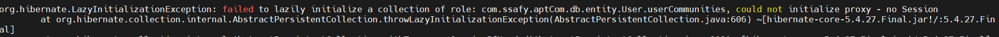

# JPA | Lazy Initialization Exception

<br>



스프링 부트에서 `JPA`를 사용하는데, 위 이미지와 같은 **LazyInitalizationException** 문제가 발생하였다.

<br>

#### LazyInitializationException 이란?

- 스프링 부트 프로젝트의 로직은 대부분 **REST API**
  - `Controller` → `Service` → `Repository`
  - `Service` 레벨에서 **@Transactional** 어노테이션이 달린 메소드가 실행 - 종료되면 **JPA Hibernate**의 **Session**이 종료됨

- `FetchType.LAZY`로 설정된 필드가 포함된 **Entity**를 `Controller`에서 조회할 때 **Getter** 메소드가 실행되면서 Query가 실행됨
- 이미 **Hibernate**의 **Session이 종료**되었기 때문에 **LazyInitialIzationException** 예외가 발생한다.

<br>

#### 해결 방법

##### 1. Open in View (안티 패턴)

- **@Transactional**이 명시된 메소드가 종료되더라도, Hibernate의 **Session**을 `Controller` 응답 리턴 시점까지 유지시키는 것
- 프로젝트 설정파일 (`yml` or `properties`) 에 작성

```yaml
spring:
  jpa:
    open-in-view : true // 기본값 : false
```

<br>

##### 2. 다른 Session 사용하기 (안티 패턴)

- Hibernate의 **Session이 종료**된 후 예외를 발생시키는 것이 아니라 또 **다른 Session을 사용**하여 데이터를 조회하는 방법
- Open in View 방식과 마찬가지로 설정파일에 작성
- But, `Entity` 간 관계 복잡성/ 상황에 따라 커넥션 풀을 고갈시키는 장애를 유발할 수 있음

```yaml
spring:
  jpa:
    properties:
      hibernate:
        enable_lazy_load_no_trans: true // 기본값 : false
```

<br>

##### 3. Entity → DTO 변환 (권장)

- `Service` 단에서 트랜잭션이 종료되는 시점에 **Return** 타입으로 `Entity`를 `DTO`로 변환하는 것
- 하나의 Entity → 단일 DTO
  - `FetchType.EAGER` 사용하는 것과 동일
- API 응답을 세분화하여 상황에 맞게 필요한 필드만 DTO로 맵핑하여 리턴한다!
  - `getUser()`, `getUserWithxxx()` 와 같이 세분화
- @Repository에서 데이토를 조회하는 시점부터 DTO에 대한 프로젝션을 수행하도록 설계

<br>

***

##### 참고 자료

- https://javaworld.co.kr/85
- https://dotkebi.blogspot.com/2017/01/jpa-lazyinitializationexception.html
- https://jsonobject.tistory.com/605