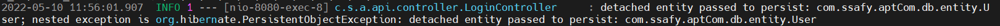
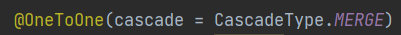

# JPA | PersistentObjectException

 

Spring Boot 프로젝트 진행 중 아래와 같은 오류가 발생했다.

 

**PersistentObjectException** ...

JPA를 사용하면서 영속성 컨텍스트와 관련된 문제 발생으로 나타나는 오류로 보인다.

 

테이블 간, 다대다/다대일 관계를 정의하면서 `CascadeType`을 설정하게 된다.

- `CascadeType.PERSIST` - 하위 엔티티까지 영속성 전달
- `CascadeType.MERGE` - 하위 엔티티까지 병합 작업 지속
- `CascadeType.REMOVE` - 하위 엔티티까지 제거 작업 지속
- `CascadeType.REFRESH` - DB로부터 인스턴스 값 다시 읽어오기
- `CascadeType.DETACH` - 영속성 컨텍스트에서 엔티티 제거

 

영속성 전이를 통해 부모 엔티티 저장시 자식 엔티티를 함께 저장하는 등의 기능을 수행할 수 있는데, `Cascade` 옵션 문제로 인해 에러가 발생할 수 있다는 것이다.

따라서 기존의 `CascadeType.PERSIST` 를 아래와 같이 `CascadeType.MERGE`로 변경해 주었다.

 

***

#### 참고 자료

- https://data-make.tistory.com/668
- https://delf-lee.github.io/post/detached-entity-passed-to-persist-error/

