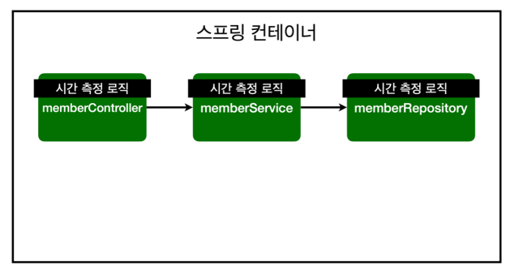
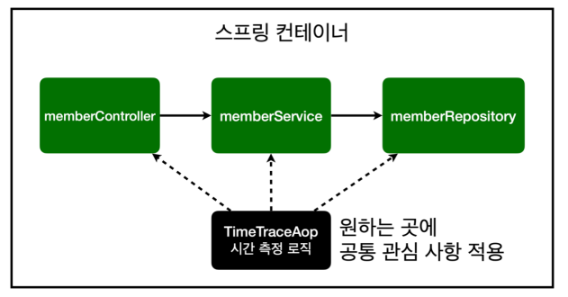
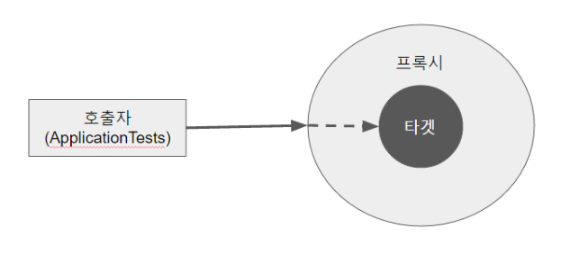

# JAVA | AOP

### AOP

AOP (Aspect Oriented Programming). 관점지향형 프로그래밍이라고 한다.

 

##### AOP 관련 예시

AOP를 이해하기 위해서 한 가지 예를 들어보자.

"회사 A의 서비스에 구현된 메소드가 10000개 있다. 김코딩은 이 메소드 10000개의 호출시간을 알고싶어 한다. 패키지 내부의 각 클래스 파일 안에 있는 10000개의 메소드 위아래로 시작 시간과 종료 시간을 찍어주는 코드를 작성해야 할까? (야근각...)"

AOP는 위와 같은 상황에 대한 해결(?) 방법의 하나이다. 우리는 각각의 메소드가 구현하는 기능에 더 큰 관심이 있지, 메소드가 호출되는 시간이 중요한 것이 아니다(서비스를 이용하는 사용자들도 마찬가지로 큰 관심이 있지는 않을 것이다)

 

AOP는 메소드 호출시간과 같은 **공통 관심 사항(cross-cutting concern)**과 회원가입, 물품구매 같은 **핵심 관심 사항(core concern)을 분리**한다. 만약 위 예시처럼 10000개의 메소드에 시간 측정 로직과 비즈니스 로직을 섞어서 작성하면 추후 유지보수가 어렵고, 코드 가독성도 엄청나게 떨어질 것이다. 반대로, 공통 관심 사항과 핵심 관심 사항을 분리하여 작성하면 핵심 비즈니스 로직을 깔끔하게 관리할 수 있다. 또한, 공통 로직만 별도로 관리하기 때문에 변경이 필요할 경우 쉽게 변경할 수 있다. 그리고 공통 로직을 적용하기 원하는 대상을 취사선택할 수 있다.

 

- 시간 측정 로직을 모든 클래스 파일에 생성하는 경우

 

- 시간 측정 로직을 별도로 작성하고, 이를 원하는 곳에 취사적으로 적용하는 경우

 

##### AOP 동작 원리

- 프록시(Proxy)를 이용하여 AOP 구현

프록시란, 타겟을 감싸서 타겟의 요청을 대신 받아주는 랩핑(Wrapping) 오브젝트이다. 클라이언트(호출자)에서 타겟을 호출하면 타겟 대신 프록시가 먼저 호출되어, 타겟 메소드 실행 전 선처리와 타겟 메소드 실행 후 후처리를 실행하도록 구성되어 있다.

 

AOP의 실제 구현 코드는 김영한님의 **스프링 입문 - 코드로 배우는 스프링 부트, 웹 MVC, DB 접근 기술** 강의를 정리한 마크다운 파일을 참고하자.

 

***

##### 참고 자료

https://sa1341.github.io/2019/05/25/%EC%8A%A4%ED%94%84%EB%A7%81-AOP-%EA%B0%9C%EB%85%90-%EB%B0%8F-Proxy%EB%A5%BC-%EC%9D%B4%EC%9A%A9%ED%95%9C-%EA%B5%AC%EB%8F%99%EC%9B%90%EB%A6%AC/

https://velog.io/@max9106/Spring-%ED%94%84%EB%A1%9D%EC%8B%9C-AOP-xwk5zy57ee

https://velog.io/@gwontaeyong/Spring-AOP%EC%97%90%EC%84%9C-Proxy%EB%9E%80

https://n1tjrgns.tistory.com/261