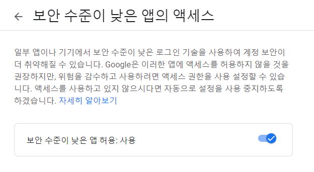
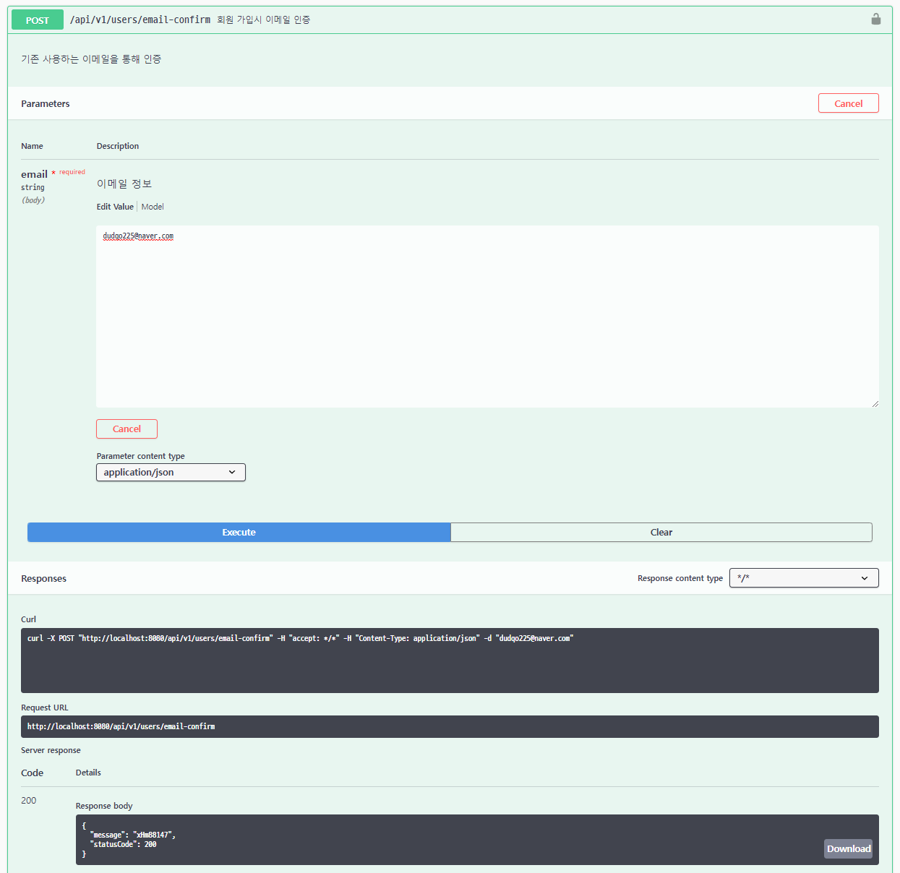
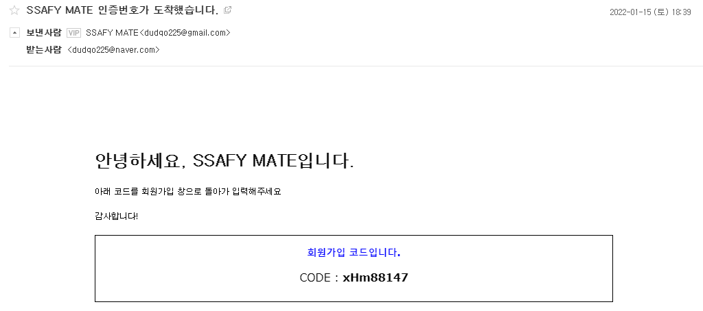

# Spring | Email Verification

서비스 이용을 위한 회원가입 단계에서 이메일을 통한 본인 인증 기능을 구현하고자 한다.
본인이 주로 사용하는 이메일 주소를 입력하고 인증 버튼을 누르면 해당 이메일로 인증 코드를 보낸다.
이메일에서 확인한 코드를 회원가입 창에 입력하고, 코드가 일치하면 계속해서 이어서 회원가입 단계를 진행할 수 있다.

<br>

메일 서버(SMTP Server)를 통해서 이메일을 송수신할 수 있는데, 이를 활용하여 인증 코드를 사용자에게 보낼 수 있다. SMTP란, Simple Mail Transfer Protocol의 약자로, 전자 메일 전송을 위한 표준 프로토콜이다.

자바에서는 메일 관련 라이브러리를 지원하는데 MIME(Multipurpose Internet Mail Extensions), 전자우편의 데이터 형식을 정의한 표준 포맷에 관한 MIMEMessage 클래스를 통해서 보내는 사람 / 받는 사람 / 제목 / 내용 관련 내용을 지정하여 메일을 보낼 수 있다.

***
## 목차
> 1. [SMTP Server & MIME](#1-smtp-server--mime)
> 2. [Dependency & Properties](#2-dependency--properties)
> 3. [Email Config](#3-email-config)
> 4. [Email Service](#4-email-service)
> 5. [User Controller](#5-user-controller)
> 6. [Swagger 활용하여 테스트 진행](#6-swagger-활용하여-테스트-진행)
> 7. [참고자료](#참고자료)

<br>

***
## 1. SMTP Server & MIME

메일 서버(SMTP Server)를 통해서 이메일을 송수신할 수 있는데, 이를 활용하여 인증 코드를 사용자에게 보낼 수 있다. 

#### SMTP란

Simple Mail Transfer Protocol의 약자로, 전자 메일 전송을 위한 표준 프로토콜이다.

#### MIME

자바에서는 메일 관련 라이브러리를 지원하는데 MIME(Multipurpose Internet Mail Extensions), 전자우편의 데이터 형식을 정의한 표준 포맷에 관한 **MimeMessage** 클래스를 통해서 보내는 사람 / 받는 사람 / 제목 / 내용 관련 내용을 지정하여 메일을 보낼 수 있다.

<br>

## 2. Dependency & Properties

### Dependency

- `build.gradle` 에 이메일 관련 의존성을 추가한다.

```java
dependencies {
	...
	implementation("org.springframework.boot:spring-boot-starter-mail")
	compile group: 'com.sun.mail', name: 'javax.mail', version: '1.4.7'
	compile group: 'org.springframework', name: 'spring-context-support', version: '5.2.6.RELEASE'
	
}
```

<br>

### Properties

- `mail.properties` 파일을 생성한다.

  - 기존 프로젝트에는 `application.yml` 에 개발 시스템 설정이 작성되어 있지만, 참조 코드 내의 통일성을 위해서 `properties` 파일로 작성하였다.
  - `application.yml` 에 작성하려면 아래와 같이 추가해주면 된다.

  ```java
  spring:  
    mail:
      host: smtp.gmail.com
      port: 587
      username: {Gmail ID}
      password: {Gmail Password}
      properties:
        mail:
          smtp:
            auth: true
            starttls:
              enable: true  
  ```

```java
// mail.properties
mail.smtp.auth=true
mail.smtp.starttls.required=true
mail.smtp.starttls.enable=true
mail.smtp.socketFactory.class=javax.net.ssl.SSLSocketFactory
mail.smtp.socketFactory.fallback=false
mail.smtp.port=465
mail.smtp.socketFactory.port=465

AdminMail.id = {Gmail ID}
AdminMail.password = {Gmail Password}
```

- 위 설정을 하더라도, 구글 Gmail의 계정 보안을 낮춰야 메일을 전송할 수 있다.
- https://myaccount.google.com/lesssecureapps
- ↑ 링크를 통해서 **보안 수준이 낮은 앱 허용 : 사용**으로 설정해야 한다.



<br>

## 3. Email Config

- 이메일을 보내기 위한 기본 설정 코드 작성

```java
// EmailConfig 클래스 코드
@Configuration
@PropertySource("classpath:mail.properties")
public class EmailConfig {
	
    @Value("${mail.smtp.port}")
    private int port;
    @Value("${mail.smtp.socketFactory.port}")
    private int socketPort;
    @Value("${mail.smtp.auth}")
    private boolean auth;
    @Value("${mail.smtp.starttls.enable}")
    private boolean starttls;
    @Value("${mail.smtp.starttls.required}")
    private boolean startlls_required;
    @Value("${mail.smtp.socketFactory.fallback}")
    private boolean fallback;
    @Value("${AdminMail.id}")
    private String id;
    @Value("${AdminMail.password}")
    private String password;

	 @Bean
	 public JavaMailSender javaMailService() {
	       JavaMailSenderImpl javaMailSender = new JavaMailSenderImpl();
	       javaMailSender.setHost("smtp.gmail.com");
	       javaMailSender.setUsername(id);
	       javaMailSender.setPassword(password);
	       javaMailSender.setPort(port);
	       javaMailSender.setJavaMailProperties(getMailProperties());       
	       javaMailSender.setDefaultEncoding("UTF-8");
	       return javaMailSender;
	 }
	 private Properties getMailProperties()
		{
			Properties pt = new Properties();
			pt.put("mail.smtp.socketFactory.port", socketPort); 
			pt.put("mail.smtp.auth", auth);
		    pt.put("mail.smtp.starttls.enable", starttls); 
		    pt.put("mail.smtp.starttls.required", startlls_required);
		    pt.put("mail.smtp.socketFactory.fallback",fallback);
		    pt.put("mail.smtp.socketFactory.class", "javax.net.ssl.SSLSocketFactory");
			return pt;
		}
}
```

<br>

## 4. Email Service

- `EmailService` 인터페이스 생성

```java
// EmailService Interface
public interface EmailService {
    String sendSimpleMessage(String to) throws Exception;
}
```

- `EmailServiceImpl` 클래스 생성
  - 보내는 대상, 메일 제목, 내용, 보내는 사람 등을 설정하고,
  - `java.util.Random` 을 활용하여 인증코드를 랜덤하게 생성한다.

```java
// EmailServiceImpl Class
@Service("emailService")
public class EmailServiceImpl implements EmailService{
	
	@Autowired
	JavaMailSender emailSender;
	
	public static final String ePw = createKey();
	
	private MimeMessage createMessage(String to)throws Exception{
		System.out.println("보내는 대상 : "+ to);
		System.out.println("인증 번호 : "+ePw);
		MimeMessage  message = emailSender.createMimeMessage();
		 	
		 	message.addRecipients(RecipientType.TO, to); // 보내는 대상
	        message.setSubject("인증번호가 도착했습니다.");  // 제목
	        
	        String msgg="";
            // 인증코드를 담아 보낼 이메일 양식을 설정할 수 있다.    
	        msgg+= "<div style='margin:100px;'>";
	       	msgg+= "<h1> 안녕하세요, 인증코드입니다. </h1>";
	        msgg+= "<br>";
	        msgg+= "<p>아래 코드를 회원가입 창으로 돌아가 입력해주세요<p>";
	        msgg+= "<br>";
	        msgg+= "<p>감사합니다!<p>";
	        msgg+= "<br>";
			msgg+= "<div align='center' style='border:1px solid black; font-family:verdana';>";
			msgg+= "<h3 style='color:blue;'>회원가입 코드입니다.</h3>";
			msgg+= "<div style='font-size:130%'>";
			msgg+= "CODE : <strong>";
         
			// ePw → 인증코드를 담고 있는 변수
         	msgg+= ePw+"</strong><div><br/> ";
         
			msgg+= "</div>";
	        message.setText(msgg, "utf-8", "html"); // 내용
	        message.setFrom(new InternetAddress("{보내는 사람 Gmail ID}","{보내는 사람}")); // 보내는 사람
	        
	        return message;
	    }
    
    // 인증코드 만들기 - jav.util.Random 사용
    public static String createKey() {
        StringBuffer key = new StringBuffer();
        Random rnd = new Random();

        for (int i = 0; i < 8; i++) { // 인증코드 8자리
            int index = rnd.nextInt(3); // 0~2 까지 랜덤

            switch (index) {
                case 0:
                    key.append((char) ((int) (rnd.nextInt(26)) + 97));
                    //  a~z  (ex. 1+97=98 => (char)98 = 'b')
                    break;
                case 1:
                    key.append((char) ((int) (rnd.nextInt(26)) + 65));
                    //  A~Z 
                    break;
                case 2:
                    key.append((rnd.nextInt(10)));
                    // 0~9
                    break;
            }
        }

        return key.toString();
    }
    
    @Override
    public String sendSimpleMessage(String to) throws Exception {
        MimeMessage message = createMessage(to);
        try { // 예외처리
            emailSender.send(message);
        } catch(MailException es){
            es.printStackTrace();
            throw new IllegalArgumentException();
        }
        return ePw;
    }
}
```

<br>

## 5. User Controller

- 유저 관련 `Controller`에 새로운 AP를 생성한다.
  - 클라이언트에서 요청시, 이메일(email)을 `String` 형태로 받아서 emailService 로 전달하고, 인증코드 생성 및 이메일을 전송한다.
  - emailService 기능이 정상적으로 작동하면, **인증코드**와 **200** 상태 메시지를 응답한다.

```java
@RestController
@RequestMapping("/api/v1/users")
public class UserController {
	@Autowired
	EmailService emailService;
	
	// 회원가입시 메일 인증
	@PostMapping("/email-confirm")
    @ApiOperation(value = "회원 가입시 이메일 인증", notes = "기존 사용하는 이메일을 통해 인증")
    @ApiResponses({
            @ApiResponse(code = 200, message = "성공"),
            @ApiResponse(code = 401, message = "인증 실패"),
            @ApiResponse(code = 404, message = "사용자 없음"),
            @ApiResponse(code = 500, message = "서버 오류")
    })
    public ResponseEntity<? extends BaseResponseBody> emailConfirm(
            @RequestBody @ApiParam(value="이메일 정보", required = true) String email) throws Exception {
 
        String confirm = emailService.sendSimpleMessage(email);
 
        return ResponseEntity.status(200).body(BaseResponseBody.of(200, confirm));
    }
}
```

<br>

## 6. Swagger 활용하여 테스트 진행

- 자주 사용하는 네이버 계정 dudqo225@naver.com 으로 이메일 인증 API 테스트를 진행하였다.
  - 이메일 주소 입력
  - API가 성공적으로 작동하면 인증코드와 200 코드 응답



- 네이버 계정에 정상적으로 인증코드가 보내진 것을 확인할 수 있음



<br>

가장 기본적인 인증코드 생성 및 이메일 전송 기능은 구현할 수 있게 되었다.

추가적으로, 생성된 인증코드를 DB에 저장할 것인지 클라이언트에 저장해두었다가 재사용할 것인지에 대한 것을 팀원들과 상의해봐야 한다. 인증코드 만료시간을 별도로 설정(ex. 3분) 해서 만료시간이 지나면 새로 인증을 받아야하는 등의 디테일한 내용도 논의가 필요하다.

<br>

## 참고자료

https://javacan.tistory.com/tag/MimeMessage

https://offbyone.tistory.com/167

https://velog.io/@ayoung0073/springboot-email-authentication

https://badstorage.tistory.com/38
